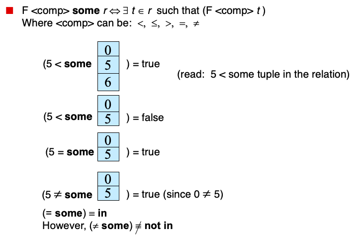
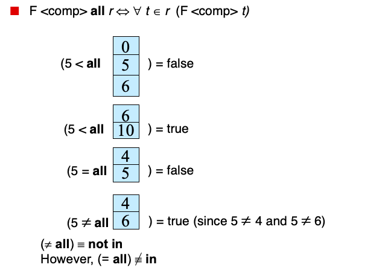

# Lecture 1: Relational Model

This course is on the design and implementation of disk-oriented database management systems.


DATA INTEGRIT Y

IMPLEMENTATION

DURABILIT Y


DATABASE MANAGEMENT SYSTEM

A DBMS is software that allows applications to store and analyze information in a database.
A general-purpose DBMS is designed to allow the definition, creation, querying, update, and administration of databases

DATA MODELS

A data model is collection of concepts for
describing the data in a database.
A schema is a description of a particular collection
of data, using a given data model.

## RELATIONAL MODEL

Structure: The definition of relations and their
contents.
Integrity: Ensure the database’s contents satisfy
constraints.
Manipulation: How to access and modify a
database’s contents.


A relation is unordered set that
contain the relationship of attributes
that represent entities.
A tuple is a set of attribute values (also
known as its domain) in the relation.
→ Values are (normally) atomic/scalar.
→ The special value NULL is a member of every domain.

## PRIMARY KEYS

Auto-generation of unique integer
primary keys:
→ SEQUENCE (SQL:2003)
→ AUTO_INCREMENT (MySQL)


## FOREIGN KEYS

A foreign key specifies that an attribute from one relation has to map to a tuple in another relation


## DATA MANIPUL ATION L ANGUAGES (DML)

How to store and retrieve information from a
database

Procedural:
→ The query specifies the (high-level) strategy the DBMS should use to find the desired result.

Non-Procedural:
→ The query specifies only what data is wanted and not how to find it.


## RELATIONAL ALGEBRA

**Six basic operators**

- $\sigma$ :Select:

  > Choose a subset of the tuples from a relation that satisfies a selection predicate

- $\pi​$ :Projection

  > Generate a relation with tuples that contains only the specified attributes

- ∪ :Union

  > Generate a relation that contains all tuples that appear in either only one or both of the input relations

- ∩ Intersection

  > Generate a relation that contains only the tuples that appear in both of the input relations.

- $-$ Difference :EXCEPT

  > Generate a relation that contains only the tuples that appear in the first and not the second of the input relations

- x: Product  CROSS JOIN

  > Generate a relation that contains all possible combinations of tuples from the input relations 

- ⋈ Join :NATURAL JOIN

  > Generate a relation that contains all tuples that are a combination of two tuples (one from each input relation) with a common value(s) for one or more attributes


**EXTRA OPERATORS:**

Rename (ρ)
Assignment (R←S)
Duplicate Elimination (δ)
Aggregation (γ)
Sorting (τ)
Division (R÷S)


### CONCLUSION

Databases are ubiquitous.
Relational algebra defines the primitives for processing queries on a relational database.
We will see relational algebra again when we talk about query optimization + execution.


# Lecture 2:   Basic SQL

Overview of The SQL Query Language
Data Definition
Basic Query Structure
Additional Basic Operations
Set Operations
Null Values
Aggregate Functions
Nested Subqueries
Modification of the Database


### 基础SQL

数据库

表

增删改查


### RELATIONAL LANGUAGES
User only needs to specify the answer that they want, not how to compute it.
The DBMS is responsible for efficient evaluation of the query.
​	→ Query optimizer: re-orders operations and generates query plan


- Data Manipulation Language (DML)

- Data Definition Language (DDL)

  > allows the specification of information about relations, including:
  >
  > - The schema for each relation.
  > - The domain of values associated with each attribute.
  > - Integrity constraints
  > - And as we will see later, also other information such as 
  >   - The set of indices to be maintained for each relations.
  >   - Security and authorization information for each relation.
  >   - The physical storage structure of each relation on disk.

- Data Control Language (DCL)

Also includes:
→ View definition
→ Integrity & Referential Constraints
→ Transactions
Important: SQL is based on bags (duplicates) not sets (no duplicates).

**Domain Types in SQL**

char(n).  Fixed length character string, with user-specified length n.
varchar(n).  Variable length character strings, with user-specified maximum length n.
int.  Integer (a finite subset of the integers that is machine-dependent).
smallint.  Small integer (a machine-dependent subset of the integer domain type).
numeric(p,d).  Fixed point number, with user-specified precision of p digits, with d digits to the right of decimal point.  (ex., numeric(3,1), allows 44.5 to be stores exactly, but not 444.5 or 0.32)
real, double precision.  Floating point and double-precision floating point numbers, with machine-dependent precision.
float(n).  Floating point number, with user-specified precision of at least n digits.

### outline

Aggregations + Group By
String / Date / Time Operations
Output Control + Redirection
Nested Queries
Common Table Expressions
Window Functions

### **Aggregate Functions**

These functions operate on the multiset of values of a column of a relation, and return a value. Functions that return a single value from a bag of tuples:

`AVG(col)`→ Return the average col value.
`MIN(col)`→ Return minimum col value.
`MAX(col)`→ Return maximum col value.
` SUM(col)`→ Return sum of values in col.
`COUNT(col)`→ Return # of values for col.

Aggregate functions can only be used in the **SELECT** output list

**Aggregate Functions**


**DISTINCT AGGREGATES**

COUNT, SUM, AVG support DISTINCT

**DISTINCT** 关键字与 SELECT 语句一起使用，来消除所有重复的记录，并只获取唯一一次记录。

`SELECT COUNT(DISTINCT login) FROM student WHERE login LIKE '%@cs';`

```sqlite
SELECT DISTINCT column1, column2,.....columnN 
FROM table_name
WHERE [condition]
```

Output of other columns outside of an aggregate is undefined.

```sqlite
SELECT AVG(s.gpa), e.cid  //not e.cid,undefind
FROM enrolled AS e, student AS s
WHERE e.sid = s.sid
```

=>利用group by e.cid可解决


####  **GROUP BY**

Project tuples into subsets and calculate aggregates against each subset

**GROUP BY** 子句用于与 SELECT 语句一起使用，来对相同的数据进行分组。

在 SELECT 语句中，GROUP BY 子句放在 WHERE 子句之后，放在 ORDER BY 子句之前

！caution：Non-aggregated values in SELECT output clause must appear in GROUP BY clause.

#### **HAVING**

Filters results based on aggregation computation. Like a WHERE clause for a GROUP BY

HAVING 子句允许指定条件来过滤将出现在最终结果中的分组结果。

WHERE 子句在所选列上设置条件，而 HAVING 子句则在由 GROUP BY 子句创建的分组上设置条件。

在一个查询中，HAVING 子句必须放在 GROUP BY 子句之后，必须放在 ORDER BY 子句之前。


####  ORDER BY

用来基于一个或多个列按升序或降序顺序排列数据。


### STRING OPERATIONS

SQL includes a string-matching operator for comparisons on character strings.  The operator like uses patterns that are described using two special characters:

- percent ( % ).  The % character matches any substring.
- underscore ( _ ).  The _ character matches any character.

Find the names of all instructors whose name includes the substring “dar”.
		`select name from instructor where name like '%dar%' `
Match the string “100%”
			`like ‘100 \%'  escape  '\' `
      in that above we use backslash (\) as the escape character.

### Set Operations

Set operations **union, intersect, and except** 

> Each of the above operations automatically eliminates duplicates

To retain all duplicates use the corresponding multiset versions **union all, intersect all and except all.**

Suppose a tuple occurs m times in r and n times in s, then, it occurs:

- m  + n times in r **union all** s
- min(m,n) times in r **intersect all** s
- max(0, m – n) times in r **except all** s


### Null Values

It is possible for tuples to have a null value, denoted by null, for some of their attributes
null signifies an unknown value or that a value does not exist.

The result of any arithmetic expression involving null is null

> Example:  5 + null  returns null

The predicate  **is null** can be used to check for null values.

> Example: Find all instructors whose salary is null.

`select name from instructor where salary is null`

**Null Values and Three Valued Logic**

Three values – true, false, unknown

Any comparison with null returns unknown
Example: 5 < null   or   null <> null    or    null = null

Three-valued logic using the value unknown:

- OR: 

  > (unknown **or** true)   = true,   
  >
  >  (unknown **or** false)  = unknown     
  >
  >   (unknown **or** unknown) = unknown

- AND:

  > (true **and** unknown)  = unknown,           
  >
  >  (false **and** unknown) = false,      
  >
  >  (unknown **and** unknown) = unknown

- NOT:  

  > (**not** unknown) = unknown

- “P  is unknown” evaluates to true if predicate P evaluates to unknown

Result of where clause predicate is treated as false if it evaluates to unknown

​		

### DATE/TIME OPERATIONS

Operations to manipulate and modify DATE/TIME
attributes.
Can be used in either output and predicates.
Support/syntax varies wildly…

### OUTPUT REDIRECTION

Store query results in another table:

- Table must not already be defined.
- Table will have the same # of columns with the same types as the input.

Insert tuples from query into another table:

- Inner SELECT must generate the same columns as the
  target table.
-  DBMSs have different options/syntax on what to do with
  duplicates.

### OUTPUT CONTROL

ORDER BY <column*> [ASC|DESC]

- Order the output tuples by the values in one or more of their columns

LIMIT <count> [offset]
→ Limit the # of tuples returned in output.
→ Can set an offset to return a “range

### NESTED SUBQUERIES

Queries containing other queries. They are often difficult to optimize.
Inner queries can appear (almost) anywhere in query.

使用子查询返回的数据将被用在主查询中作为条件，以进一步限制要检索的数据。

子查询可以与 SELECT、INSERT、UPDATE 和 DELETE 语句一起使用，可伴随着使用运算符如 =、<、>、>=、<=、IN、BETWEEN 等。

以下是子查询必须遵循的几个规则：

- 子查询在 SELECT 子句中只能有一个列，除非在主查询中有多列，与子查询的所选列进行比较。
- ORDER BY 不能用在子查询中，虽然主查询可以使用 ORDER BY。可以在子查询中使用 GROUP BY，功能与 ORDER BY 相同。
- 子查询返回多于一行，只能与多值运算符一起使用，如 IN 运算符。
- BETWEEN 运算符不能与子查询一起使用，但是，BETWEEN 可在子查询内使用。

#### subquery种类

The nesting can be done in the following SQL query	

```sql
select A1, A2, ..., An
from r1, r2, ..., rm	
where P1,P2,...Pm
```

as follows:

- Ai   can be replaced be a subquery that generates a single value.
- ri  can be replaced by any valid subquery
- P can be replaced with an expression of the form:
                  B <operation> (subquery)
       Where B is an attribute and <operation> to be defined later.

#### Set Comparison— 用于where语句

ALL→ Must satisfy expression for all rows in subquery
ANY→ Must satisfy expression for at least one row
in sub-query.
IN→ Equivalent to '=ANY()' .
EXISTS→ At least one row is returned

```sqlite
Get the names of students in ‘15-445'

SELECT name FROM student
WHERE sid in(
SELECT sid FROM enrolled
WHERE cid = '15-445'
);

SELECT name FROM student
WHERE sid = ANY(
SELECT sid FROM enrolled
WHERE cid = '15-445'
);

SELECT (SELECT S.name FROM student AS S
WHERE S.sid = E.sid) AS sname
FROM enrolled AS E
WHERE cid = '15-445';
```


```sqlite
Find student record with the highest id that is enrolled in at least one course.
    
SELECT sid, name FROM student
WHERE sid => ALL(
SELECT sid FROM enrolled
);

SELECT sid, name FROM student
WHERE sid IN (
SELECT MAX(sid) FROM enrolled
);

SELECT sid, name FROM student
WHERE sid IN (
SELECT sid FROM enrolled
ORDER BY sid DESC LIMIT 1
);

//window function
SELECT * FROM(
	SELECT *,
    	RANK() OVER (PARTITION BY cid
                    	ORDER BY grade ASC)
    	AS rank
    FROM enrolled) AS ranking
WHERE ranking.rank = 1;

//cte
WITH cteSource (maxId) AS (
SELECT MAX(sid) FROM enrolled
)
SELECT name FROM student, cteSource
WHERE student.sid = cteSource.maxId；
```


**Some语句**

```sql
---Find names of instructors with salary greater than that of some (at least one) instructor in the Biology department.
select distinct T.name
from instructor as T, instructor as S
where T.salary > S.salary and S.dept name = ’Biology’;
---Same query using > some clause
select name
from instructor
where salary > some (select salary
                     from instructor
                     where dept name = ’Biology’);
```



**all语句**

```sql
---Find the names of all instructors whose salary is greater than the salary of all instructors in the Biology department.
select name
from instructor
where salary > all (select salary
                    from instructor
                    where dept name = ’Biology’);
```



**unique语句**

The unique construct tests whether a subquery has any duplicate tuples in its result.
The unique construct evaluates to “true” if a given subquery contains no duplicates .

```sql
---Find all courses that were offered at most once in 2009
    select T.course_id
    from course as T
    where unique (select R.course_id                        
                  from section as R                       
                  where T.course_id= R.course_id                                   					 and R.year = 2009);
```

**Subqueries in the Form Clause**

**Subqueries in the Select Clause**

**With Clause**

The **with** clause provides a way of defining a temporary relation whose definition is available only to the query in which the with clause occurs. 


### WINDOW FUNCTIONS

Performs a calculation across a set of tuples that related to a single row.
Like an aggregation but tuples are not grouped into a single output tuples

```sqlite
SELECT ... FUNC-NAME(...) OVER (...)
FROM tableName
```

- FUNC-NAME -> Aggregation Functions Special Functions

- OVER -> how to slice up data, can also sort

  > The OVER keyword specifies how to group together tuples when computing the window function. Use PARTITION BY to specify group.

Aggregation functions: Anything that we discussed earlier
Special window functions:

- ROW_NUMBER()→ # of the current row
- RANK()→ Order position of the current row


### COMMON TABLE EXPRESSIONS

Provides a way to write auxiliary statements for use in a larger query. Think of it like a temp table just for one query. Alternative to nested queries and views.

```sqlite
WITH cteName AS (
SELECT 1
)
SELECT * FROM cteName
```

You can bind output columns to names before the AS keyword

```sqlite
WITH cteName (col1, col2) AS (
SELECT 1, 2
)
SELECT col1 + col2 FROM cteName
```


```sqlite
//Print the sequence of numbers from 1 to 10.

WITH RECURSIVE cteSource (counter) AS (
(SELECT 1)
UNION ALL
(SELECT counter + 1 FROM cteSource
WHERE counter < 10)
)
SELECT * FROM cteSource
```


CONCLUSION

SQL is not a dead language.
You should (almost) always strive to compute your
answer as a single SQL statement

# Advanced SQL 


### Join  Expressions

Join operations take two relations and return as a result another relation.

A join operation is a Cartesian product which requires that tuples in the two relations match (under some condition).  It also specifies the attributes that are present in the result of the join 

The join operations are typically used as subquery expressions in the **from** clause

**outer join**

An extension of the join operation that avoids loss of information.

Computes the join and then adds tuples form one relation that does not match tuples in the other relation to the result of the join. 

Uses null values.

- **natural left outer join** ,  **natural right outer join** , **natural full outer join** 

**Joined Relations**

- Join operations 

  take two relations and return as a result another relation.
  These additional operations are typically used as subquery expressions in the from clause

- Join condition

  defines which tuples in the two relations match, and what attributes are present in the result of the join.

  + natural
  + on
  + using

- Join type 

   defines how tuples in each relation that do not match any tuple in the other relation (based on the join condition) are treated.

  + Inner join
  + Left outer join
  + Right outer join
  + full outer join


### Transactions

Unit of work
Atomic transaction
either fully executed or rolled back as if it never occurred
Isolation from concurrent transactions
Transactions begin implicitly
Ended by commit work or rollback work
But default on most databases: each SQL statement commits automatically
Can turn off auto commit for a session (e.g. using API)
In SQL:1999, can use:  begin atomic  ….  end
Not supported on most databases

### Integrity Constraints

not null
primary key
unique
check (P), where P is a predicate

### SQL Data Types and Schemas

date:  Dates, containing a (4 digit) year, month and date
Example:  date ‘2005-7-27’
time:  Time of day, in hours, minutes and seconds.
Example:  time ‘09:00:30’         time ‘09:00:30.75’
timestamp: date plus time of day
Example:  timestamp  ‘2005-7-27 09:00:30.75’
interval:  period of time
Example:   interval  ‘1’ day
Subtracting a date/time/timestamp value from another gives an interval value
Interval values can be added to date/time/timestamp values

### Authorization

Forms of authorization on parts of  the database:
Read - allows reading, but not modification of data.
Insert - allows insertion of new data, but not modification of existing data.
Update - allows modification, but not deletion of data.
Delete - allows deletion of data.

Forms of authorization to modify the database schema
Index - allows creation and deletion of indices.
Resources - allows creation of new relations.
Alteration - allows addition or deletion of attributes in a relation.
Drop - allows deletion of relations


### **Online Analytical Processing (OLAP)**

Interactive analysis of data, allowing data to be summarized and viewed in different ways in an online fashion (with negligible delay)

**multidimensional data**:

Data that can be modeled as dimension attributes and measure attributes

- **Measure attributes** 

  > measure some value can be aggregated upon
  >
  > e.g., the attribute *number* of the *sales* relation

- **Dimension attributes**

  > define the dimensions on which measure attributes (or aggregates thereof) are viewed
  >
  > e.g., attributes *item_name**, color,* and *size* of the *sales* relation


**Pivoting:** changing the dimensions used in a cross-tab is called 

**Slicing:** creating a cross-tab for fixed values only

Sometimes called **dicing**, particularly when values for multiple dimensions are fixed.

**Rollup:** moving from finer-granularity data to a coarser granularity 

**Drill down:** The opposite operation -  that of moving from coarser-granularity data to finer-granularity data

#### OLAP in SQL

- **cube** operation computes union of **group by**’s on every subset of the specified
  attributes

Relational representation of cross-tab that we saw earlier, but with *null* in place of **all**, can be computed by

```sql
  select item_name, color, sum(number)
  from sales group by cube(item_name, color)
```

The function **grouping()** can be applied on an attribute. Returns 1 if the value is a null value representing all, and returns 0 in all other cases. 

```sql
 select item_name, color, size, sum(number),
   grouping(item_name) as item_name_flag,
   grouping(color) as color_flag,
   grouping(size) as size_flag,
 from sales
 group by cube(item_name, color, size)
```

Can use the function **decode()** in the **select** clause to replace  such nulls by a value such as **all**. Example: replace *item_name*  in first query by 

```sql
decode( grouping(item_name), 1, ‘all’, item_name)
```

nThe rollup construct generates union on every prefix of specified list of attributes 

nE.g., 

  select item_name, color, size, sum(number)
   from sales   group by rollup(item_name**, color, size)

Generates union of four groupings:

         { (item_name**, color, size), (item_name**, color), (item_name), ( ) }

nRollup can be used to generate aggregates at multiple levels of a
 hierarchy.

nE.g., suppose table itemcategory(item_name**, category) gives the category of each item. Then  

             select category, item_name, sum(number)
            from sales, itemcategory
            where sales.item_name = itemcategory.item_name
            group by rollup(category, item_name)

  would give a hierarchical summary by item_name and by category.

# Embedded Database Logic

Move application logic into the DBMS to avoid
multiple network round-trips.
Potential Benefits
→ Efficiency
→ Reuse

## User-defined Functions

A user-defined function (UDF) is a function written by the application developer that extends the system's functionality beyond its built-in operations.
→ It takes in input arguments (scalars)
→ Perform some computation
→ Return a result (scalars, tables)

**Return Types:**
→ Scalar Functions: Return a single data value
→ Table Functions: Return a single result table.
### Computation Definition 
####  SQL Functions

A SQL-based UDF contains a list of SQL statements that the DBMS executes in order when the UDF is invoked.

- The function returns whatever the result is of the last query executed;

```sql
CREATE TABLE foo (
id INT PRIMARY KEY,
val VARCHAR(16)
);
```

```sqlite
CREATE FUNCTION get_foo(int)
RETURNS foo AS $$
SELECT * FROM foo WHERE foo.id = $1;
$$ LANGUAGE SQL;
```

#### External Programming Language

Some DBMSs support writing UDFs in languages
other than SQL.

- SQL Standard: SQL/PSM
-  Oracle/DB2: PL/SQL
-  Postgres: PL/pgSQL
-  MSSQL/Sybase: Transact-SQL

Other systems support more common programming languages:

- Sandbox vs. non-Sandbox

**PL/PGSQL EXAMPLE**

```sqlite
CREATE OR REPLACE FUNCTION get_foo(int)
RETURNS SETOF foo AS $$
BEGIN
RETURN QUERY SELECT * FROM foo
WHERE foo.id = $1;
END;
$$ LANGUAGE plpgsql;
```

```sqlite
CREATE OR REPLACE FUNCTION sum_foo(i int)
RETURNS int AS $$
DECLARE foo_rec RECORD;
DECLARE out INT;
BEGIN
out := 0;
FOR foo_rec IN SELECT id FROM foo
WHERE id > i LOOP
out := out + foo_rec.id;
END LOOP;
RETURN out;
END;
$$ LANGUAGE plpgsql;
```


## Stored Procedures

A stored procedure is a self-contained function that performs more complex logic inside of the DBMS.
→ Can have many input/output parameters.
→ Can modify the database table/structures.
→ Not normally used within a SQL query.
Some DBMSs distinguish UDFs vs. stored procedures, but not all.

Example: `CALL PROC(x=99)` 

**STORED PROCEDURE VS. UDF**
A UDF is meant to perform a subset of a read-only computation within a query. 

A stored procedure is meant to perform a complete computation that is independent of a query

## Triggers

A trigger instructs the DBMS to invoke a UDF when some event occurs in the database.
The developer has to define:
→ What type of event will cause it to fire.
→ The scope of the event.
→ When it fires relative to that event.

```sql
CREATE TABLE foo (
id INT PRIMARY KEY,
val VARCHAR(16)
);

CREATE TABLE foo_audit (
id SERIAL PRIMARY KEY,
foo_id INT REFERENCES foo (id),
orig_val VARCHAR,
cdate TIMESTAMP
);
```

```sqlite
CREATE OR REPLACE FUNCTION log_foo_updates()
RETURNS trigger AS $$
BEGIN
    IF NEW.val <> OLD.val THEN
        INSERT INTO foo_audit
        (foo_id, orig_val, cdate)
        VALUES (OLD.id, OLD.val, NOW());
    END IF;
    RETURN NEW;
END;
$$ LANGUAGE plpgsql;
```

```sqlite
CREATE TRIGGER foo_updates
	BEFORE UPDATE ON foo FOR EACH ROW
EXECUTE PROCEDURE log_foo_updates();
```

| Event Type: | Event Scope: | Trigger Timing                             |
| ----------- | ------------ | ------------------------------------------ |
| INSERT      | TABLE        | Before the statement executes              |
| UPDATE      | DATABASE     | After                                      |
| DELETE      | VIEW         | Before each row that the statement affects |
| TRUNCATE    | SYSTEM       | After                                      |
| CREATE      |              | Instead of the statement.                  |
| ALTER       |              |                                            |
| DROP        |              |                                            |

## Change Notifications

A change notification is like a trigger except that the DBMS sends a message to an external entity that something notable has happened in the database.
→ Think a "pub/sub" system.
→ Can be chained with a trigger to pass along whenever a change occurs.
SQL standard: LISTEN + NOTIFY

```plsql
CREATE OR REPLACE FUNCTION notify_foo_updates()
RETURNS trigger AS $$
    DECLARE notification JSON;
    BEGIN
        notification = row_to_json(NEW);
        PERFORM pg_notify('foo_update',
        notification::text);
        RETURN NEW;
    END;
$$ LANGUAGE plpgsql;
```

```sql
CREATE TRIGGER foo_notify
AFTER INSERT ON foo_audit FOR EACH ROW
EXECUTE PROCEDURE notify_foo_updates();
```


All DBMSs support the basic primitive types in the SQL standard. They also support basic arithmetic and string manipulation on them. But what if we want to store data that doesn’t match any of the built-in types?

**Approach #1: Attribute Splitting**
→ Store each primitive element in the complex type as its own attribute in the table.
Approach #2: Application Serialization
→ Java serialize, Python pickle
→ Google Protobuf, Facebook Thrift
→ JSON / XML


## User-defined Types

A user-defined type is a special data type that is defined by the application developer that the DBMS can stored natively.
→ First introduced by Postgres in the 1980s.
→ Added to the SQL:1999 standard as part of the "objectrelational database" extensions. 

Sometimes called structured user-defined types or structured types.

```sql
CREATE TYPE coordinates AS OBJECT (
x INT NOT NULL,
y INT NOT NULL,
label VARCHAR(32) NOT NULL
);
```


## Views

Creates a "virtual" table containing the output from a SELECT query. The view can then be accessed as if it was a real table.
This allows programmers to simplify a complex query that is executed often.
→ Won’t make it faster though.
Often used as a mechanism for hiding a subset of a table's attributes from certain users.

```sqlite
---Create a view of the CS student records with just their id, name, and login
CREATE VIEW cs_students AS
SELECT sid, name, login
FROM student
WHERE login LIKE '%@cs';

```

**VIEW**
→ Dynamic results are only materialized when needed.
**SELECT…INTO**
→ Creates static table that does not get updated when student gets updated

```sqlite
---Create a view with the average age of all of the students.
CREATE VIEW cs_gpa AS
SELECT AVG(gpa) AS avg_gpa
FROM student
WHERE login LIKE '%@cs';

SELECT AVG(gpa) AS avg_gpa
INTO cs_gpa
FROM student
WHERE login LIKE '%@cs';
```


#### UPDATING VIEWS
The SQL-92 standard specifies that an application is allowed to modify a VIEW if it has the following properties:
→ It only contains one base table.
→ It does not contain grouping, distinction, union, or aggregation.

#### MATERIALIZED VIEWS
Creates a view containing the output from a SELECT query that is automatically updated when the underlying tables change.

```sqlite
CREATE MATERIALIZED VIEW cs_gpa AS
SELECT AVG(gpa) AS avg_gpa
FROM student
WHERE login LIKE '%@cs';
```

## CONCLUSION

Moving application logic into the DBMS has lots of benefits.
→ Better Efficiency
→ Reusable across applications
But it has problems:
→ Not portable
→ DBAs don't like constant change.
→ Potentially need to maintain different versions