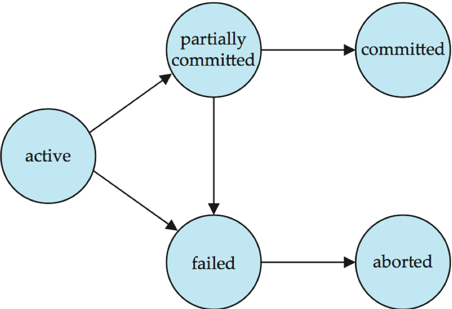
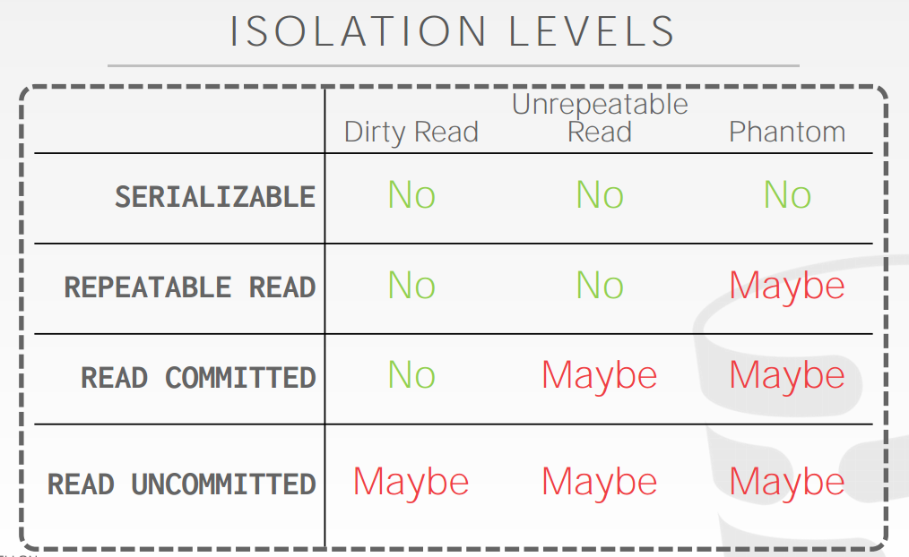

# TRANSACTIONS

> A transaction is the execution of a sequence of one or more operations (e.g., SQL queries) on a shared database to perform some higher-level function. It is the basic unit of change in a DBMS:
> → Partial transactions are not allowed!
>
> A transaction is a unit of program execution that accesses and  possibly updates various data items.

- **Two main issues to deal with:**

  + Failures of various kinds, such as hardware failures and system crashes

  + Concurrent execution of multiple transactions


**STRAWMAN SYSTEM**

Execute each txn one-by-one (i.e., serial order) as they arrive at the DBMS.
→ One and only one txn can be running at the same time in the DBMS.

Before a txn starts, copy the entire database to a new file and make all changes to that file.
→ If the txn completes successfully, overwrite the original file with the new one.
→ If the txn fails, just remove the dirty copy

A (potentially) better approach is to allow concurrent execution of independent transactions.
Why do we want that?
→ Utilization/throughput &  Increased response times to users.
But we also would like:
→ Correctness &  Fairness

Hard to ensure correctness…
→ What happens if Andy only has $100 and tries to pay off two bookies at the same time?
Hard to execute quickly…
→ What happens if Andy needs to pay off his gambling debts very quickly all at once?


**PROBLEM STATEMENT**
Arbitrary interleaving can lead to
→ Temporary inconsistency (ok, unavoidable)
→ Permanent inconsistency (bad!) Need formal correctness criteria.

**DEFINITIONS**
A txn may carry out many operations on the data retrieved from the database
However, the DBMS is only concerned about what data is read/written from/to the database.
→ Changes to the "outside world" are beyond the scope of the DBMS.

**FORMAL DEFINITIONS**
Database: A fixed set of named data objects (e.g., A, B, C, …).
→ We do not need to define what these objects are now. Transaction: A sequence of read and write operations ( R(A), W(B), …)
→ DBMS’s abstract view of a user program

**TRANSACTIONS IN SQL**
A new txn starts with the BEGIN command.
The txn stops with either **COMMIT** or **ABORT:**
→ If commit, all changes are saved.
→ If abort, all changes are undone so that it’s like as if the txn never executed at all.
→ Abort can be either self-inflicted or caused by the DBMS.

## **Transaction State**

**Active** – the initial state; the transaction stays in this state while it is executing

**Partially committed** – after the final statement has been executed.

**Failed** -- after the discovery that normal execution can no longer proceed.

**Aborted** – after the transaction has been rolled back and the database restored to its state prior to the start of the transaction.  Two options after it has been aborted:

- Restart the transaction
   can be done only if no internal logical error
- Kill the transaction

**Committed** – after successful completion.




A transaction in SQL ends by:
Commit work commits current transaction and begins a new one.
Rollback work causes current transaction to abort.

## Required Properties of a Transaction：ACID

Atomicity: “all or nothing”
Consistency: “it looks correct to me”
Isolation: “as if alone”
Durability: “survive failures”

### Atomicity

All actions in the txn happen, or none happen.

Two possible outcomes of executing a txn:

- Commit after completing all its actions.
-  Abort (or be aborted by the DBMS) after executing some actions.

DBMS guarantees that txns are atomic.
 From user’s point of view: txn always either executes all its actions, or executes no actions at all.

**MECHANISMS FOR ENSURING ATOMICITY**

- Approach #1: Logging
  → DBMS logs all actions so that it can undo the actions of aborted transactions.
  → Think of this like the black box in airplanes… Logging used by all modern systems.
  → Audit Trail & Efficiency Reasons

- Approach #2: Shadow Paging
  → DBMS makes copies of pages and txns make changes to those copies. Only when the txn commits is the page made visible to others.
  → Originally from System R. 


### Consistency

If each txn is consistent and the DB starts consistent, then it ends up consistent.

The "world" represented by the database is logically correct. All questions asked about the data are given logically correct answers.

#### Database Consistency

The database accurately models the real world and follows **integrity constraints.**

In general, consistency requirements include 

- **Explicitly specified integrity constraints** such as primary keys and foreign keys

- **Implicit integrity constraints**

  > e.g., sum of balances of all accounts, minus sum of loan amounts must equal value of cash-in-hand

Transactions in the future see the effects of transactions committed in the past inside of the database.

#### Transaction Consistency

If the database is consistent before the transaction starts (running alone), it will also be consistent after. Transaction consistency is the application’s responsibility


A transaction, when starting to execute,  must see a consistent database.

During transaction execution the database may be temporarily inconsistent.

When the transaction completes successfully the database must be consistent

- Erroneous transaction logic can lead to inconsistency

### Isolation

Although multiple transactions may execute concurrently, each transaction must be unaware of other concurrently executing transactions.  Intermediate transaction results must be hidden from other concurrently executed transactions.  Execution of one txn is isolated from that of other txns.

Concurrency is achieved by DBMS, which  interleaves actions (reads/writes of DB objects) of various transactions.

#### MECHANISMS FOR ENSURING ISOLATION

A concurrency control protocol is how the DBMS decides the proper interleaving of operations from multiple transactions.
**Two categories of protocols:**
→ Pessimistic: Don’t let problems arise in the first place.
→ Optimistic: Assume conflicts are rare, deal with them after they happen.

**INTERLEAVING TRANSACTIONS**
We interleave txns to maximize concurrency.
→ Slow disk/network I/O.
→ Multi-core CPUs.
When one txn stalls because of a resource (e.g., page fault), another txn can continue executing and make forward progress.

**CORRECTNESS**
How do we judge whether a schedule is correct?
If the schedule is **equivalent to some serial execution**.

### Durability

After a transaction completes successfully, the changes it has made to the database persist, even if there
are system failures. 

All of the changes of committed transactions should be persistent.
→ No torn updates.
→ No changes from failed transactions.
The DBMS can use either logging or shadow paging to ensure that all changes are durable.


## **Concurrent Executions**

 ### **Advantages** 

- *Increased processor and disk utilization*, leading to better transaction throughput

  > E.g. one transaction can be using the CPU while another is reading from or writing to the disk

- *Reduced average response time* for transactions: short transactions need not wait behind long ones.

### **Concurrency control schemes** 

> mechanisms  to achieve isolation

That is, to **control the interaction among the concurrent transactions** in order to prevent them from destroying the consistency of the database

Will study in Chapter 15, after studying notion of correctness of concurrent executions.

## Schedules

a sequences of instructions that specify the chronological order in which instructions of concurrent transactions are executed

- A schedule for a set of transactions must consist of all instructions of those transactions
- Must preserve the order in which the instructions appear in each individual transaction.

A transaction that successfully completes its execution will have a commit instructions as the last statement 

- By default transaction assumed to execute commit instruction as its last step

A transaction that fails to successfully complete its execution will have an abort instruction as the last statement。

### Formal Properties

- Serial Schedule
  → A schedule that does not interleave the actions of different transactions.
- Equivalent Schedules
  → For any database state, the effect of executing the first schedule is identical to the effect of executing the second schedule.
  → Doesn't matter what the arithmetic operations are!
- Serializable Schedule
  → A schedule that is equivalent to some serial execution of the transactions.

### **Serializability**

Basic Assumption – Each transaction preserves database consistency.
Thus, serial execution of a set of transactions preserves database consistency.
A (possibly concurrent) schedule is serializable if it is equivalent to a serial schedule.  Different forms of schedule equivalence give rise to the notions of:

1.	conflict serializability
2.	view serializability

If each transaction preserves consistency, every serializable schedule preserves consistency

Serializability is a less intuitive notion of correctness compared to txn initiation time or commit order, but it provides the DBMS with additional flexibility in scheduling operations.
More flexibility means better parallelism.

#### Conflicting Operation

We need a formal notion of equivalence that can  be implemented efficiently based on the notion of "conflicting" operations
Two operations conflict if:
→ They are by different transactions,
→ They are on the same object and at least one of them is a write.

**INTERLEAVED EXECUTION ANOMALIES**

- Read-Write Conflicts (R-W)

  Unrepeatable Reads

- Write-Read Conflicts (W-R)

  Reading Uncommitted Data ("Dirty Reads")

- Write-Write Conflicts (W-W)

  Overwriting Uncommitted Data

Given these conflicts, we now can understand what it means for a schedule to be serializable.
→ This is to check whether **schedules are correct.**
→ This is not how to **generate a correct schedule.**

#### **Different levels of serializability:**

##### Conflict Serializability

Most DBMSs try to support this.

**Type 1:**

Two schedules are **conflict equivalent** iff:
	→ They involve the same actions of the same transactions, and
	→ Every pair of conflicting actions is ordered the same way.

If a schedule S can be transformed into a schedule S´  by a series of swaps of non-conflicting instructions, we say that S and S´ are **conflict equivalent.**

**Type 2:**

Schedule S is **conflict serializable** if:
	→ S is conflict equivalent to some serial schedule.

We say that a schedule S is **conflict serializable** if it is conflict equivalent to a serial schedule.

> 即，一个不serial schedule经过一系列不confict操作可以转换为一个serial schedule。

**CONFLICT SERIALIZABILIT Y INTUITION**
Schedule S is conflict serializable if you are able to transform S into a serial schedule by **swapping consecutive non-conflicting operations** of different transactions.

If a schedule S can be transformed into a schedule S´  by a series of swaps of non-conflicting instructions, we say that S and S´ are **conflict equivalent.**

We say that a schedule S is **conflict serializable** if it is conflict equivalent to a serial schedule

**DEPENDENCY GRAPHS**

> a direct graph where the vertices are the transactions (names).

One node per txn.
Edge from Ti to Tj if:
→ An operation Oi of Ti conflicts with an operation Oj of Tj and
→ O_i appears earlier in the schedule than Oj.
Also known as a precedence graph. A schedule is conflict serializable iff its dependency graph is acyclic.

#### View Serializability

No DBMS can do this.

Alternative (weaker) notion of serializability. Schedules S1 and S2 are view equivalent if:
→ If T_1 reads initial value of A in S1, then T1 also reads initial value of A in S_2.
→ If T_1 reads value of A written by T2 in S1, then T1 also reads value of A written by T2 in S2.

→ If T_1 writes final value of A in S1, then T1 also writes final value of A in S_2.

**SERIALIZABILITY**
View Serializability allows for (slightly) more schedules than Conflict Serializability does.
→ But is difficult to enforce efficiently.
Neither definition allows all schedules that you would consider "serializable".
→ This is because they don’t understand the meanings of the operations or the data (recall example #3)

In practice, Conflict Serializability is what systems support because it can be enforced efficiently.
To allow more concurrency, some special cases get handled separately at the application level.

### Special Schedule

- **Recoverable schedule** 

  > if a transaction Tj reads a data item previously written by a transaction Ti , then the commit operation of Ti  must appear before the commit operation of Tj.

- **Cascading rollback** 

  > a single transaction failure leads to a series of transaction rollbacks.  Consider the following schedule where none of the transactions has yet committed (so the schedule is recoverable)

- **Cascadeless Schedules**

  > + for each pair of transactions Ti and Tj such that Tj  reads a data item previously written by Ti, the commit operation of Ti  appears before the read operation of Tj.
  > + Every cascadeless schedule is also recoverable
  > + It is desirable to restrict the schedules to those that are cascadeless

### **Levels of Consistency in SQL-92**

**Serializable** — default

**Repeatable read** — only committed records to be read, repeated reads of same record must return same value.  However, a transaction may not be serializable – it may find some records inserted by a transaction but not find others.

**Read committed** — only committed records can be read, but successive reads of record may return different (but committed) values.

**Read uncommitted** — even uncommitted records may be read. 

# Concurrency Control 

Concurrency control and recovery are among the most important functions provided by a DBMS.
Concurrency control is automatic。
→ System automatically inserts lock/unlock requests and schedules actions of different txns.
→ Ensures that resulting execution is equivalent to executing the txns one after the other in some order.

Multiple transactions are allowed to run concurrently in the system. 

## **Lock-Based Protocols**

A lock is a mechanism to control concurrent access to a data item
Data items can be locked in two modes :
    1.  **exclusive (X) mode.** Data item can be both read as well as   
         written. X-lock is requested using  lock-X instruction.
    2.  **shared (S) mode.** Data item can only be read. S-lock is          
         requested using  lock-S instruction.
Lock requests are made to the concurrency-control manager by the programmer. Transaction can proceed only after request is granted.

A  locking protocol is a set of rules followed by all transactions while requesting and releasing locks. Locking protocols restrict the set of possible schedules.

# Two-Phase Locking (2PL)

→ Determine serializability order of conflicting operations at runtime while txns execute.

We need a way to guarantee that all execution schedules are correct (i.e., serializable) without knowing the entire schedule ahead of time.
Solution: Use locks to protect database objects.

Two-phase locking (2PL) is a concurrency control protocol that determines whether a txn is allowed to access an object in the database on the fly.
The protocol does not need to know all of the queries that a txn will execute ahead of time.

This protocol ensures conflict-serializable schedules.

> 当且仅当某组并发事务的交叉调度产生的结果和这些事务的某一串行调度的结果相同，则称这个交叉调度是**可串行化**。可串行化是并行事务正确性的准则，一个交叉调度，当且仅当它是可串行化的，它才是正确的。两段锁协议是保证并行事务可串行化的方法。

## Step

Phase #1: Growing
→ Each txn requests the locks that it needs from the DBMS’s lock manager.
→ The lock manager grants/denies lock requests.

> 可得锁，不放锁

Phase #2: Shrinking
→ The txn is allowed to only release locks that it previously  acquired. It cannot acquire new locks.

> 可放锁，不得锁

The txn is not allowed to acquire/upgrade locks after the growing phase finishes.

The protocol assures serializability. It can be proved that the transactions can be serialized in the order of their **lock points**  (i.e., the point where a transaction acquired its final lock). 

2PL on its own is sufficient to guarantee conflict serializability.
→ It generates schedules whose precedence graph is acyclic. But it is subject to cascading aborts.

> 对于遵守两段协议的事务，其交叉并发操作的执行结果一定是正确的。值得注意的是，上述定理是充分条件，不是必要条件。一个可串行化的并发调度的所有事务并不一定都符合两段锁协议，存在不全是2PL的事务的可串行化的并发调度。同时我们必须指出，遵循两段锁协议的事务有可能发生死锁。


**lock conversion**

共享锁是允许向排它锁升级的，排它锁是允许向共享锁降级的，升级（upgrade）和降级（downgrade）操作，称为锁转换（lock conversion）。升级只能发生在增长阶段，降级只能发生在缩减阶段。升降级发生在同一个事务内部，但目的也是为了提高多个事务之间的并发度。同一个事物内部比较锁是否兼容，用到的是锁的升级列表，这与锁的兼容性列表是不同的。

## Problem

There are potential schedules that are serializable but would not be allowed by 2PL.
→ Locking limits concurrency.
May still have "dirty reads".
→ Solution: Strict 2PL
May lead to deadlocks.
→ Solution: Detection or Prevention

The potential for deadlock exists in most locking protocols. Deadlocks are a necessary evil.

When a deadlock occurs there is a possibility of **cascading roll-backs.** 

Cascading roll-back is possible under two-phase locking. To avoid this, follow a modified protocol called strict two-phase locking -- a transaction must hold all its exclusive locks till it commits/aborts.

Rigorous two-phase locking is even stricter. Here, all locks are held till commit/abort. In this protocol transactions can be serialized in the order in which they commit.

> 两阶段封锁协议实现了事务集的串行化调度，但同时，一个事务的失败可能会引起一连串事务的回滚。为避免这种情况的发生，我们需要进一步加强对两阶段封锁协议的控制，这就是：严格两阶段封锁协议和强两阶段封锁协议。
>
> 严格两阶段封锁协议除了要求封锁是两阶段之外，还要求事务持有的所有排它锁必须在事务提交之后方可释放。这个要求保证未提交事务所写的任何数据，在该事务提交之前均以排它锁封锁，防止其他事务读取这些数据。
>
> 强两阶段封锁协议，要求事务提交之前不得释放任何锁。使用锁机制的数据库系统，要么使用严格两阶段封锁协议，要么使用强两阶段封锁协议。
>
> 两阶段封锁协议并不保证不会发生死锁，数据库系统必须采取其他的措施，预防和解决死锁问题。

## Strict 2PL

The txn is not allowed to acquire/upgrade locks after the growing phase finishes.
Allows only conflict serializable schedules, but it is often stronger than needed for some apps.

A schedule is strict if a value written by a txn is not read or overwritten by other txns until that txn finishes.
Advantages:
→ Does not incur cascading aborts.
→ Aborted txns can be undone by just restoring original values of modified tuples.

### **Implementation of Locking**

A lock manager can be implemented as a separate process to which transactions send lock and unlock requests

The lock manager replies to a lock request by sending a lock grant messages (or a message asking the transaction to roll back, in case of  a deadlock)

The requesting transaction waits until its request is answered

The lock manager maintains a data-structure called a lock table to record granted locks and pending requests

The lock table is usually implemented as an in-memory hash table indexed on the name of the data item being locked


## Deadlock 

A deadlock is a cycle of transactions waiting for locks to be released by each other.
Two ways of dealing with deadlocks:
→ Approach #1: Deadlock Detection
→ Approach #2: Deadlock Prevention

### Deadlock Detection

The DBMS creates a **waits-for graph** to keep track of what locks each txn is waiting to acquire:
→ Nodes are transactions
→ Edge from Ti to Tj if Ti is waiting for Tj to release a lock.
The system will periodically check for cycles in waits-for graph and then make a decision on how
to break it.

When the DBMS detects a deadlock, it will select a "victim" txn to rollback to break the cycle.
The victim txn will either restart or abort(more common) depending on how it was invoked.
There is a trade-off between the frequency of checking for deadlocks and how long txns have to wait before deadlocks are broken.

**VICTIM SELECTION**

Selecting the proper victim depends on a lot of different variables….
→ By age (lowest timestamp)
→ By progress (least/most queries executed)
→ By the # of items already locked
→ By the # of txns that we have to rollback with it
We also should consider the # of times a txn has been restarted in the past to prevent starvation.

**ROLLBACK LENGTH**

After selecting a victim txn to abort, the DBMS can also decide on how far to rollback the txn’s changes.
Approach #1: Completely
Approach #2: Minimally

### Deadlock Prevention
Deadlock prevention protocols ensure that the system will never enter into a deadlock state. 

Some prevention strategies :

- Require that each transaction locks all its data items before it begins execution (predeclaration).
- Impose partial ordering of all data items and require that a transaction can lock data items only in the order specified by the partial order.

Following schemes use transaction **timestamps** for the sake of deadlock prevention alone.

**(1)wait-die scheme — non-preemptive**

older transaction may wait for younger one to release data item. (older means smaller timestamp) Younger transactions never Younger transactions never wait for older ones; they are rolled back instead.
a transaction may die several times before acquiring needed data item

**(2)wound-wait scheme — preemptive**

older transaction wounds (forces rollback) of younger transaction instead of waiting for it. Younger transactions may wait for older ones.
may be fewer rollbacks than wait-die scheme.

When a txn tries to acquire a lock that is held by another txn, the DBMS kills one of them to prevent a deadlock. This approach does not require a waits-for graph or detection algorithm.

**(3)Timeout-Based Schemes:**

Both in wait-die and in wound-wait schemes, a rolled back transactions is restarted with its original timestamp. Older transactions thus have precedence over newer ones, and starvation is hence avoided.

a transaction waits for a lock only for a specified amount of time. If the lock has not been granted within that time, the transaction is rolled back and restarted,
Thus, deadlocks are not possible
simple to implement; but starvation is possible. Also difficult to determine good value of the timeout interval

Assign priorities based on timestamps:
→ Older Timestamp = Higher Priority (e.g., T1 > T2)

- Wait-Die ("Old Waits for Young")
  → If requesting txn has higher priority than holding txn, then requesting txn waits for holding txn.
  → Otherwise requesting txn aborts.

- Wound-Wait ("Young Waits for Old")
  → If requesting txn has higher priority than holding txn, then holding txn aborts and releases lock.
  → Otherwise requesting txn waits.

## Hierarchical Locking

### **Intention Lock Modes**

An intention lock allows a higher level node to be locked in shared or exclusive mode without
having to check all descendent nodes. If a node is in an intention mode, then explicit locking is being done at a lower level in the tree.

- Intention-Shared (IS)
  → Indicates explicit locking at a lower level with shared locks.

- Intention-Exclusive (IX)
  → Indicates locking at lower level with exclusive or shared locks.
- Shared+Intention-Exclusive (SIX)
  → The subtree rooted by that node is locked explicitly in shared mode and explicit locking is being done at a lower level with exclusive-mode locks.

**LOCKING PROTOCOL**
Each txn obtains appropriate lock at highest level of the database hierarchy.
To get S or IS lock on a node, the txn must hold at least IS on parent node.
To get X, IX, or SIX on a node, must hold at least IX on parent node

**MULTIPLE LOCK GRANULARITIES**
Hierarchical locks are useful in practice as each txn only needs a few locks.
Intention locks help improve concurrency:
→ Intention-Shared (IS): Intent to get S lock(s) at finer granularity.
→ Intention-Exclusive (IX): Intent to get X lock(s) at finer granularity.
→ Shared+Intention-Exclusive (SIX): Like S and IX at the same time.

**Lock escalation**

Lock escalation dynamically asks for coarsergrained locks when too many low level locks
acquired.
This reduces the number of requests that the lock manager has to process.

**LOCK TABLE**
Explicitly locks a table.
Not part of the SQL standard.
→ Postgres/DB2/Oracle Modes: SHARE, EXCLUSIVE
→ MySQL Modes: READ, WRITE

```SQL
---postgresql
LOCK TABLE <table> IN <mode> MODE;
---mysql
LOCK TABLE <table> <mode>;
```

SELECT...FOR UPDATE
Perform a select and then sets an exclusive lock on
the matching tuples.
Can also set shared locks:
→ Postgres: FOR SHARE
→ MySQL: LOCK IN SHARE MODE

```sql
SELECT * FROM <table>
WHERE <qualification> FOR UPDATE;
```


# Timestamp Ordering (T/O) 

The protocol manages concurrent execution such that the time-stamps determine the serializability orde

> Determine serializability order of txns before they execute.


If TS(T_i) < TS(T_j), then the DBMS must ensure that the execution schedule is equivalent to a serial schedule where T_i appears before T_j.

**TIMESTAMP ALLOCATION**

Each txn T_i is assigned a unique fixed timestamp that is monotonically increasing.
→ Let TS(Ti) be the timestamp allocated to txn Ti.
→ Different schemes assign timestamps at different times during the txn.
Multiple implementation strategies:
→ System Clock.
→ Logical Counter.
→ Hybrid.

### Basic T/O

Txns read and write objects without locks.
Every object X is tagged with timestamp of the last txn that successfully did read/write:
→ W-TS(X) – Write timestamp on X
→ R-TS(X) – Read timestamp on X

> W-timestamp(Q) is the largest time-stamp of any transaction that executed write(Q) successfully.
> R-timestamp(Q) is the largest time-stamp of any transaction that executed read(Q) successfully.

 timestamps for every operation:
→ If txn tries to access an object "from the future", it aborts and restarts.

Optimistic Concurrency Control
Partition-based Timestamp Ordering
Isolation Levels

The timestamp ordering protocol ensures that any conflicting read and write operations are executed in timestamp order.

#### READS

If TS(Ti) < W-TS(X), this violates timestamp order of T_i with regard to the writer of X.
→ Abort T_i and restart it with same TS.
Else:
→ Allow T_i to read X.
→ Update R-TS(X) to max(R-TS(X), TS(Ti))
→ Have to make a local copy of X to ensure repeatable readsfor T_i.


#### WRITES
If TS(Ti) < R-TS(X) or TS(Ti) < W-TS(X)
→ Abort and restart T_i.
Else:
→ Allow T_i to write X and update W-TS(X)
→ Also have to make a local copy of X to ensure repeatable reads for T_i.

THOMAS WRITE RULE
If TS(Ti) < R-TS(X):
→ Abort and restart Ti.
If TS(Ti) < W-TS(X):
→ Thomas Write Rule: Ignore the write and allow the txn to continue.
→ This violates timestamp order of Ti.
Else:
→ Allow Ti to write X and update W-TS(X)

Generates a schedule that is conflict serializable if you do not use the Thomas Write Rule.
→ No deadlocks because no txn ever waits.
→ Possibility of starvation for long txns if short txns keep causing conflicts.

Permits schedules that are not recoverable.

**RECOVERABLE SCHEDULES**
A schedule is recoverable if txns commit only after all txns whose changes they read, commit.
Otherwise, the DBMS cannot guarantee that txns read data that will be restored after recovering from a crash.

**PERFORMANCE ISSUES**
High overhead from copying data to txn’s workspace and from updating timestamps.
Long running txns can get starved.
→ The likelihood that a txn will read something from a newer txn increases.

If you assume that conflicts between txns are rare and that most txns are short-lived, then forcing txns to wait to acquire locks adds a lot of overhead.
A better approach is to optimize for the noconflict case.

### OPTIMISTIC CONCURRENCY CONTROL

The DBMS creates a private workspace for each txn.
→ Any object read is copied into workspace.
→ Modifications are applied to workspace.
When a txn commits, the DBMS compares workspace write set to see whether it conflicts with other txns. If there are no conflicts, the write set is installed into the "global" database.

1 – Read Phase:

→ Track the read/write sets of txns and store their writes in
a private workspace.

2 – Validation Phase:

→ When a txn commits, check whether it conflicts with
other txns.

3 – Write Phase:

→ If validation succeeds, apply private changes to database.
Otherwise abort and restart the txn.

**VALIDATION PHASE**
The DBMS needs to guarantee only serializable
schedules are permitted.
Ti checks other txns for RW and WW conflicts
and makes sure that all conflicts go one way (from
older txns to younger txns).

**SERIAL VALIDATION**
Maintain global view of all active txns.
Record read set and write set while txns are
running and write into private workspace.
Execute Validation and Write phase inside a
protected critical section

**VALIDATION PHASE**
Each txn's timestamp is assigned at the beginning
of the validation phase.
Check the timestamp ordering of the committing
txn with all other running txns.
If TS(Ti) < TS(Tj), then one of the following
three conditions must hold…

VALIDATION STEP #1
Ti completes all three phases before Tj begins.

VALIDATION STEP #2
Ti completes before Tj starts its Write phase, and
Ti does not write to any object read by Tj.
→ WriteSet(Ti) ∩ ReadSet(Tj) = Ø

VALIDATION STEP #3
Ti completes its Read phase before Tj completes its Read phase
And Ti does not write to any object that is either read or written by Tj:
→ WriteSet(Ti) ∩ ReadSet(Tj) = Ø
→ WriteSet(Ti) ∩ WriteSet(Tj) = Ø


OCC works well when the # of conflicts is low:
→ All txns are read-only (ideal).
→ Txns access disjoint subsets of data.
If the database is large and the workload is not skewed, then there is a low probability of conflict, so again locking is wasteful.

High overhead for copying data locally.
Validation/Write phase bottlenecks.
Aborts are more wasteful than in 2PL because they only occur after a txn has already executed.

When a txn commits, all previous T/O schemes check to see whether there is a conflict with
concurrent txns.
→ This requires latches.
If you have a lot of concurrent txns, then this is slow even if the conflict rate is low.

### PARTITION-BASED T/O
Split the database up in disjoint subsets called
horizontal partitions (aka shards).
Use timestamps to order txns for serial execution
at each partition.
→ Only check for conflicts between txns that are running in
the same partition.

Txns are assigned timestamps based on when they arrive at the DBMS.
Partitions are protected by a single lock:
→ Each txn is queued at the partitions it needs.
→ The txn acquires a partition’s lock if it has the lowest timestamp in that partition’s queue.
→ The txn starts when it has all of the locks for all the partitions that it will read/write.

**READS**
Txns can read anything that they want at the partitions that they have locked.
If a txn tries to access a partition that it does not have the lock, it is aborted + restarted.

**WRITES**
All updates occur in place.
→ Maintain a separate in-memory buffer to undo changes if the txn aborts.
If a txn tries to write to a partition that it does not have the lock, it is aborted + restarted

**PERFORMANCE ISSUES**
Partition-based T/O protocol is fast if:
→ The DBMS knows what partitions the txn needs before it starts.
→ Most (if not all) txns only need to access a single  partition.
Multi-partition txns causes partitions to be idle while txn executes

DYNAMIC DATABASES
Recall that so far we have only dealing with
transactions that read and update data.
But now if we have insertions, updates, and
deletions, we have new problems…

THE PHANTOM PROBLEM

How did this happen?
→ Because T
1 locked only existing records and not ones
under way!
Conflict serializability on reads and writes of
individual items guarantees serializability only if
the set of objects is fixed.

PREDICATE LOCKING
Lock records that satisfy a logical predicate:
→ Example: status='lit'
In general, predicate locking has a lot of locking
overhead.
Index locking is a special case of predicate locking
that is potentially more efficient

**INDEX LOCKING**
If there is a dense index on the status field then the
txn can lock index page containing the data with
status='lit'.
If there are no records with status='lit', the
txn must lock the index page where such a data
entry would be, if it existed.

**LOCKING WITHOUT AN INDEX**
If there is no suitable index, then the txn must obtain:
→ A lock on every page in the table to prevent a record’s
status='lit' from being changed to lit.
→ The lock for the table itself to prevent records with
status='lit' from being added or deleted.

REPEATING SCANS
An alternative is to just re-execute every scan again when the txn commits and check whether it gets the same result.
→ Have to retain the scan set for every range query in a txn.
→ Andy doesn't know of any commercial system that does this (only just Silo?)

WEAKER LEVELS OF ISOL ATION
Serializability is useful because it allows
programmers to ignore concurrency issues.
But enforcing it may allow too little concurrency
and limit performance.
We may want to use a weaker level of consistency
to improve scalability.

#### ISOLATION LEVELS
Controls the extent that a txn is exposed to the
actions of other concurrent txns.
Provides for greater concurrency at the cost of
exposing txns to uncommitted changes:
→ Dirty Reads
→ Unrepeatable Reads
→ Phantom Reads


SERIALIZABLE: No phantoms, all reads repeatable,
no dirty reads.
REPEATABLE READS: Phantoms may happen.
READ COMMITTED: Phantoms and unrepeatable
reads may happen.
READ UNCOMMITTED: All of them may happen.



SERIALIZABLE: Obtain all locks first; plus index
locks, plus strict 2PL.
REPEATABLE READS: Same as above, but no index
locks.
READ COMMITTED: Same as above, but S locks are
released immediately.
READ UNCOMMITTED: Same as above, but allows
dirty reads (no S locks).

SQL-92 ISOL ATION LEVELS
You set a txn's isolation level before
you execute any queries in that txn.
Not all DBMS support all isolation
levels in all execution scenarios
→ Replicated Environments
The default depends on implementation…

```SQL
SET TRANSACTION ISOLATION LEVEL <isolation-level>;
BEGIN TRANSACTION ISOLATION LEVEL <isolation-level>;
```

**SQL-92 ACCESS MODES**
You can provide hints to the DBMS
about whether a txn will modify the
database during its lifetime.
Only two possible modes:
→ READ WRITE (Default)
→ READ ONLY
Not all DBMSs will optimize execution if you set
a txn to in READ ONLY mode.

```SQL
SET TRANSACTION <access-mode>;
BEGIN TRANSACTION <access-mode>;
```


CONCLUSION
Every concurrency control can be broken down
into the basic concepts that I've described in the
last two lectures.
I'm not showing benchmark results because I don't
want you to get the wrong idea.


# Multi-Version Concurrency Control(MVCC)

