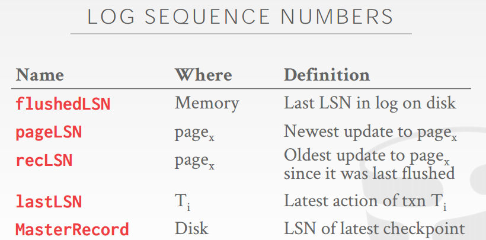

CRASH RECOVERY
Recovery algorithms are techniques to ensure database consistency, transaction atomicity, and durability despite failures.
Recovery algorithms have two parts:
→ Actions during normal txn processing to ensure that the DBMS can recover from a failure.
→ Actions after a failure to recover the database to a state that ensures atomicity, consistency, and durability

# Logging Schemes

## Failure Classification

STORAGE T YPES
Volatile Storage:
→ Data does not persist after power is cut.
→ Examples: DRAM, SRAM
Non-volatile Storage:
→ Data persists after losing power.
→ Examples: HDD, SDD
Stable Storage:
→ A non-existent form of non-volatile storage that survives
all possible failures scenarios.

### Type #1 – Transaction Failures

Logical Errors:
→ Transaction cannot complete due to some internal error condition (e.g., integrity constraint violation).
Internal State Errors:
→ DBMS must terminate an active transaction due to an error condition (e.g., deadlock)

### Type #2 – System Failures

Software Failure:
→ Problem with the DBMS implementation (e.g., uncaught divide-by-zero exception).
Hardware Failure:
→ The computer hosting the DBMS crashes (e.g., power plug gets pulled).
→ Fail-stop Assumption: Non-volatile storage contents are assumed to not be corrupted by system crash.

### Type #3 – Storage Media Failures

Non-Repairable Hardware Failure:
→ A head crash or similar disk failure destroys all or part of non-volatile storage.
→ Destruction is assumed to be detectable (e.g., disk controller use checksums to detect failures).
No DBMS can recover from this! Database must be restored from archived version.

OBSERVATION
The primary storage location of the database is on non-volatile storage, but this is much slower than
volatile storage.
Use volatile memory for faster access:
→ First copy target record into memory.
→ Perform the writes in memory.
→ Write dirty records back to disk.

The DBMS needs to ensure the following guarantees:
→ The changes for any txn are durable once the DBMS has told somebody that it committed.
→ No partial changes are durable if the txn aborted.

## Buffer Pool Policies

### UNDO VS. REDO

Undo: The process of removing the effects of an incomplete or aborted txn.
Redo: The process of re-instating the effects of a committed txn for durability.
How the DBMS supports this functionality depends on how it manages the buffer pool 

### STEAL POLICY

Whether the DBMS allows **an uncommitted txn to overwrite** the most recent committed value of an
object in non-volatile storage.
STEAL: Is allowed.
NO-STEAL: Is not allowed.

### FORCE POLICY
Whether the DBMS requires that all updates made by a txn are reflected on non-volatile storage
before the txn is allowed to commit.
FORCE: Is enforced.
NO-FORCE: Is not enforced

NO-STEAL + FORCE
This approach is the easiest to implement:
→ Never have to undo changes of an aborted txn because
the changes were not written to disk.
→ Never have to redo changes of a committed txn because
all the changes are guaranteed to be written to disk at
commit time.

## Shadow Paging

Maintain two separate copies of the database (master, shadow). Updates are only made in the shadow copy. When a txn commits, atomically switch the shadow to become the new master.
Buffer Pool Policy: NO-STEAL + FORCE

Organize the database pages in a tree structure where the root is a single disk page.
There are two copies of the tree, the master and shadow
→ The root points to the master copy.
→ Updates are applied to the shadow copy

To install the updates, overwrite the root so it points to the shadow, thereby swapping the master
and shadow:
→ Before overwriting the root, none of the transaction’s updates are part of the disk-resident database
→ After overwriting the root, all of the transaction’s updates are part of the disk-resident database.

### UNDO/REDO
Supporting rollbacks and recovery is easy.
Undo: Remove the shadow pages. Leave the master and the DB root pointer alone.
Redo: Not needed at all.

DISADVANTAGES
Copying the entire page table is expensive:
→ Use a page table structured like a B+tree.
→ No need to copy entire tree, only need to copy paths in the tree that lead to updated leaf nodes.
Commit overhead is high:
→ Flush every updated page, page table, and root.
→ Data gets fragmented.
→ Need garbage collection

## Write-Ahead Log

Record the changes made to the database in a log file before the change is made.
→ Assume that the log is on stable storage.
→ Log contains sufficient information to perform the necessary undo and redo actions to restore the databaseafter a crash.
Buffer Pool Policy: STEAL + NO-FORCE

The DBMS stages all of a txn's log records in volatile storage (usually backed by buffer pool).
All log records pertaining to an updated page are written to non-volatile storage before the page itself is over-written in non-volatile storage. A txn is not considered committed until all its log records have been written to stable storage

Write a <BEGIN> record to the log for each txn to
mark its starting point.
When a txn finishes, the DBMS will:
→ Write a <COMMIT> record on the log
→ Make sure that all log records are flushed before it
returns an acknowledgement to application

Each log entry contains information about the
change to a single object:
→ Transaction Id
→ Object Id
→ Before Value (UNDO)
→ After Value (REDO)

### IMPLEMENTATION
1) When should the DBMS write log entries to disk?

> → When the transaction commits.
> → Can use group commit to batch multiple log flushes together to amortize overhead.

2) When should the DBMS write dirty records to disk?

→ Every time the txn executes an update?
→ Once when the txn commits?

DEFERRED UPDATES
If we prevent the DBMS from writing dirty records to disk until the txn commits, then we don’t need to store their original values.

This won’t work if the change set of a txn is larger than the amount of memory available.
The DBMS cannot undo changes for an aborted txn if it doesn’t have the original values in the log.
We need to use the STEAL policy

## Checkpoints

The WAL will grow forever.
After a crash, the DBMS has to replay the entire
log which will take a long time.
The DBMS periodically takes a checkpoint where
it flushes all buffers out to disk

Output onto stable storage all log records currently
residing in main memory.
Output to the disk all modified blocks.
Write a <CHECKPOINT> entry to the log and flush
to stable storage.

CHALLENGES
We have to stall all txns when take a checkpoint to
ensure a consistent snapshot.
Scanning the log to find uncommitted txns can
take a long time.
Not obvious how often the DBMS should take a
checkpoint…

FREQUENCY
Checkpointing too often causes the runtime
performance to degrade.
→ System spends too much time flushing buffers.
But waiting a long time is just as bad:
→ The checkpoint will be large and slow.
→ Makes recovery time much longer

## Logging Schemes

### Physical Logging
→ Record the changes made to a specific location in the database.
→ Example: "Diff”
### Logical Logging
→ Record the high-level operations executed by txns.
→ Not necessarily restricted to single page.
→ Example: The UPDATE, DELETE, and INSERT queries invoked by a txn

Logical logging requires less data written in each log record than physical logging.
Difficult to implement recovery with logical  logging if you have concurrent txns.
→ Hard to determine which parts of the database may have been modified by a query before crash.
→ Also takes longer to recover because you must re-execute every txn all over again

### PHYSIOLOGICAL LOGGING
Hybrid approach where log records target a single
page but do not specify data organization of the
page.
This is the most popular approach

# CRASH RECOVERY

ARIES MAIN IDEAS
Write-Ahead Logging:
→ Any change is recorded in log on stable storage before the
database change is written to disk.
→ Has to be STEAL + NO-FORCE.
Repeating History During Redo:
→ On restart, retrace actions and restore database to exact
state before crash.
Logging Changes During Undo:
→ Record undo actions to log to ensure action is not
repeated in the event of repeated failures.

## Log Sequence Numbers

WAL RECORDS
We need to extend our log record format from last class to include additional info.
Every log record now includes a globally unique log sequence number (LSN).
Various components in the system keep track of LSNs that pertain to them

### WRITING LOG RECORDS

Each data page contains a pageLSN.
→ The LSN of the most recent update to that page. System keeps track of flushedLSN.
→ The max LSN flushed so far.
Before page x can be written to disk, we must flush log at least to the point where:
→ pageLSNx ≤ flushedLSN

All log records have an LSN.
Update the pageLSN every time a txn modifies a
record in the page.
Update the flushedLSN in memory every time the
DBMS writes out the WAL buffer to disk.

## Normal Commit & Abort Operations

Normal Commit

Each txn invokes a sequence of reads and writes,
followed by commit or abort.
Assumptions in this lecture:
→ All log records fit within a single page.
→ Disk writes are atomic.
→ Single-versioned tuples with Strict 2PL.
→ STEAL + NO-FORCE buffer management with WAL

TRANSACTION COMMIT
Write COMMIT record to log.
All log records up to txn’s COMMIT record are
flushed to disk.
→ Note that log flushes are sequential, synchronous writes
to disk.
→ Many log records per log page.
When the commit succeeds, write a special TXNEND record to log.
→ This does not need to be flushed immediately

TRANSACTION ABORT
Aborting a txn is actually a special case of the
ARIES undo operation applied to only one
transaction.
We need to add another field to our log records:
→ prevLSN: The previous LSN for the txn.
→ This maintains a linked-list for each txn that makes it
easy to walk through its records

COMPENSATION LOG RECORDS
A CLR describes the actions taken to undo the
actions of a previous update record.
It has all the fields of an update log record plus the
undoNext pointer (the next-to-be-undone LSN).
CLRs are added to log like any other record

ABORT ALGORITHM
First write an ABORT record to log.
Then play back updates in reverse order. For each
update:
→ Write a CLR entry.
→ Restore old value.
At end, write a TXN-END log record.
Notice: CLRs never need to be undone.

## Fuzzy Checkpointing
## Recovery Algorithm