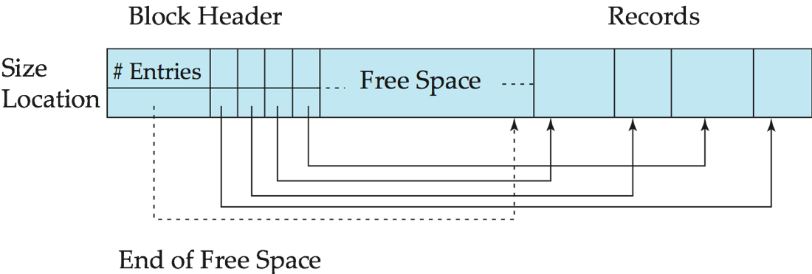

# Part 1

learn how to build software that manages a database.

The DBMS assumes that the primary storage location of the database is on non-volatile disk. The DBMS's components manage the movement of data between non-volatile and volatile storage.

## STORAGE HIERARCHY

- CPU Registers

- CPU Caches 

- DRAM

（1）Volatile （2）Random Access  （3）Byte-Addressable

- SSD
- HDD
- Network Storage

（1）Non-Volatile （2）Sequential Access （3）Block-Addressable

Physical Storage Media

Cache

Main memory

Flash memory

​	 NAND flash

​	 NOR flash.

Magnetic-disk storage

Disks usually connected directly to computer system
In Storage Area Networks (SAN), a large number of disks are connected by a high-speed network to a number of servers
In Network Attached Storage (NAS) networked storage provides a file system interface using networked file system protocol, instead of providing a disk system interface

**SYSTEM DESIGN GOALS**

Allow the DBMS to manage databases that exceed the amount of memory available. Reading/writing to disk is expensive, so it must be managed carefully to avoid large stalls and performance degradation.

### SEQUENTIAL VS. RANDOM ACCESS

Random access on an HDD is much slower than sequential access. Traditional DBMSs are designed to maximize sequential access.

- Algorithms try to reduce number of writes to random pages so that data is stored in contiguous blocks.
- Allocating multiple pages at the same time is called an extent.

## DBMS vs. OS

WHY NOT USE THE OS?

One can use mmap to map the contents of a file into a process' address space.
The OS is responsible for moving data for moving the files' pages in and out of memory。 

What if we allow multiple threads to access the mmap files to hide page fault stalls? This works good enough for read-only access. It is complicated when there are multiple writers

There are some solutions to this problem:
→ madvise: Tell the OS how you expect to read certain pages.
→ mlock: Tell the OS that memory ranges cannot be paged out.
→ msync: Tell the OS to flush memory ranges out to disk.

DBMS (almost) always wants to control things itself and can do a better job at it.
→ Flushing dirty pages to disk in the correct order.
→ Specialized prefetching.
→ Buffer replacement policy.
→ Thread/process scheduling.

### **RAID: Redundant Arrays of Independent Disks**

disk organization techniques that manage a large numbers of disks, providing a view of a single disk of 

- high capacity and high speed  by using multiple disks in parallel,  
- high reliability by storing data redundantly, so that data can be recovered even if  a disk fails 

### Problem #1:

 How the DBMS represents the database in files on disk.

## File Storage

The DBMS stores a database as one or more files on disk.

The **storage manager** is responsible for maintaining a database's files.
It organizes the files as a collection of pages.

- Tracks data read/written to pages.
- Tracks the available space.

## Database Pages 

The DBMS organizes the database across one or more files in fixed-size blocks of data called pages. Pages
can contain different kinds of data (tuples, indexes, etc). Most systems will not mix these types within pages.

Each page is given a unique identifier. If your database is a single file, then the page id can just be the offset.Most DBMSs have an indirection layer that keeps maps a page id to a file path and offset.

There are three concepts of pages in DBMS:

- Hardware page (usually 4KB)
- OS page (4KB)
- Database page (1-16KB)

Each tuple in the database is assigned a unique identifier:

- Most common: page id + offset/slot.
- An application cannot rely on these ids to mean anything.

## TUPLE STORAGE 

A page is a fixed-size block of data.

- It can contain tuples, meta-data, indexes, log records…
-  Most systems do not mix page types.
- Some systems require a page to be self-contained.

Each page is given a unique identifier.

- The DBMS uses an indirection layer to map page ids to physical locations.

### Fixed-Length Records

The database is stored as a collection of files.  Each file is a sequence of records.  A record is a sequence of fields.

- assume record size is fixed
- each file has records of one particular type only 
- different files are used for different relations
- easiest to implement

**Deletion** of record i: 

- do not move records, but link all free records on a free list

**Free Lists**

Store the address of the first deleted record in the file header. Use this first record to store the address of the second deleted record, and so on

### Variable-Length Records

Variable-length records arise in database systems in several ways:

- Storage of multiple record types in a file.
- Record types that allow variable lengths for one or more fields such as strings (varchar)
- Record types that allow repeating fields (used in some older data models).

Attributes are stored in order

Variable length attributes represented by fixed size (offset, length), with actual data stored after all fixed length attributes

Null values represented by null-value bitmap

#### **Slotted Page Structure**

Slotted page header contains:

- number of record entries
- end of free space in the block
- location and size of each record

Records can be moved around within a page to keep them contiguous with no empty space between them; entry in the header must be updated.

Pointers should not point directly to record — instead they should point to the entry for the record in header.

Different DBMSs manage pages in files on disk in different ways.**Organization of Records in Files**

- Heap 

  > a record can be placed anywhere in the file where there is space

  + Suitable for applications that require sequential processing of the entire file.
  + The records in the file are ordered by a search-key.

- Sequential 

  > store records in sequential order, based on the value of the search key of each record

- Hashing 

  > a hash function computed on some attribute of each record; the result specifies in which block of the file the record should be placed

Records of each relation may be stored in a separate file. In a  **multitable clustering file organization**  records of several different relations can be stored in the same file

> Motivation: store related records on the same block to minimize I/O

## DATABASE HEAP

A heap file is an unordered collection of pages where tuples that are stored in random order.

- Get / Delete Page
- Must also support iterating over all pages. 

The DBMS needs a **way to find a page** on disk given a page id.
1. **Linked List:** Header page holds pointers to list for free and data pages.

   Maintain a header page at the beginning of the file that stores two pointers:
   	→ HEAD of the free page list.
   	→ HEAD of the data page list.
   Each page keeps track of the number of free slots in itself.

2. **Page Directory:** DBMS maintains special pages that track locations of data pages

### Data Dictionary Storage

The DBMS maintains special pages that tracks the location of data pages
in the database files.
The directory also records the number of free slots per page.
The DBMS has to make sure that the directory pages are in sync with the
data pages.

The **Data dictionary** (also called **system catalog**) stores **metadata**; 

1. Information about relations
   + names of relations
   + names, types and lengths of attributes of each relation
   + names and definitions of views
   + integrity constraints

2. User and accounting information, including passwords

3. Statistical and descriptive data

   + number of tuples in each relation

4. Physical file organization information

   + How relation is stored (sequential/hash/…)

   + Physical location of relation 

5. Information about indices

### **Storage Access**

A database file is partitioned into fixed-length storage units called blocks.  Blocks are units of both storage allocation and data transfer.

Database system seeks to minimize the number of block transfers between the disk and memory.  We can reduce the number of disk accesses by keeping as many blocks as possible in main memory.

- Buffer

  > portion of main memory available to store copies of disk blocks.

- Buffer manager 

  > subsystem responsible for allocating buffer space in main memory.

## Page Layout

#### PAGE HEADER

Every page contains a header of metadata about the page's contents.

- Page Size
-  Checksum
-  DBMS Version
-  Transaction Visibility
-  Compression Information 

For any page storage architecture, we now need to understand how to **organize the data stored** inside of the page. We are still assuming that we are only storing tuples.
**Two approaches:**

- Tuple-oriented
-  Log-structured

#### **Slotted Pages**

The most common layout scheme is called **slotted pages**.
The slot array maps "slots" to the tuples' starting position offsets.
The header keeps track of:

- The # of used slots
-  The offset of the starting location of the last slot used

#### Log-Structured

Instead of storing tuples in pages, the DBMS only stores log records.
The system appends log records to the file of how the database was modified:

- Inserts store the entire tuple.
-  Deletes mark the tuple as deleted.
-  Updates contain the delta of just the attributes that were modified.

To read a record, the DBMS scans the log backwards and "recreates” the tuple to find what it needs. Build indexes to allow it to jump to locations in the log.

#####  Compaction

Compaction coalesces larger log files into smaller files by removing unnecessary records

## Tuple Layout

A tuple is essentially a sequence of bytes. It's the job of the DBMS to interpret those bytes into attribute types and values.

The DBMS's catalogs contain the schema information about tables that the system uses to figure out the tuple's layout.

### TUPLE HEADER

Each tuple is prefixed with a header that contains meta-data about it.

- Visibility info (concurrency control)
- Bit Map for NULL values.

We do not need to store meta-data about the schema.

### TUPLE DATA

Attributes are typically stored in the order that you specify them when you create the table.

### DENORMALIZED TUPLE DATA

Can physically denormalize (e.g., “pre join") related tuples and store them together in the same page.

- Potentially reduces the amount of I/O for common workload patterns.
-  Can make updates more expensive

### RECORD IDS

The DBMS needs a way to keep track of individual tuples. Each tuple is assigned a unique record identifier.

+ Most common: page_id + offset/slot
+ Can also contain file location info.
+ An application cannot rely on these ids to mean anything. 

**Summary**

Database is organized in pages.
Different ways to track pages.
Different ways to store pages.
Different ways to store tuples.

# Part 2 

- Data Representation

  > This determines how a DBMS stores the actual bits for a value in-memory.

- System Catalogs

- Storage Models

## EXTERNAL VALUE STORAGE

Most DBMSs don't allow a tuple to exceed the size of a single page. To store values that are larger than a
page, the DBMS uses separate overflow storage pages

Some systems allow you to store a really large value in an external file. Treated as a BLOB type.
The DBMS cannot manipulate the contents of an external file.

- No durability protections.
-  No transaction protections

## SYSTEM CATALOGS

A DBMS stores meta-data about databases in its internal catalogs.
→ Tables, columns, indexes, views
→ Users, permissions
→ Internal statistics
Almost every DBMS stores their a database’s catalog in itself.
→ Wrap object abstraction around tuples.
→ Specialized code for "bootstrapping" catalog tables.

You can query the DBMS’s internal **INFORMATION_SCHEMA** catalog to get info about the database.
→ ANSI standard set of read-only views that provide info about all of the tables, views, columns, and procedures in a database. DBMSs also have non-standard shortcuts to retrieve this information.

## Workloads

- OLTP:On-line Transaction Processing

Simple queries that read/update a small
amount of data that is related to a single
entity in the database.

- OLAP:On-line Analytical Processing

Complex queries that read large portions of the database spanning multiple entities.
You execute these workloads on the data you have collected from your OLTP application(s).

**WORKLOAD CHARACTERIZATION**

OLTP :  operation complexity is simple , Workload Focus is Writes

OLAP :  operation complexity is Complex , Workload Focus is Reads

## DATA STORAGE MODELS

The DBMS can store tuples in different ways that are better for either OLTP or OLAP workloads.
We have been assuming the n-ary storage model (aka "row storage") so far this semester.The DBMS can store tuples in different ways that are better for either OLTP or OLAP workloads.

### N-Ary Storage Model (NSM)

The DBMS stores all attributes for a single tuple contiguously in a page.
Ideal for OLTP workloads where queries tend to operate only on an individual entity and insert heavy workloads.

**Advantages**
→ Fast inserts, updates, and deletes.
→ Good for queries that need the entire tuple.
**Disadvantages**
→ Not good for scanning large portions of the table and/or a subset of the attributes

There are two different ways to organize a NSM database:

- Heap Organized Tables: Tuples are stored in blocks called a heap, and the heap does not necessarily
  define an order.
-  Index-Organized Tables: Tuples are stored in the primary key index itself, but different from a
  clustered index.

### Decomposition Storage Model (DSM)

The DBMS stores the values of a single attribute for all tuples contiguously in a page.  Also known as a **"column store".**
Ideal for OLAP workloads where read-only queries perform large scans over a subset of the table’s attributes.

### TUPLE IDENTIFICATION

Choice #1: Fixed-length Offsets

- Each value is the same length for an attribute.

Choice #2: Embedded Tuple Ids

- Each value is stored with its tuple id in a column.

**Advantages**
→ Reduces the amount wasted I/O because the DBMS only reads the data that it needs.
→ Better query processing and data compression 
**Disadvantages**
→ Slow for point queries, inserts, updates, and deletes because of tuple splitting/stitching.

### CONCLUSION

The storage manager is not entirely independent from the rest of the DBMS.
It is important to choose the right storage model for the target workload:
→ OLTP = Row Store
→ OLAP = Column Store

# Buffer Pool

DBMS manages its memory and move data back-and-forth from disk using buffer pool.

**DATABASE STORAGE**

- Spatial Control:
  → Where to write pages on disk.
  → The goal is to keep pages that are used together often as physically close together as possible on disk.

- Temporal Control:
  → When to read pages into memory, and when to write them to disk.
  → The goal is minimize the number of stalls from having to read data from disk

Programs call on the buffer manager when they need a block from disk.

1. If the block is already in the buffer, buffer manager returns the address of the block in main memory
2. If the block is not in the buffer, the buffer manager
   - Allocates space in the buffer for the block
     + Replacing (throwing out) some other block, if required, to make space for the new block.
     + Replaced block written back to disk only if it was modified since the most recent time that it was written to/fetched from the disk.
   - Reads the block from the disk to the buffer, and returns the address of the block in main memory to requester. 

## LOCKS VS. L ATCHES

Locks:
→ Protects the database's logical contents from other
transactions.
→ Held for transaction duration.
→ Need to be able to rollback changes.

Latches:
→ Protects the critical sections of the DBMS's internal data
structure from other threads.
→ Held for operation duration.
→ Do not need to be able to rollback changes

## Buffer Pool Structure

**BUFFER POOL ORGANIZATION**

Memory region organized as an array of fixed-size pages. An array entry is called a frame. When the DBMS requests a page, an exact copy is placed into one of these frames

**BUFFER POOL META-DATA**

The page table keeps track of pages that are currently in memory.
Also maintains additional meta-data per page:

- Dirty Flag
- Pin/Reference Counter 

### PAGE TABLE VS. PAGE DIRECTORY

The **page directory** is the mapping from page ids to page locations in the database files.

- All changes must be recorded on disk to allow the DBMS to find on restart.

The **page table** is the mapping from page ids to a copy of the page in buffer pool frames.

- This is an **in-memory data structure** that does not need to be stored on disk.

## Optimizations

### Multiple Buffer Pools

 The DBMS can also have multiple buffer pools for different purposes. This helps reduce latch contention and improves locality

- Multiple buffer pool instances
- Per-database buffer pool
-  Per-page type buffer pool

Helps reduce latch contention and improve locality.

### PRE-FETCHING

The DBMS can also prefetch pages based on a query plan.
→ Sequential Scans
→ Index Scans

### SCAN SHARING

Queries are able to reuse data retrieved from storage or operator computations. This is different from result caching. Allow multiple queries to attach to a single cursor that scans a table.

- Queries do not have to be exactly the same.
-  Can also share intermediate results.

If a query starts a scan and if there one already doing this, then the DBMS will attach to the
second query's cursor. The DBMS keeps track of where the second query joined with the first so that it can finish the scan when it reaches the end of the data structure.

### BUFFER POOL BYPASS

The sequential scan operator will not store fetched pages in the buffer pool to avoid overhead.
→ Memory is local to running query.
→ Works well if operator needs to read a large sequence of pages that are contiguous on disk.
Called "Light Scans" in Informix

 **OS PAGE CACHE**
Most disk operations go through the OS API. Unless you tell it not to, the OS maintains its own
filesystem cache. Most DBMSs use direct I/O (O_DIRECT) to bypass
the OS's cache.
→ Redundant copies of pages.
→ Different eviction policies.

### **Buffer-Replacement Policies**

When the DBMS needs to free up a frame to make room for a new page, it must decide which page to
evict from the buffer pool.
Goals:
→ Correctness
→ Accuracy
→ Speed
→ Meta-data overhead

#### LEAST-RECENTLY USED

Maintain a timestamp of when each page was last accessed.
When the DBMS needs to evict a page, select the one with the oldest timestamp.
→ Keep the pages in sorted order to reduce the search time on eviction.

#### CLOCK

Approximation of LRU without needing a separate timestamp per page.
→ Each page has a reference bit.
→ When a page is accessed, set to 1.
Organize the pages in a circular buffer with a "clock hand":
→ Upon sweeping, check if a page's bit is set to 1.
→ If yes, set to zero. If no, then evict

**PROBLEMS**
LRU and CLOCK replacement policies are susceptible to sequential flooding.
→ A query performs a sequential scan that reads every page.
→ This pollutes the buffer pool with pages that are read
once and then never again.
The most recently used page is actually the most unneeded page

#### Others

- Pinned block 

  > memory block that is not allowed to be written back to disk.

- Toss-immediate strategy 

  > frees the space occupied by a block as soon as the final tuple of that block has been processed

- Most recently used (MRU) strategy 

  > system must pin the block currently being processed.  After the final tuple of that block has been processed, the block is unpinned, and it becomes the most recently used block.

Buffer manager can use statistical information regarding the probability that a request will reference a particular relation

> the data dictionary is frequently accessed.  Heuristic:  keep data-dictionary blocks in main memory buffer

Buffer managers also support **forced output** of blocks for the purpose of recovery 

