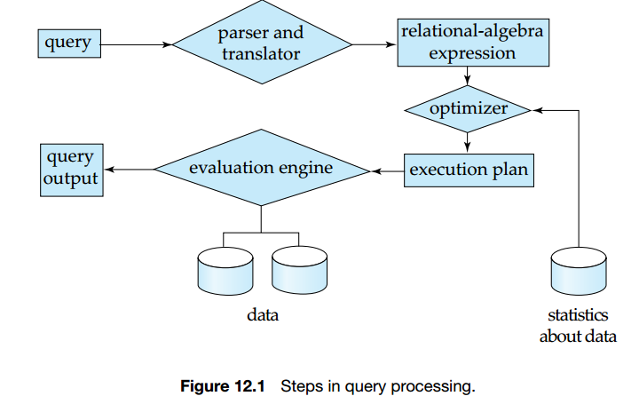
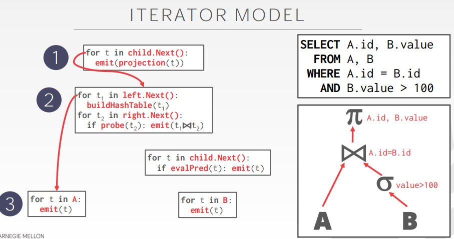
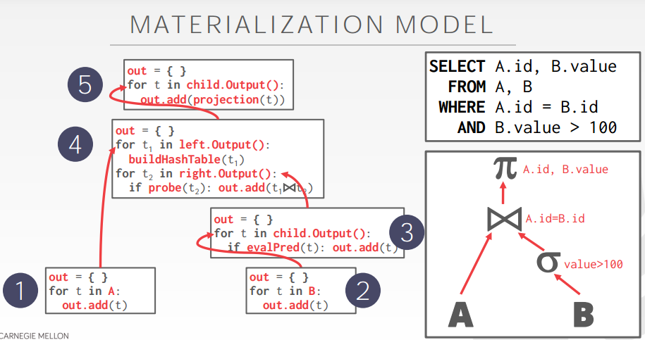
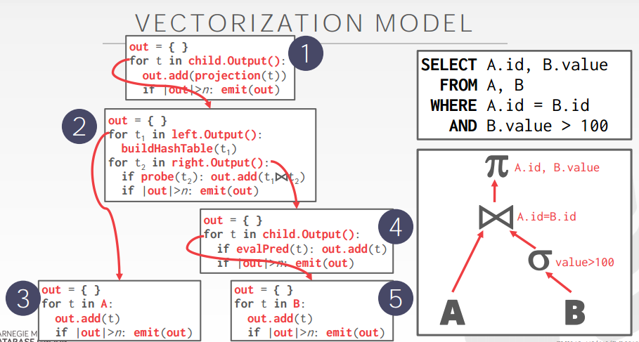
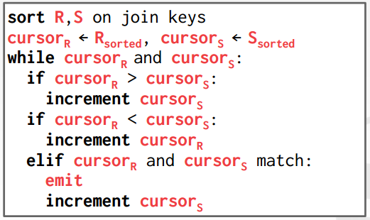
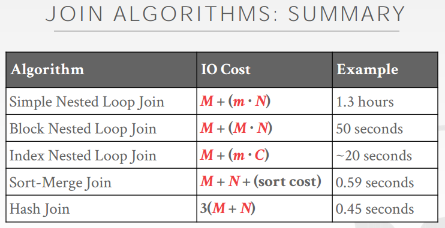

## Overiew

1. Parsing and translation.
2. Optimization.
3. Evaluation.

The system constructs a parse-tree representation of the query, which it then translates into a relational-algebra expression. 



- Parsing and translation

  > translate the query into its internal form.  This is then translated into relational algebra.
  > Parser checks syntax, verifies relations

- Evaluation

  > The query-execution engine takes a query-evaluation plan, executes that plan, and returns the answers to the query.

## QUERY PLAN
The operators are arranged in a tree. Data flows from the leaves toward the
root. The output of the root node is the result of the query.


### **Measures of Query Cost**


Number of seeks             * average-seek-cost
Number of blocks read     * average-block-read-cost
Number of blocks written * average-block-write-cost
Cost to write a block is greater than cost to read a block 
data is read back after being written to ensure that the write was successful


## Processing Models

A DBMS's processing model defines how the system executes a query plan.

> Different trade-offs for different workloads.

we examine how to coordinate the execution of multiple operations in a query evaluation plan, in particular, how to use pipelined operations to avoid writing intermediate results to disk.

we consider how to evaluate an expression containing multiple operations. The obvious way to evaluate an expression is simply to evaluate one operation at a time, in an appropriate order. The result of each evaluation is **materialized** in a temporary relation for subsequent use. A disadvantage to this approach is the need to construct the temporary relations, which (unless they are small) must be written to disk. 

An alternative approach is to evaluate several operations simultaneously in a **pipeline**, with the results of one operation passed on to the next, without the need to store a temporary relation.

Three approaches:

- Iterator Model
-  Materialization Model
-  Vectorized / Batch Model


### ITERATOR MODEL

**Pipelined evaluation** **:**  evaluate several operations simultaneously, passing the results of one operation on to the next.

- Much cheaper than materialization: no need to store a temporary relation to disk.
- Pipelining may not always be possible – e.g., **sort, hash-join.** 
- For pipelining to be effective, use evaluation algorithms that generate output tuples even as tuples are received for inputs to the operation. 
- Pipelines can be executed in two ways:  **demand driven and producer driven** 

Each query plan operator implements a next function.

- On each invocation, the operator returns either a single tuple or a null marker if there are no more tuples.

- The operator implements a loop that calls next on its children to retrieve their tuples and then process them.

Top-down plan processing. Also called Volcano or **Pipeline Model**




This is used in almost every DBMS. Allows for tuple pipelining.Some operators will block until children emit all of their tuples.

- Joins, Subqueries, Order By

Output control works easily with this approach.

- Limit

#### Two implementation

1. **In demand driven  or lazy evaluation**

- system repeatedly requests next tuple  from top level operation
- Each operation requests  next tuple from children operations as required, in order to output its next tuple
- In between calls, operation has to maintain **“state”** so it knows what to return next

2. **In producer-driven or eager pipelining**

- Operators produce tuples eagerly and pass them up to their parents

  + Buffer maintained between operators, child puts tuples in buffer, parent removes tuples from buffer

  + if buffer is full, child waits till there is space in the buffer, and then generates more tuples

- System schedules operations that have space in output buffer and can process more input tuples

- Alternative name: **pull and push models** of pipelining

#### Implementation of demand-driven pipelining

Each operation is implemented as an iterator implementing the following operations

- open()
  + E.g. file scan: initialize file scan
     state: pointer to beginning of file
  + E.g.merge join: sort relations;
     state: pointers to beginning of sorted relations
-  next()
  E.g. for file scan: Output next tuple, and advance and store file pointer
  E.g. for merge join:  continue with merge from earlier state till next output tuple is found.  Save pointers as iterator state.
- close()

### MATERIALIZATION MODEL

Materialized evaluation:  evaluate one operation at a time, starting at the lowest-level.  Use intermediate results materialized into temporary relations to evaluate next-level operations.

Each operator processes its input all at once and then emits its output all at once.
→ The operator "materializes" it output as a single result.
→ The DBMS can push down hints into to avoid scanning too many tuples.
Bottom-up plan processing




MATERIALIZATION MODEL
Better for OLTP workloads because queries typically only access a small number of tuples at a time.
	->Lower execution / coordination overhead.
Not good for OLAP queries with large intermediate results.

- Materialized evaluation is always applicable

- Cost of writing results to disk and reading them back can be quite high
  + Our cost formulas for operations ignore cost of writing results to disk, so
    + Overall cost  =  costs of individual operations + writing intermediate results to disk

- Double buffering: use two output buffers for each operation, when one is full write it to disk while the other is getting filled 
  + Allows overlap of disk writes with computation and reduces execution time


### VECTORIZATION MODEL
Like Iterator Model, each operator implements a next function.
Each operator emits a batch of tuples instead of a single tuple.
→ The operator's internal loop processes multiple tuples at a
time.
→ The size of the batch can vary based on hardware or
query properties.



Ideal for OLAP queries
→ Greatly reduces the number of invocations per operator.
→ Allows for operators to use vectorized (SIMD) instructions to process batches of
tuples.

### summay

Iterator / Volcano
→ Direction: Top-Down
→ Emits: Single Tuple
→ Target: General Purpose

Vectorized
→ Direction: Top-Down
→ Emits: Tuple Batch
→ Target: OLAP

Materialization
→ Direction: Bottom-Up
→ Emits: Entire Tuple Set
→ Target: OLTP

## Access Methods

An access method is a way that the DBMS can access the data stored in a
table.
→ Not defined in relational algebra.
Three basic approaches:
→ Sequential Scan
→ Index Scan
→ Multi-Index / "Bitmap" Scan


### SEQUENTIAL SCAN

For each page in the table:
→ Retrieve it from the buffer pool.
→ Iterate over each tuple and check whether to include it.
The DBMS maintains an internal cursor that tracks the last page / slot it examined.

#### OPTIMIZATIONS
This is almost always the worst thing that the
DBMS can do to execute a query.
Sequential Scan Optimizations:
→ Prefetching
→ Parallelization
→ Buffer Pool Bypass
→ Zone Maps
→ Late Materialization
→ Heap Clustering


#### ZONE MAPS
Pre-computed aggregates for the attribute values
in a page. DBMS checks the zone map first to
decide whether it wants to access the page.


#### LATE MATERIALIZATION
DSM DBMSs can delay stitching together tuples until the upper parts of the query plan.


#### HEAP CLUSTERING
Tuples are sorted in the heap's pages using the order specified by a **clustering index.**
If the query accesses tuples using the clustering index's attributes, then the DBMS can jump directly to the pages that it needs.

### INDEX SCAN

The DBMS picks an index to find the tuples that
the query needs.
Which index to use depends on:
→ What attributes the index contains
→ What attributes the query references
→ The attribute's value domains
→ Predicate composition
→ Whether the index has unique or non-unique keys


### MULTI-INDEX SCAN
If there are multiple indexes that the DBMS can
use for a query:
→ Compute sets of record ids using each matching index.
→ Combine these sets based on the query's predicates
(union vs. intersect).
→ Retrieve the records and apply any remaining terms.
Postgres calls this Bitmap Scan


INDEX SCAN PAGE SORTING

Retrieving tuples in the order that appear in an unclustered index is inefficient.
The DBMS can first figure out all the tuples that it needs and then sort them based on their page id

## Expression Evaluation

The DBMS represents a **WHERE** clause as an **expression tree.**
The nodes in the tree represent different expression types:
→ Comparisons (=, <, >, !=)
→ Conjunction (AND), Disjunction (OR)
→ Arithmetic Operators (+, -, *, /, %)
→ Constant Values
→ Tuple Attribute References


## Sorting Algorithms

WHY DO WE NEED TO SORT ?
Tuples in a table have no specific order
But users often want to retrieve tuples in a specific
order.
→ Trivial to support duplicate elimination (DISTINCT)
→ Bulk loading sorted tuples into a B+ tree index is faster
→ Aggregations (GROUP BY)


We may build an index on the relation, and then use the index to read the relation in sorted order.  May lead to one disk block access for each tuple. For relations that fit in memory, techniques like quicksort can be used.  For relations that don’t fit in memory, external sort-merge is a good choice. 

EXTERNAL MERGE SORT
Sorting Phase
→ Sort small chunks of data that fit in main-memory, and
then write back the sorted data to a file on disk.
Merge Phase
→ Combine sorted sub-files into a single larger file.


We will start with a simple example of a 2-way
external merge sort.
Files are broken up into N pages.
The DBMS has a finite number of B fixed-size
buffers.


2-WAY EXTERNAL MERGE SORT
Pass #0
→ Reads every B pages of the table into memory
→ Sorts them, and writes them back to disk.
→ Each sorted set of pages is called a run.
Pass #1,2,3,…
→ Recursively merges pairs of runs into runs twice as long
→ Uses three buffer pages (2 for input pages, 1 for output)


Pass #0
→ Use B buffer pages.
→ Produce ⌈N / B⌉ sorted runs of size B
Pass #1,2,3,…
→ Merge B-1 runs (i.e., K-way merge).
Number of passes = 1 + ⌈ logB-1 ⌈N / B⌉ ⌉
Total I/O Cost = 2N ∙ (# of passes)


USING B+TREES
If the table that must be sorted already has a B+
tree index on the sort attribute(s), then we can use
that to accelerate sorting.
Retrieve tuples in desired sort order by simply
traversing the leaf pages of the tree.
Cases to consider:
→ Clustered B+ tree
→ Unclustered B+ tree


Clustered B+ tree

Traverse to the left-most leaf page,
and then retrieve tuples from all leaf
pages.
This will always better than external
sorting


Unclustered B+ tree

Chase each pointer to the page that
contains the data.
This is almost always a bad idea.
In general, one I/O per data record.

## Aggregations

Collapse multiple tuples into a single scalar value.
Two implementation choices:
→ Sorting
→ Hashing


Hashing

What if we don’t need the data to be ordered?
→ Forming groups in GROUP BY (no ordering)
→ Removing duplicates in DISTINCT (no ordering)
Hashing is a better alternative in this scenario.
→ Only need to remove duplicates, no need for ordering.
→ Can be computationally cheaper than sorting.


HASHING AGGREGATE
Populate an ephemeral hash table as the DBMS
scans the table. For each record, check whether
there is already an entry in the hash table:
→ DISTINCT: Discard duplicate.
→ GROUP BY: Perform aggregate computation.
If everything fits in memory, then it's easy.
If we have to spill to disk, then we need to be
smarter

Partition Phase
→ Divide tuples into buckets based on hash key.
ReHash Phase
→ Build in-memory hash table for each partition and
compute the aggregation.


HASHING AGGREGATE PHASE #1: PARTITION

Use a hash function h
1 to split tuples into
partitions on disk.
→ We know that all matches live in the same partition.
→ Partitions are "spilled" to disk via output buffers.
Assume that we have B buffers.


HASHING AGGREGATE PHASE #2: REHASH
For each partition on disk:
→ Read it into memory and build an in-memory hash table
based on a second hash function h
→ Then go through each bucket of this hash table to bring
together matching tuples.
This assumes that each partition fits in memory


ASHING SUMMARIZATION
During the ReHash phase, store pairs of the form
(GroupKey→RunningVal)
When we want to insert a new tuple into the hash
table:
→ If we find a matching GroupKey, just update the
RunningVal appropriately
→ Else insert a new GroupKey→RunningVal


### COST ANALYSIS
How big of a table can we hash using this approach?
→ B-1 "spill partitions" in Phase #1
→ Each should be no more than B blocks big
Answer: B ∙ (B-1)
→ A table of N pages needs about sqrt(N) buffers
→ Assumes hash distributes records evenly.
Use a "fudge factor" f>1 for that: we need
B ∙ sqrt(f ∙ N)


CONCLUSIO N
Choice of sorting vs. hashing is subtle and depends
on optimizations done in each case.
We already discussed the optimizations for
sorting:
→ Chunk I/O into large blocks to amortize seek+RD costs.
→ Double-buffering to overlap CPU and I/O


## Join

WHY DO WE NEED TO JOIN?
We normalize tables in a relational database to
avoid unnecessary repetition of information.
We use the join operate to reconstruct the original
tuples without any information loss.

We will focus on joining two tables at a time.
In general, we want the smaller table to always be
the outer table.
Things we need to discuss first:
→ Output
→ Cost Analysis Criteria


For a tuple r ∈ R and a tuple s ∈ S
that match on join attributes,
concatenate rand s together into a
new tuple.
Contents can vary:
→ Depends on processing model
→ Depends on storage model
→ Depends on the query


### JOIN OPERATOR OUTPUT: DATA

Copy the values for the attributes in
outer and inner tuples into a new
output tuple


Subsequent operators in the query
plan never need to go back to the base
tables to get more data

### JOIN OPERATOR OUTPUT: RECORD IDS

Only copy the joins keys along with
the record ids of the matching tuples


Ideal for column stores because the
DBMS does not copy data that is not
need for the query.
This is called late materialization

#### I/O COST ANALYSIS

Assume:
→ M pages in table R, m tuples total
→ N pages in S, n tuples total
Cost Metric: # of IOs to compute join
We will ignore output costs since that depends on
the data and we cannot compute that yet


#### JOIN VS CROSS -PRODUCT
R⨝S is the most common operation and thus
must be carefully optimized.
R×S followed by a selection is inefficient because
the cross-product is large.
There are many algorithms for reducing join cost,
but no particular algorithm works well in all
scenarios.


### Nested Loop Join

R : M pages m tuples

S : N pages n tuples

#### Simple

```
foreach tuple r ∈ R:                    -------Outer
    foreach tuple s ∈ S:                 -------Inner
        emit, if r and s match
```

Why is this algorithm bad?

- For every tuple in R, it scans S once
- Cost: M + (m ∙ N)

good practise： smaller table is used as the outer table  

#### Block

```java
foreach block B_R ∈ R:
    foreach block B_S ∈ S:
        foreach tuple r ∈ B_R:
            foreach tuple s ∈ B_S:
                emit, if r and s match
```

This algorithm performs fewer disk accesses.

- For every block in R, it scans S once
- Cost: M + (M ∙ N )

Which one should be the outer table?

- The smaller table in terms of # of pages

What if we have B buffers available?

- Use B-2 buffers for scanning the outer table.
- Use one buffer for the inner table, one buffer for storing output.

```java
foreach B - 2 blocks b_R ∈ R:
    foreach block b_S ∈ S:
        foreach tuple r ∈ b_R:
            foreach tuple s ∈ b_S:
            	emit, if r and s match
```

This algorithm uses B-2 buffers for scanning R.
**Cost: M + ( [M / (B-2)] ∙ N)**
What if the outer relation completely fits in memory (B >M+2)?

- Cost: M + N = 1000 + 500 = 1500 IOs
-  At 0.1ms/IO, Total time ≈ 0.15 seconds

#### Index

Why do basic nested loop joins suck ass?

- For each tuple in the outer table, we have to do a sequential scan to check for a match in the inner table.

Can we accelerate the join using an index? Use an **index to find inner table** matches.

- We could use an existing index for the join.
- Or even build one on the fly.

```c
foreach tuple r ∈ R:
    foreach tuple s ∈ Index(ri = sj):
  	  emit, if r and s match
```

Assume the cost of each index probe is some **constant C** per tuple.

- Cost: M + (m ∙ C)

**summary**

- Pick the smaller table as the outer table.
- Buffer as much of the outer table in memory as possible.
- Loop over the inner table or use an index.


### Sort-Merge Join

- Phase #1: Sort
  → Sort both tables on the join key(s).
  → Can use the external merge sort algorithm that we talked about last class.
- Phase #2: Merge
  → Step through the two sorted tables in parallel, and emit
  matching tuples.
  → May need to backtrack depending on the join type.




**Cost**

- Sort Cost (R):  2M ∙ (log M / log B)
- Sort Cost (S):  2N ∙ (log N / log B)
- Merge Cost:  (M + N)
- Total Cost:  Sort + Merge

The worst case for the merging phase is when the join attribute of all of the tuples in both relations
contain the same value.
**Cost: (M ∙ N) + (sort cost)**


WHEN IS SORT-MERGE JOIN USEFUL?
One or both tables are already sorted on join key. Output must be sorted on join key.
The input relations may be sorted by either by an explicit sort operator, or by scanning the relation
using an index on the join key

### Hash Join

If tuple `r ∈ R` and a tuple `s ∈ S `satisfy the join condition, then they have the same value for the
join attributes.
If that value is hashed to some value `i`, the R tuple has to be in `r_i` and the S tuple in `s_i`.
Therefore, R tuples in `r_i` need only to be compared with S tuples in `s_i`


#### BASIC HASH JOIN ALGORITHM

- Phase #1: Build
  	→ Scan the outer relation and populate a hash table using the hash function h1 on the join attributes.

- Phase #2: Probe
          → Scan the inner relation and use h1 on each tuple to jump to a location in the hash table and find a matching tuple.

```c
build hash table HT_R for R
foreach tuple s ∈ S
	output, if h1(s) ∈ HT_R
```

**Key:** The attribute(s) that the query is joining the tables on.
**Value:** Varies per implementation.
→ Depends on what the operators above the join in the query plan expect as its input

**HASH TABLE VALUES**

- Approach #1: Full Tuple
  → Avoid having to retrieve the outer relation's tuple contents on a match.
  → Takes up more space in memory.

- Approach #2: Tuple Identifier
  → Ideal for column stores because the DBMS doesn't fetch data from disk it doesn't need.
  → Also better if join selectivity is low.

What happens if we do not have enough memory to fit the entire hash table?
We do not want to let the buffer pool manager swap out the hash table pages at a random.

#### GRACE HASH JOIN

Hash join when tables don’t fit in memory.
→ Build Phase: Hash both tables on the join attribute into partitions.
→ Probe Phase: Compares tuples in corresponding partitions for each table

```c
foreach tuple r ∈ bucket(R,0):
    foreach tuple s ∈ bucket(S,0):
    	emit, if match(r, s)
```

Hash R into (0, 1, ..., max) buckets.
Hash S into the same # of buckets with the same hash function.

Join each pair of matching buckets between R and S


If the buckets do not fit in memory, then use recursive partitioning to split the tables into chunks that will fit.
→ Build another hash table for bucket
R,i using hash function h2 (with h2≠h1).
→ Then probe it for each tuple of the other table's bucket at that level.


RECURSIVE PARTITIONING


Cost of hash join?
→ Assume that we have enough buffers.
→ Cost: 3(M + N)
Partitioning Phase:
→ Read+Write both tables
→ 2(M+N) IOs
Probing Phase:
→ Read both tables
→ M+N IOs

If the DBMS knows the size of the outer table,
then it can use a static hash table.
→ Less computational overhead for build / probe
operations.
If we do not know the size, then we have to use a
dynamic hash table or allow for overflow pages




**CONCLUSION**

Hashing is almost always better than sorting for
operator execution.
Caveats:
→ Sorting is better on non-uniform data.
→ Sorting is better when result needs to be sorted.
Good DBMSs use either or both.

## Selection Operation**

### **File scan** 

Algorithm A1 (linear search).  Scan each file block and test all records to see whether they satisfy the selection condition.
Cost estimate = br block transfers + 1 seek
br  denotes number of blocks containing records from relation r
If selection is on a key attribute, can stop on finding record
cost = (br /2) block transfers + 1 seek
Linear search can be applied regardless of 
selection condition or
ordering of records in the file, or 
availability of indices
Note: binary search generally does not make sense since data is not stored consecutively
except when there is an index available, 
and binary search requires more seeks than index search

### **Index scan**

selection condition must be on search-key of index.
A2 (primary index, equality on key).  Retrieve a single record that satisfies the corresponding equality condition  
Cost = (hi + 1) * (tT + tS)
A3 (primary index, equality on nonkey) Retrieve multiple records. 
Records will be on consecutive blocks
Let b = number of blocks containing matching records
Cost = hi * (tT + tS) + tS + tT * b

A4 (secondary index, equality on nonkey).
Retrieve a single record if the search-key is a candidate key
Cost = (hi + 1) * (tT + tS)
Retrieve multiple records if search-key is not a candidate key
each of n matching records may be on a different block  
Cost =  (hi + n) * (tT + tS) 
Can be very expensive!


### **Complex Selections**

