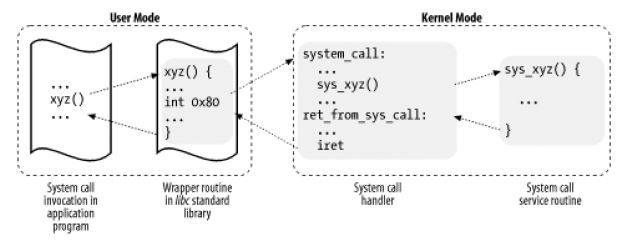
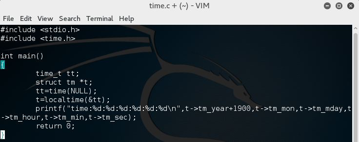
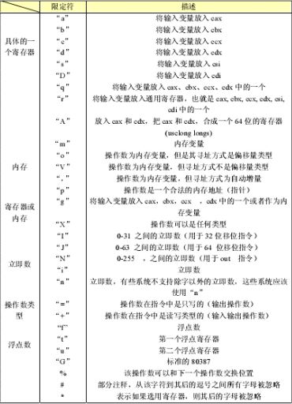
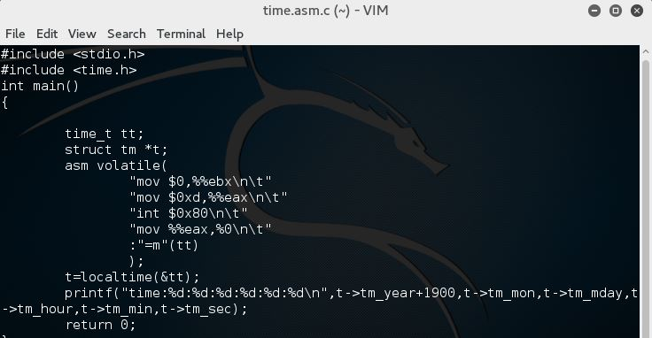
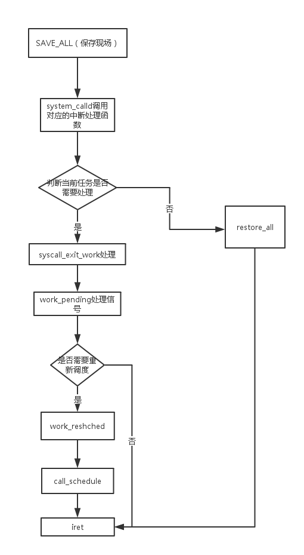

# 系统调用的三个层次（上）

使用库函数API和C代码中嵌入汇编代码两种方式使用同一个系统调用

## 基础知识

### 用户态、内核态和中断

#### 内核态

在高的执行级别下，代码可以执行特权指令，访问任意的物理地址，这时的CPU就对应内核态

#### 用户态

在低级别的指令状态下，代码 只能在级别允许的特定范围内活动。在日常操作下，执行系统调用的方式是通过库函数，库函数封装系统调用，为用户提供接口以便直接使用。

**注：**
1.在Linux下0级表示内核态，3级表示用户态。

2.内核态cs:eip的值是任意的，即可以访问所有的地址空间。用户态只能访问其中的一部分内存地址。

#### 中断处理过程

系统调用是一种特殊的中断，中断处理是从用户态进入内核态的主要方式。中断发生后的第一件事就是保存现场。从用户态切换到内核态，中断指令会在堆栈上保存用户态的寄存器上下文。

> + 包括用户态栈顶地址、当时的状态字、cs:eip的值，以及内核态的栈顶地址、当时的状态字、中断处理程序入口。
> + 中断处理结束前的最后一件事就是恢复现场，退出中断程序，恢复保存寄存器的数据。

**举例说明中断处理的完整过程**

```c
interrupt(ex:int 0X80)//发生系统调用
save cs:eip/ss:esp/eflags(current)to kernel stack
//保存cs:eip的值，保存当前堆栈段寄存器当前栈顶和标志位寄存器
load cs:eip(entry of a specific ISR)and ss:eip(point to kenerl stack)
//把当前的中断信号或系统调用相关中断服务例程入口加载到cs:eip中，把当前的堆栈段和esp加载到CPU
SAVE_ALL//保存现场
...//内核代码，完成中断服务，发生进程调度
RESTORE_ALL//恢复现场
iret - pop cs:eip/ss:esp/eflags from kernel stack//iret对应相反的中断指令
```

### 系统调用概述

应用程序、封装例程、系统调用处理程序及系统调用服务例程之间的关系：



系统调用的三个层次依次是：xyz函数（API）、system_ call（中断向量）和 sys_ xyz（中断服务程序）

#### 关于传参

内核实现了很多不同的系统调用，进程必须指明需要哪个系统调用，这需要传递一个名为**系统调用号**的参数，system_call是linux中所有系统调用的入口点，每个系统调用至少有一个参数，使用eax寄存器传递系统调用号。

寄存器传递参数具有如下限制：

1. 每个参数的长度不能超过寄存器的长度，即32位
2. 在系统调用号（ eax）之外，参数的个数不能超过6个（ ebx，ecx， edx， esi， edi， ebp）
3. 超过6个的情况下，使用某一个寄存器作为指针，进入内核态之后可以访问所有的地址空间，通过某一片区域传递参数。

## 系统调用栗子

- 使用库函数API获取系统当前时间， 利用API调用time函数，体现API的接口功能：



输出结果


- C代码中嵌入汇编代码的写法

```c
/* __asm__(
    汇编语句模板：
    输入部分：
    输出部分：
    破坏描述部分：); */

include <stdio.h>
int main(){
    /*实现的功能：val1+val2=val3*/
    unsigned int val1 = 1;
    unsigned int val2 = 2;
    unsigned int val3 = 0;
    printf("val1:%d,val2:%d,val3:%d\n",val1,val2,val3);

    asm volatile(
    "movl $0,%%eax\n\t" /*两个%表示转义字符，这一句的目的是把%eax清零*/
    "addl %1,%%eax\n\t" /*%1指的是参数的标记，m编号为0，c为1，d为2 这一句把val1赋给eax*/
    "addl %2,%%eax\n\t" /*%eax=val1+val2*/
    "movl %%eax,%0\n\t" /*把val1和val2的值存储在eax里面*/
    : "=m" (val3) /* =表示把val3 的值写到内存变量里面*/
    : "c" (val1),"d" (val2) /*用%ecx存储val1，用%edx存储val2*/
    );

    printf("val1:%d+val2:%d=val3:%d\n",val1,val2,val3);
    return 0;
}
```

限定符对照表：



- 用汇编方式触发系统调用获取系统当前时间



```c
"mov $0,%%ebx\n\t"/*将ebx清零*/
"mov $0xd,%%eax\n\t"/*将0xd放入eax中，传递系统调用号，13是time的系统调用号*/
"int $0x80\n\t"
"mov %%eax,%0\n\t"/*系统调用和普通函数一样返回值在eax中存储*/
："=m"(tt)
```

## 开始实验

本实验中使用20号系统调用getpid来获取当前进程的pid

**使用库函数API获取当前进程的pid**

代码：

```c
#include <stdio.h>
#include <unistd.h>

int main(){
    pid_t p;
    p = getpid();
    printf("%u\n",p);
    return 0;
}
```

**用汇编方式触发系统调用获取当前进程的pid**

代码：

```c
#include <stdio.h>
#include <time.h>
int main()
{
    unsigned pid;
    asm volatile(
        "mov $0,%%ebx\n\t"
        "mov $20,%%eax\n\t"
        "int $0x80\n\t"
        "mov %%eax,%0\n\t"
        :"=m"(pid)
    );
    printf("pid is %u\nget pid by asm\n",pid);
    return 0;
}

```

```assembly
"movl $0x14,%%eax\n\t"/*将getpid系统调用号20放入寄存器eax中*/
"int $0x80\n\t"/*系统发生中断，执行getpid进程*/
"movl %%eax,%0\n\t"/*返回值保存在eax中，并将eax的值放在0号变量tt中输出*/
:"=m"(tt)
```

# 系统调用的三个层次（下）

本周的课程主要内容有三点：

1. 在MenuOS中通过添加代码增加自定义的系统调用命令
2. 使用gdb跟踪调试内核
3. 简单分析system_call代码了解系统调用在内核代码中的处理过程

由于本周实验是在Kali虚拟机上进行操作的，具体实现过程中的代码和实验楼里的环境有一定的差异，在解决了各种报错之后终于完成了实验，在这次的实验报告中将较为详细的记录实验过程中遇到的问题以及解决方案，以便以后更加熟练地理解与掌握Kali的操作原理和步骤。

## 分析system_call中断处理过程

#### 给MenuOS增加time和time-asm命令

- **在源代码中增加getpid和getpid-asm的代码**

  menu文件夹，打开目录即可看到内核相关代码，通过vim test.c指令打开并编辑源代码，在其中加入自定义添加的函数代码。

```c
int Getpid(int argc, char *argv[]){
    pid_t tt;
    tt = getpid();
    printf("%u\n",tt);
    return 0;
}

int GetpidAsm(int argc, char *argv[]){
    unsigned pid;
    asm volatile(
        "mov $0,%%ebx\n\t"
        "mov $20,%%eax\n\t"
        "int $0x80\n\t"
        "mov %%eax,%0\n\t"
        :"=m"(pid)
    );
    printf("pid is %u\nget pid by asm\n",pid);
    return 0;
}
```

- **在main函数中增加MenuConfig**

  在main函数中添加对应的函数调用代码，格式与代码中原有的函数调用格式保持一致。

```c
MenuConfig("getpid","get pid!",Getpid);
MenuConfig("getpid-asm","get pid!(asm)",GetpidAsm);
```

- **make rootfs（将分步编译的过程编写在脚本当中自动生成）**

  进行这一步的时候无论是使用make rootfs脚本编译还是make all都会出现错误：Nothing to be done，make clean指令也无效。其原因是该文件目录下有一个名为rootfs的文件夹，导致编译失败，删除该文件夹后即可成功编译，结果如下图所示。

  使用help指令查看命令

#### 使用gdb跟踪系统调用内核函数sys_time

- **启动内核到调试状态**

  ```shell
  qemu-system-i386 -kernel linux-3.18.6/arch/x86/boot/bzImage -initrd rootfs.img -S -s
  ```

- **重新启动一个终端进行调试**

  在内核中加载符号表：

  ```shell
  file /usr/src/linux-source-4.4/vmlinux
  ```

  由于Kali是64位机所以要进行设置否则会报错"Remote 'g'packet reply is too long"。

  ```
  set arch i386:x86-64
  ```

  之后使用1234端口连接并开始调试。

- **设置断点并单步跟踪调试**

  注意不能在start _ kernel处设置断点因为此时还没有完整设置好64位的运行环境，因此无法设置断点进行调试。

  s单步执行，sys _ getpid 函数返回之后进入汇编代码处理，gdb无法继续跟踪，在sys _ call处设置断点也无法停下来调试。

##### 系统调用机制的初始化

\init\main.c start _ kernel中调用了trap _ init()函数。

\arch\x86\kernel\traps.c代码中定义了系统调用的初始化。

```c
#ifdef CONFIG_X86_32
set_system_trap_gate(SYSCALL_VECTOR, &system_call);
//系统调用的中断向量和system_call的入口。一旦执行0x80，系统就自动跳转到system _call执行
set_bit(SYSCALL_VECTOR, used_vectors);
#endif
```

##### 分析system_call伪代码

```assembly
ENTRY(system_call)          #0x80的下一条 指令
    RING0_INT_FRAME         # can't unwind into user space anyway
    ASM_CLAC
    pushl_cfi %eax          # save orig_eax
    SAVE_ALL                # 保存系统寄存器信息
    GET_THREAD_INFO(%ebp)   # 获取thread_info结构的信息
                # system call tracing in operation / emulation
    testl $_TIF_WORK_SYSCALL_ENTRY,TI_flags(%ebp) # 测试是否有系统跟踪
    jnz syscall_trace_entry   # 如果有系统跟踪，先执行，然后再回来
    cmpl $(NR_syscalls), %eax # 比较eax中的系统调用号和最大syscall，超过则无效
    jae syscall_badsys # 无效的系统调用 直接返回
syscall_call:
    call *sys_call_table(,%eax,4) # 调用实际的系统调用程序
syscall_after_call:
    movl %eax,PT_EAX(%esp)      # 将系统调用的返回值eax存储在栈中
syscall_exit:
    LOCKDEP_SYS_EXIT
    DISABLE_INTERRUPTS(CLBR_ANY)    # make sure we don't miss an interrupt
                
    TRACE_IRQS_OFF
    movl TI_flags(%ebp), %ecx
    testl $_TIF_ALLWORK_MASK, %ecx  # 判断当前的任务是否需要进程调度
    jne syscall_exit_work           # 未完成，则去执行这些任务
restore_all:
    TRACE_IRQS_IRET         # iret 从系统调用返回
```

##### 系统调用流程分析



### 参考资料

1. [系统调用](http://baike.baidu.com/link?url=zcKqTAX6EAl7u8bu4YjWms2MrGF2-4RiJ8jvqfiKucTd3O7UM8-pPxJcPTF3zbTbnhqsxFC4k7XwP9XKLjbMFXrDT32pAQvh7PQq82C-waKCaIw3YrOvtPwbcmxV_IFN)
2. [第四节 系统调用的三个层次](<https://www.cnblogs.com/July0207/p/5277774.html>)
3. [第四节 系统调用的三个层次下](<https://www.cnblogs.com/July0207/p/5320325.html>)
