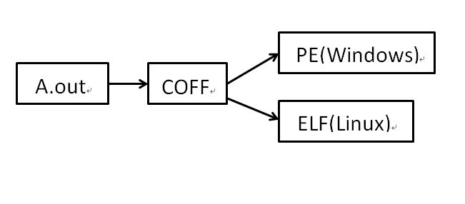

## 实验内容

1. 可执行程序是如何得到的以及可执行程序的目标文件格式
2. 动态库 &动态链接库
3. 系统调用sys_exec函数的执行过程

---


- 理解编译链接的过程和ELF可执行文件格式，详细内容参考本周第一节；
- 编程使用exec*库函数加载一个可执行文件，动态链接分为可执行程序装载时动态链接和运行时动态链接，编程练习动态链接库的这两种使用方式，详细内容参考本周第二节；
- 使用gdb跟踪分析一个execve系统调用内核处理函数sys_execve ，验证您对Linux系统加载可执行程序所需处理过程的理解，详细内容参考本周第三节；推荐在实验楼Linux虚拟机环境下完成实验。
- 特别关注新的可执行程序是从哪里开始执行的？为什么execve系统调用返回后新的可执行程序能顺利执行？对于静态链接的可执行程序和动态链接的可执行程序execve系统调用返回时会有什么不同？

## 实验过程

### 1.可执行文件的生成过程。

首先引用一张孟老师的图，来说明可执行文件生成的过程，总结的很赞


可执行文件是给计算机中的cpu执行的二进制代码。按照老师上课使用的shell命令演示一下。


hello.static 是静态链接编译的可执行文件，可以很看到，比动态链接编译的hello文件要大得多，相差100倍，原因也很简单，就是静态链接是将程序中需要使用的库都放在了静态编译的文件中，导致文件大小剧增。


### 2.查看elf文件相关信息

对于静态链接的elf文件，基本上在加载时对应加上程序入口地址，将相应的代码数据加载到对应的内存空间中，然后逐步执行代码。以下是我的ELF Header情况。


下面来查看elf头信息,从图中可以看出真正的代码从0x8048320开始，这是程序载入内存被执行的真正入口


### 3.动态链接库
通常我们的程序还需要使用动态链接库。分为装载时动态链接和运行时动态链接。

[孟老师提供的演示代码](http://mooc.study.163.com/course/attachment.htm?fileName=SharedLibDynamicLink.zip&nosKey=DF0B57B0514B0357EA08D0DCA4538B4A-1427446685857)

生成共享库和运行时链接库：
```
gcc -shared shlibexample.c -o libshlibexample.so -m32
gcc -shared dllibexample.c -o libdllibexample.so -m32
```

生成的库文件如下，并运行


### 4. 跟踪execlp的调用

这次跟踪分析一个execve系统调用内核处理函数sys_execve。

#### 1.将test.c替换为test_exec.c，为MenuOS增加exec功能。

```
cd LinuxKernel
cd menu
mv test_exec.c test.c
```

新的test.c的main函数中为界面增加了exec的选项。


查看exec本身代码内容。就是一个简单的程序。子进程执行了hello。


#### 2.调试MenuOS

编译运行menu，因为前面几个实验都做了无数遍了，就不多浪费篇幅。加上-s –S运行，然后利用gdb跟踪，设3个断点：sys\_execve、load\_elf_binary、start_thread。


continue继续运行，启动menu过程中会触发断点，直接继续执行。menu启动完成后，输入exec命令，这时会停在第一个断点。


 继续运行，停在第二个断点，是装载的过程。


继续运行，停在第三个断点。


这是注意到有一个新的ip地址new_ip作为参数传递过来。打印后发现这个地址是0x8048d2a，其内容目前无法访问。

这时另开一个终端窗口，打印hello的头文件，发现就是hello可执行程序的起始位置，即用户态第一条指令的位置。


执行到start_thread代码。


下面是start_kernel的源代码

```c
start_thread(struct pt_regs *regs, unsigned long new_ip, unsigned long new_sp)
{
    set_user_gs(regs, 0);
    regs->fs        = 0;
    regs->ds        = __USER_DS;
    regs->es        = __USER_DS;
    regs->ss        = __USER_DS;
    regs->cs        = __USER_CS;
    regs->ip        = new_ip;
    regs->sp        = new_sp;
    regs->flags        = X86_EFLAGS_IF;
    /*
     * force it to the iret return path by making it look as if there was
     * some work pending.
     */
    set_thread_flag(TIF_NOTIFY_RESUME);
}
```

单步运行。可以看到对寄存器的修改情况。


execve在返回前用新的ip和sp更新了进程的ip和sp。对于需要动态链接的程序，elf_entry就会加载动态链接器ld的入口地址。

继续执行，程序就将进入用户态执行


## 代码分析

execve和前面博文分析的fork系统一样，是一种特殊的系统调用。fork的特殊在于系统调用后两次返回，生成了新进程，而不单单是在原来程序的系统调用的下一条语句。而execve的特殊在于它返回之后，执行的是一个新的程序了（例如返回程序的main入口，修改的是elf_entry），而不是以前调用execve的进程shell了。
内核处理函数sys_execve内部会解析可执行文件格式，它的内部执行流程是do_execve -> do_execve_common -> exec_binprm。
gdb断点设置：b sys_execve ;停到该位置，继续设置断点 b load_elf_binary; b start_thread。
其中的一些函数解释：
1）search_binary_handler符合寻找文件格式对应的解析模块，如下：

```c
list_for_each_entry(fmt, &formats, lh) {
if (!try_module_get(fmt->module))
continue;
read_unlock(&binfmt_lock);
bprm->recursion_depth++;
retval = fmt->load_binary(bprm);
read_lock(&binfmt_lock);
```

对于ELF格式的可执行文件fmt->load_binary(bprm);执行的应该是load_elf_binary

2）Linux内核是如何支持多种不同的可执行文件格式的？

```c
static struct linux_binfmt elf_format = {
.module = THIS_MODULE,
.load_binary = load_elf_binary,
.load_shlib = load_elf_library,
.core_dump = elf_core_dump,
.min_coredump = ELF_EXEC_PAGESIZE,
};
static int __init init_elf_binfmt(void)
{
register_binfmt(&elf_format);
return 0;
}
```

elf\_format 和 init_elf_binfmt，就是观察者模式中的观察者。

3)可执行文件开始执行的起点在哪里？如何才能让execve系统调用返回到用户态时执行新程序？
load_elf_binary -> start_thread中通过修改内核堆栈中的EIP的值作为新程序的起点。即修改一开始int 0x80压入内核堆栈的EIP。start_thread中的new_ip是返回到用户态第一条指令的地址，与可执行程序的头中的入口地址相同。


## 总结
新的可执行程序是从new\_ip开始执行,start_thread实际上是把返回到用户态的位置从Int 0x80的下一条指令，变成了规定的新加载的可执行文件的入口位置,即修改内核堆栈的EIP的值作为新程序的起点。
当执行到execve系统调用时，陷入内核态，用execve加载的可执行文件覆盖当前进程的可执行程序，当execve系统调用返回时，返回新的可执行程序的执行起点（main函数位置），所以execve系统调用返回后新的可执行程序能顺利执行。
对于静态链接的可执行程序和动态链接的可执行程序execve系统调用返回时，如果是静态链接，elf\_entry指向可执行文件规定的头部（main函数对应的位置0x8048\***）；如果需要依赖动态链接库，elf_entry指向动态链接器的起点。动态链接主要是由动态链接器ld来完成的。


## 预处理、编译、链接和目标文件的格式

#### 可执行程序是如何得来的


```
预处理：gcc –E –o hello.cpp hello.c -m32 //负责把include的文件包含进来，宏替换
编 译：gcc -x cpp-output –S hello.s –o hello.cpp -m32 //gcc –S调用ccl,编译成汇编代码
汇 编：gcc -x assembler –c hello.s –o hello.o; //gcc -c 调用as,得到二进制文件，不可
链 接：gcc –o hello hello.o ;gcc -o //调用ld形成目标可执行文件
```


```
/*ELF格式文件使用共享库，如果静态编译，把所有需要的依赖的文件全部放在程序内部*/
静态编译：gcc –o hello.static hello.o -m32 -static
```

#### 目标文件的格式ELF

可执行文件格式的发展过程:



ELF：可执行&可链接的文件格式，是一个文件格式的标准。

ABI：应用程序二进制接口，目标文件中已经是二进制兼容的格式。

##### ELF中的三种主要的目标文件

- 可重定位文件：保存代码和适当的数据，用来和其他object文件一起创建一个可执行文件或一个共享文件。主要是.o文件。
- 可执行文件：保存一个用来执行的程序，指出了exec(BA_OS)如何来创建程序进程映象，怎么把文件加载出来以及从哪里开始执行。
- 共享文件：保存着代码和数据用来被以下两个链接器链接。一是链接编译器，可以和其他的可重定位和共享文件创建其他的object文件；二是动态链接器，联合一个可执行文件和其他 共享文件来创建一个进程映象。主要是.so文件。

##### 文件格式

Object文件参与程序的联接（创建一个文件）和程序的执行（运行一个文件）

##### 查看ELF文件的头部

```
$ readelf -h hello
```

当创建或增加一个进程映象的时候，系统在理论上将拷贝一个文件的段到一个虚拟的内存段。

#### 静态链接的ELF可执行文件与进程的地址空间

Entry point address：入口地址为0x8048X00（不唯一）

其原因是：32位x86的系统有4G的进程地址空间（前面的1G供内核用；之后的3G用户态可访问）当一个ELF可执行文件要加载到内存中时，先把代码段和数据段加载到当中（默认从0x8048000位置开始加载）。开始加载时，前面的都是ELF格式的头部信息，大小不尽相同，根据头部大小可确定程序的实际入口，当启动一个刚加载过可执行文件的进程时，就可从这个位置开始执行。

一般静态链接会将所有的代码放在同一个代码段；动态链接的进程会有多个代码段。

## 可执行程序、共享库和动态链接

#### 可执行程序的执行环境

命令行参数和shell环境，一般我们执行一个程序的Shell环境，我们的实验直接使用execve系统调用。


Shell本身不限制命令行参数的个数，命令行参数的个数受限于命令自身

```c
int main(int argc, char *argv[])
int main(int argc, char *argv[], char *envp[])//用户输入的参数1、参数2、shell的环境变量
```

Shell会调用execve将命令行参数和环境参数传递给可执行程序的main函数

```c
int execve(const char *filename,char *const argv[],char *const envp[]);
```


库函数`exec*`都是`execve`的封装例程

```
#include <stdio.h>
#include <stdlib.h>
#include <unistd.h>
int main(int argc, char * argv[]){
    int pid;
    /* fork another process */
    pid = fork();//执行shell之前先创建一个新的子进程
    if (pid<0) 
    { 
        /* error occurred */
        fprintf(stderr,"Fork Failed!");//如果fork不成功，则不能执行新的程序
        exit(-1);
    } 
    else if (pid==0) //成功fork一个子进程
    {
        /*   child process   */
        execlp("/bin/ls","ls",NULL);//根据命令行传进来参数加载要执行的程序
    } 
    else 
    {  
        /*     parent process  */
        /* parent will wait for the child to complete*/
        wait(NULL);
        printf("Child Complete!");//父进程等待子进程加载完毕
        exit(0);
    }
}
```

命令行参数和环境变量是如何进入新程序的堆栈的？

在创建一个新的用户态堆栈的时候，实际上是把命令行和环境变量参数的内容通过指针的方式传递到系统调用的内核处理函数，函数在创建可执行程序新的堆栈初始化时候再拷贝进去。先函数调用参数传递，再系统调用参数传递。

#### 装载时动态链接和运行时动态链接应用举例

##### 共享库和动态加载共享库相关范例代码

动态链接分为可执行程序装载时动态链接和运行时动态链接，如下代码演示了这两种动态链接。

- 共享库

  ```c
    /*准备.so文件*/     
    shlibexample.h (1.3 KB) - Interface of Shared Lib Example
    shlibexample.c (1.2 KB) - Implement of Shared Lib Example
  
    /*编译成libshlibexample.so文件*/
    $ gcc -shared shlibexample.c -o libshlibexample.so -m32
  
    /*使用库文件（因为已经包含了头文件所以可以直接调用函数）*/
    SharedLibApi();
  ```

- 动态加载链接

  ```c
    dllibexample.h (1.3 KB) - Interface of Dynamical Loading Lib Example
    dllibexample.c (1.3 KB) - Implement of Dynamical Loading Lib Example
  
    /*编译成libdllibexample.so文件*/
    $ gcc -shared dllibexample.c -o libdllibexample.so -m32
  
    /*使用库文件*/
    void * handle = dlopen("libdllibexample.so",RTLD_NOW);//先加载进来
    int (*func)(void);//声明一个函数指针
    func = dlsym(handle,"DynamicalLoadingLibApi");//根据名称找到函数指针
    func(); //调用已声明函数
  ```

编译main，注意这里只提供shlibexample的-L（库对应的接口头文件所在目录）和-l（库名，如libshlibexample.so去掉lib和.so的部分），并没有提供dllibexample的相关信息，只是指明了-ldl

```
$ gcc main.c -o main -L/path/to/your/dir -lshlibexample -ldl -m32
$ export LD_LIBRARY_PATH=$PWD 
/*将当前目录加入默认路径，否则main找不到依赖的库文件，当然也可以将库文件copy到默认路径下。*/
```

## 可执行程序的装载

#### 可执行程序的装载关键问题的分析

execve和fork都是特殊的系统调用

- fork两次返回，第一次返回到父进程继续向下执行，第二次是子进程返回到ret_from_fork然后正常返回到用户态。
- execve执行的时候陷入到内核态，用execve中加载的程序把当前正在执行的程序覆盖掉，当系统调用返回的时候也就返回到新的可执行程序起点。

sys_execve内核处理过程：


对于ELF格式的可执行文件fmt->load _ binary(bprm);执行的应该是load _ elf _ binary。其内部是和ELF文件格式解析的部分需要和ELF文件格式标准结合起来阅读。

Linux内核是如何支持多种不同的可执行文件格式的？

```
static struct linux_binfmt elf_format//声明一个全局变量 = {
.module     = THIS_MODULE,
.load_binary    = load_elf_binary,//观察者自动执行
.load_shlib = load_elf_library,
.core_dump  = elf_core_dump,
.min_coredump   = ELF_EXEC_PAGESIZE,
};

static int __iit init_elf_binfmt(void)
{n
    register_binfmt(&elf_format);//把变量注册进内核链表,在链表里查找文件的格式
    return 0;
}
```

可执行文件开始执行的起点在哪里？如何才能让execve系统调用返回到用户态时执行新程序？

修改int 0x80压入内核堆栈的EIP，通过修改内核堆栈中EIP的值作为新程序的起点。

#### sys_execve的内部处理过程

- 系统调用的入口：

  ```
    return do_execve(getname(filename), argv, envp);
  ```

- 转到do _ execve _ common函数

  ```
    return do_execve_common(filename, argv, envp);
  
    file = do_open_exec(filename);//打开要加载的可执行文件，加载它的文件头部。
  
    bprm->file = file;
    bprm->filename = bprm->interp = filename->name;
    //创建了一个结构体bprm，把环境变量和命令行参数都copy到结构体中；
  ```

- exec_binprm：

  ```
    ret = search_binary_handler(bprm);//寻找此可执行文件的处理函数
  
    在其中关键的代码：
    list_for_each_entry(fmt, &formats, lh);
    retval = fmt->load_binary(bprm);
    //在这个循环中寻找能够解析当前可执行文件的代码并加载出来
    //实际调用的是load_elf_binary函数
  ```

- 文件解析相关模块

核心的工作就是把文件映射到进程的空间，对于ELF可执行文件会被默认映射到0x8048000这个地址。

需要动态链接的可执行文件先加载链接器ld(load _ elf _ interp 动态链接库动态链接文件)，动态链接器的起点。如果它是一个静态链接，可直接将文件地址入口进行赋值。

发现在start_thread处会有两种可能：

- 如果是静态链接，elf _ entry就指向了可执行文件中规定的头部，即main函数对应的位置，是新程序执行的起点；
- 如果是需要依赖其他动态库的动态链接，elf _ entry是指向动态链接器的起点。将CPU控制权交给ld来加载依赖库并完成动态链接。

# 实验——使用gdb跟踪分析execve系统调用内核处理函数sys_execve

前期操作与上周实验相同，代码部分除了增加了exec函数之外还在Makefile中编译了hello.c，然后在生成根文件系统的时候把init和hello都放到rootfs.img中了，在这个实验中hello就是一个加载进来的可执行文件。

（1）exec函数运行结果：


（2）设置断点到sys_exec


（3）进入函数内部发现调用了do_execve()函数


（4）继续执行到load _ elf _ binary处的断点，此时调用这个函数进行对可执行文件格式的解析（load _ elf _ binary函数在do _ execve _ common的内部，具体调用关系可参照上文的流程图）


（5）继续执行到start_thread处的断点。


因为是静态链接，elf _ entry指向了可执行文件中规定的头部。使用po new _ ip指令打印其指向的地址，new _ ip是返回到用户态的第一条指令的地址


（6）查看hello的elf头部，发现与new _ ip所指向的地址是一致的。


（7）继续单步执行，可以看到加载新可执行程序的一系列数据，并构造新的代码段。


## 参考资料

[1. 静态库、共享库和动态加载库](http://blog.csdn.net/since20140504/article/details/45057619)

[2. linux程序的命令行参数](http://blog.csdn.net/dog250/article/details/5303629)

[3. Linux内核如何装载和启动一个可执行程序](http://swordautumn.blog.51cto.com/1485402/1633663/)

[4. Linux内核如何装载和启动一个可执行程序](http://m.blog.csdn.net/article/details?id=51111604)

[5. Linux内核如何装载和启动一个可执行程序](https://xuezhaojiang.github.io/LinuxCore/lab7/lab7.html)

[6. Linux内核如何装载和启动一个可执行程序]()
