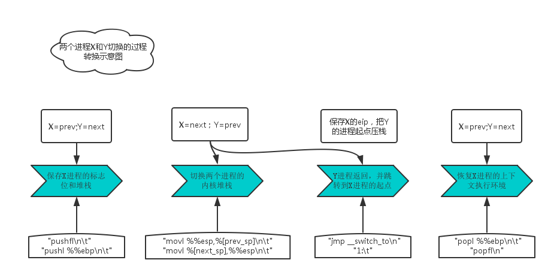

# 内容

1. Linux中进程调度的基本概念与相关知识
2. schedule函数如何实现进程调度
3. Linux进程的执行过程（一般情况与特殊情况）
4. 宏观描述Linux系统执行

- 理解Linux系统中进程调度的时机，可以在内核代码中搜索schedule()函数，看都是哪里调用了schedule()，判断我们课程内容中的总结是否准确；

- 使用gdb跟踪分析一个schedule()函数 ，验证您对Linux系统进程调度与进程切换过程的理解。
- 特别关注并仔细分析switch_to中的汇编代码，理解进程上下文的切换机制，以及与中断上下文切换的关系；

# 实验过程

```c
cd LinuxKernel
rm -rf menu
git clone https://github.com/mengning/menu.git
cd menu
mv test_exec.c test.c
make rootfs
//2.通过增加-s -S启动参数打开调试模式
qemu -kernel ../linux-3.18.6/arch/x86/boot/bzImage -initrd ../rootfs.img -s -S
//3.打开gdb进行远程调试
gdb
file ../linux-3.18.6/vmlinux
target remote:1234
//运行MenuOS，设置3个断点：schedule、context\_switch、switch_to。
b schedule
b context_switch
b switch_to
b pick_next_task
```

# 代码分析

## 0.在switch_to函数中，通过嵌入如下的汇编代码实现进程上下文的切换以及与中断上下文的切换：

```c
asm volatile("pushfl\n\t"          /* 保存标志位 */    
     "pushl %%ebp\n\t"             /* 保存    EBP   */    
    "movl %%esp,%[prev_sp]\n\t"    /* 保存    ESP   */ 
     "movl %[next_sp],%%esp\n\t"   /* 恢复 ESP   */ 
     "movl $1f,%[prev_ip]\n\t"     /* 保存    EIP   */    
     "pushl %[next_ip]\n\t"        /* 恢复 EIP   */    
     __switch_canary            
     "jmp __switch_to\n"           /* 跳转l  */    
     "1:\t"        
     "popl %%ebp\n\t"              /* 恢复 EBP   */    
     "popfl\n"                     /* 恢复标志位*/    
            
     /* output parameters */        
     : [prev_sp] "=m" (prev->thread.sp),        
       [prev_ip] "=m" (prev->thread.ip),        
       "=a" (last),            
                   
       /* clobbered output registers: */        
       "=b" (ebx), "=c" (ecx), "=d" (edx),        
       "=S" (esi), "=D" (edi)        
                   
       __switch_canary_oparam        
            
       /* input parameters: */        
     : [next_sp]  "m" (next->thread.sp),        
       [next_ip]  "m" (next->thread.ip),        
                   
       /* regparm parameters for __switch_to(): */    
       [prev]     "a" (prev),        
       [next]     "d" (next)        
            \
       __switch_canary_iparam        
            \
     : /* reloaded segment registers */    
    "memory"); 
```

## 1. schedule

```c
asmlinkage __visible void __sched schedule(void)
{
        struct task_struct *tsk = current;//来获取当前进程
  
        sched_submit_work(tsk);//避免死锁
        __schedule();//处理切换过程
}
```

## 2. __schedule

```c
static void __sched __schedule(void)
{
    struct task_struct *prev, *next;
    unsigned long *switch_count;
    struct rq *rq;
    int cpu;
 
need_resched:
    preempt_disable();   //关闭内核抢占
    cpu = smp_processor_id();
    rq = cpu_rq(cpu);   //找到当前cpu上的就绪队列rq，跟当前进程相关的runqueue的信息被保存在rq中
    rcu_note_context_switch(cpu);
    prev = rq->curr;   //将正在运行的进程curr保存到prev中
 
    schedule_debug(prev);//如果禁止内核抢占，而又调用了cond_resched就会出错，这里就是用来捕获该错误的
 
    if (sched_feat(HRTICK))
        hrtick_clear(rq);
 
    smp_mb__before_spinlock();
    raw_spin_lock_irq(&rq->lock);
 
    switch_count = &prev->nivcsw;//切换次数记录, 默认认为非主动调度计数
     
    if (prev->state && !(preempt_count() & PREEMPT_ACTIVE))//如果内核态没有被抢占，并且内核抢占有效
    {
        //如果当前进程有非阻塞等待信号，并且它的状态是TASK_INTERRUPTIBLE
        if (unlikely(signal_pending_state(prev->state, prev)))
        {
            prev->state = TASK_RUNNING; //将当前进程的状态设为：TASK_RUNNING
        }
        else
        {
            deactivate_task(rq, prev, DEQUEUE_SLEEP);//将当前进程从runqueue(运行队列)中删除
            prev->on_rq = 0;  //标识当前进程不在runqueue中
 
           
            if (prev->flags & PF_WQ_WORKER)
            {
                struct task_struct *to_wakeup;
 
                to_wakeup = wq_worker_sleeping(prev, cpu);
                if (to_wakeup)
                    try_to_wake_up_local(to_wakeup);
            }
        }
        switch_count = &prev->nvcsw;
    }
 
    pre_schedule(rq, prev);
 
    if (unlikely(!rq->nr_running))//如果runqueue中没有正在运行的进程
        idle_balance(cpu, rq); //就会从其它CPU拉入进程
 
    put_prev_task(rq, prev);   //通知调度器，当前进程要被另一个进程取代，做好准备
    next = pick_next_task(rq); //从runqueue中选择最适合的进程
    clear_tsk_need_resched(prev); //清除当前进程的重调度标识
    rq->skip_clock_update = 0;
    //当前进程与所选进程是否是同一进程，不属于同一进程才需要切换
    if (likely(prev != next))
    {
        rq->nr_switches++;
        rq->curr = next; //所选进程代替当前进程
        ++*switch_count;
 
        context_switch(rq, prev, next); //负责底层上下文切换
 
        cpu = smp_processor_id();
        rq = cpu_rq(cpu);
    }
    else
        raw_spin_unlock_irq(&rq->lock);  //如果不需要切换进程，则只需要解锁
 
    post_schedule(rq);
 
    sched_preempt_enable_no_resched();
    if (need_resched())
        goto need_resched;
}
```

put\_prev_task和pick_next\_task是进程的调度的核心；理解context\_switch是理解进程的切换的必要过程。在系统进行上下文切换中，首先需要判断prev和next是否是同一个进程，如果是，则保持原状，不切换；否则接着将next设置为rq->curr，然后调用context_switch来进行实际的上下文切换。


## 3. context_switch

```c
/*context_switch - switch to the new MM and the new thread's register state.*/
static __always_inline struct rq *context_switch(struct rq *rq, struct task_struct *prev, struct task_struct *next){
    struct mm_struct *mm, *oldmm;

    /*  完成进程切换的准备工作  */
    prepare_task_switch(rq, prev, next);

    mm = next->mm;
    oldmm = prev->active_mm;
    
    /*For paravirt, this is coupled with an exit in switch_to to
    combine the page table reload and the switch backend into
    one hypercall.*/
    arch_start_context_switch(prev);

    /* 如果next是内核线程，则线程使用prev所使用的地址空间schedule( )函数把该线程设置为懒惰TLB模式
    内核线程并不拥有自己的页表集(task_struct->mm = NULL),它使用一个普通进程的页表集
    不过，没有必要使一个用户态线性地址对应的TLB表项无效,因为内核线程不访问用户态地址空间。*/
    if (!mm){   //  内核线程无虚拟地址空间, mm = NULL
     /*  内核线程的active_mm为上一个进程的mm
      注意此时如果prev也是内核线程,则oldmm为NULL, 即next->active_mm也为NULL  */
        next->active_mm = oldmm;
        //增加mm的引用计数 
        atomic_inc(&oldmm->mm_count);
         //通知底层体系结构不需要切换虚拟地址空间的用户部分, 这种加速上下文切换的技术称为惰性TBL 
        enter_lazy_tlb(oldmm, next);
    }
    else //  不是内核线程, 则需要切切换虚拟地址空间 
        switch_mm(oldmm, mm, next);
    /*  如果prev是内核线程或正在退出的进程,就重新设置prev->active_mm,然后把指向prev内存描述符的指针保存到运行队列的prev_mm字段中*/
    if (!prev->mm){
    	//将prev的active_mm赋值和为空  /
        prev->active_mm = NULL;
        //更新运行队列的prev_mm成员  /
        rq->prev_mm = oldmm;
    }
    /*
    - Since the runqueue lock will be released by the next
    - task (which is an invalid locking op but in the case
    - of the scheduler it's an obvious special-case), so we
    - do an early lockdep release here:
    */
    lockdep_unpin_lock(&rq->lock);
    spin_release(&rq->lock.dep_map, 1, THIS_IP);

    /* Here we just switch the register state and the stack. 
    - 切换进程的执行环境, 包括堆栈和寄存器
    - 同时返回上一个执行的程序
    - 相当于prev = switch_to(prev, next)  */
    switch_to(prev, next, prev);
    /* switch_to之后的代码只有在
    - 当前进程再次被选择运行(恢复执行)时才会运行
    - 而此时当前进程恢复执行时的上一个进程可能跟参数传入时的prev不同
    - 甚至可能是系统中任意一个随机的进程
    - 因此switch_to通过第三个参数将此进程返回
    */
    /*  路障同步, 一般用编译器指令实现
     *  确保了switch_to和finish_task_switch的执行顺序
     *  不会因为任何可能的优化而改变  */
    barrier();  
    /*  进程切换之后的处理工作  */
    finish_task_switch(this_rq(), prev);
}
```

## 4. switch_to

```c
/*
 * Saving eflags is important. It switches not only IOPL between tasks,
 * it also protects other tasks from NT leaking through sysenter etc.
 */
#define switch_to(prev, next, last)                                     \
do {                                                                    \
        /*                                                              \
         * Context-switching clobbers all registers, so we clobber      \
         * them explicitly, via unused output variables.                \
         * (EAX and EBP is not listed because EBP is saved/restored     \
         * explicitly for wchan access and EAX is the return value of   \
         * __switch_to())                                               \
         */                                                             \
        unsigned long ebx, ecx, edx, esi, edi;                          \
                                                                        \
        asm volatile("pushfl\n\t" /* save flags 保存就的ebp、和flags寄存器到旧进程的内核栈中*/   \
                     "pushl %%ebp\n\t"          /* save    EBP   */     \
                     "movl %%esp,%[prev_sp]\n\t"        /* save ESP  将旧进程esp保存到thread_info结构中 */ \
                     "movl %[next_sp],%%esp\n\t"        /* restore ESP 用新进程esp填写esp寄存器，此时内核栈已切换  */ \
                     "movl $1f,%[prev_ip]\n\t"  /* save EIP将标号1:的地址保存到prev->thread.ip中，下一次该进程被调用的时候从1的位置开始执行*/     \
                     "pushl %[next_ip]\n\t"     /* restore EIP 将新进程的ip值压入到新进程的内核栈中 */     \
                     __switch_canary                                    \
                     "jmp __switch_to\n"        /* regparm call  */     \
                     "1:\t"                                             \
                     "popl %%ebp\n\t"           /* restore EBP 该进程执行，恢复ebp寄存器*/     \
                     "popfl\n"                  /* restore flags  恢复flags寄存器*/     \
                                                                        \
                     /* output parameters */                            \
                     : [prev_sp] "=m" (prev->thread.sp),/*m表示把变量放入内存，即把[prev_sp]存储的变量放入内存，最后再写入prev->thread.sp*/\
                       [prev_ip] "=m" (prev->thread.ip),                \
                       "=a" (last), /*=表示输出,a表示把变量last放入ax,eax = last*/         \
                                                                        \
                       /* clobbered output registers: */                \
                       "=b" (ebx), "=c" (ecx), "=d" (edx),/*b 变量放入ebx,c表示放入ecx，d放入edx,S放入si,D放入edi*/\
                       "=S" (esi), "=D" (edi)                           \
                                                                        \
                       __switch_canary_oparam                           \
                                                                        \
                       /* input parameters: */                          \
                     : [next_sp]  "m" (next->thread.sp), /*next->thread.sp 放入内存中的[next_sp]*/\
                       [next_ip]  "m" (next->thread.ip),                \
                                                                        \
                       /* regparm parameters for __switch_to(): */      \
                       [prev]     "a" (prev),                           \
                       [next]     "d" (next)                            \
                                                                        \
                       __switch_canary_iparam                           \
                                                                        \
                     : /* reloaded segment registers */                 \
                        "memory");                                      \
} while (0)
```

## 5.\__switch_to

```c
__visible __notrace_funcgraph struct task_struct *
__switch_to(struct task_struct *prev_p, struct task_struct *next_p)
{
    struct thread_struct *prev = &prev_p->thread,
                 *next = &next_p->thread;
    int cpu = smp_processor_id();/* 得到当前代码运行的CPU编号 */
    struct tss_struct *tss = &per_cpu(init_tss, cpu);/* 得到当前CPU的TSS init_tss为一个per cpu变量*/
    fpu_switch_t fpu;
 
    /* never put a printk in __switch_to... printk() calls wake_up*() indirectly */
 
    fpu = switch_fpu_prepare(prev_p, next_p, cpu);/* 加载FPU、MMX、XMM的寄存器组 */
 
    /*
     * Reload esp0.
     */
    load_sp0(tss, next);//重新载入esp0：把next_p->thread.esp0装入对应于本地cpu的tss的esp0字段；
    //任何由sysenter汇编指令产生的从用户态到内核态的特权级转换将把这个地址拷贝到esp寄存器中 
 
    /*
     * Save away %gs. No need to save %fs, as it was saved on the
     * stack on entry.  No need to save %es and %ds, as those are
     * always kernel segments while inside the kernel.  Doing this
     * before setting the new TLS descriptors avoids the situation
     * where we temporarily have non-reloadable segments in %fs
     * and %gs.  This could be an issue if the NMI handler ever
     * used %fs or %gs (it does not today), or if the kernel is
     * running inside of a hypervisor layer.
     */
    lazy_save_gs(prev->gs);
 
    /*
     * Load the per-thread Thread-Local Storage descriptor.
     */
    load_TLS(next, cpu);//装载每个线程的线程局部存储描述符：
    //把next进程使用的线程局部存储(TLS)段  装入本地CPU的全局描述符表；
    //三个段选择符保存在进程描述符内的tls_array数组中 
 
    /*
     * Restore IOPL if needed.  In normal use, the flags restore
     * in the switch assembly will handle this.  But if the kernel
     * is running virtualized at a non-zero CPL, the popf will
     * not restore flags, so it must be done in a separate step.
     */
    if (get_kernel_rpl() && unlikely(prev->iopl != next->iopl))
        set_iopl_mask(next->iopl);
 
    /*
     * If it were not for PREEMPT_ACTIVE we could guarantee that the
     * preempt_count of all tasks was equal here and this would not be
     * needed.
     */
    task_thread_info(prev_p)->saved_preempt_count = this_cpu_read(__preempt_count);
    this_cpu_write(__preempt_count, task_thread_info(next_p)->saved_preempt_count);
 
    /*
     * Now maybe handle debug registers and/or IO bitmaps
     */
    if (unlikely(task_thread_info(prev_p)->flags & _TIF_WORK_CTXSW_PREV ||
             task_thread_info(next_p)->flags & _TIF_WORK_CTXSW_NEXT))
        __switch_to_xtra(prev_p, next_p, tss);
 
    /*
     * Leave lazy mode, flushing any hypercalls made here.
     * This must be done before restoring TLS segments so
     * the GDT and LDT are properly updated, and must be
     * done before math_state_restore, so the TS bit is up
     * to date.
     */
    arch_end_context_switch(next_p);
 
    this_cpu_write(kernel_stack,
          (unsigned long)task_stack_page(next_p) +
          THREAD_SIZE - KERNEL_STACK_OFFSET);
 
    /*
     * Restore %gs if needed (which is common)
     */
    if (prev->gs | next->gs)
        lazy_load_gs(next->gs);
 
    switch_fpu_finish(next_p, fpu);
 
    this_cpu_write(current_task, next_p);
 
    return prev_p;
}
```

# 六、总结

本次课程学习了操作系统如何进行进程的切换以及系统的一般执行过程。其中还是脱离不出中断的使用，进程切换最主要的时机就在于中断的过程，对关键函数switch_to的跟踪分析以及函数解读清晰地展示了堆栈如何变化的。

schedule()函数用来选择一个新的进程来运行，并调用context\_switch()进行上下文的切换，这个宏调用switch_to()来进行关键上下文切换，其中pick_next_task()函数封装了进程调度算法。


##1.对“Linux系统一般执行过程”的理解：

Linux系统中，一个进程的一般执行过程：

即从正在运行的用户态进程X切换到运行用户态进程Y的过程。


## 2.这里有几个特殊情况：

通过中断处理过程中的调度时机，用户态进程与内核线程之间互相切换和内核线程之间互相切换，与最一般的情况非常类似，只是内核线程运行过程中发生中断没有进程用户态和内核态的转换；

1. 内核线程主动调用schedule()，只有进程上下文的切换，没有发生中断上下文的切换，与最一般的情况略简略；

2. 创建子进程的系统调用在子进程中的执行起点及返回用户态，如fork；

3. 加载一个新的可执行程序后返回到用户态的情况，如execve。

## 3.典型的Linux操作系统的结构


##4.switch_to从A进程切换到B进程的步骤如下：

### step1：复制两个变量到寄存器：

```
[prev]"a" (prev)
[next]"d" (next)
```
即

> eax <== prev_A或eax<==%p(%ebp_A) 
> edx <== next_A 或edx<==%n(%ebp_A)


### step2：保存进程A的ebp和eflags

```
pushfl /*将状态寄存器eflags压栈*/
pushl %ebp
```
因为现在esp还在A的堆栈中，所以它们是被保存到A进程的内核堆栈中。


### step3：保存当前esp到A进程内核描述符中：

```assembly
movl %%esp, %[prev_sp]\n\t  /*save    ESP  */
```
即
> prev_A->thread.sp<== esp_A

在调用switch_to时，prev是指向A进程自己的进程描述符的。

### step4：从next（进程B）的描述符中取出之前从B切换出去时保存的esp_B。

```
movl %[next_sp], %%esp\n\t/* restore ESP */
```
即
> esp_B <==next_A->thread.sp


### step5：把标号为1的指令地址保存到A进程描述符的ip域：

```
movl $1f, %[prev_ip]\n\t/* save    EIP  */
```
即
> prev_A->thread.ip<== %1f

当A进程下次从switch_to回来时，会从这条指令开始执行。具体方法要看后面被切换回来的B的下一条指令。

### step6：将返回地址保存到堆栈，然后调用switch_to()函数，switch_to()函数完成硬件上下文切换。

```
pushl %[next_ip]\n\t/* restoreEIP   */
jmp switch_to\n /* regparmcall  */
```

如果之前B也被switch_to出去过，那么[next_ip]里存的就是下面这个1f的标号，但如果进程B刚刚被创建，之前没有被switch_to出去过，那么[next_ip]里存的将是ret_ftom_fork（参看copy_thread()函数）。

当这里switch_to()返回时，将返回值prev_A又写入了%eax，这就使得在switch_to宏里面eax寄存器始终保存的是prev_A的内容，或者，更准确的说，是指向A进程描述符的“指针”。

### step7：从switch_to()返回后继续从1:标号后面开始执行，修改ebp到B的内核堆栈，恢复B的eflags：

```
popl %%ebp\n\t/* restore EBP */   
popfl\n/*restore flags */
```

如果从switch_to()返回后从这里继续运行，那么说明在此之前B肯定被switch_to调出过，因此此前肯定备份了ebp_B和flags_B，这里执行恢复操作。

### step8：将eax写入last，以在B的堆栈中保存正确的prev信息。

```
 "=a"(last)
```
即
> last_B <== %eax

而从context_switch()中看到的调用switch_to的方法是：switch_to(prev,next, prev);

# 基础补充

## 进程的调度时机与进程的切换

##### 不同类型进程的不同调度需求

**第一种分类：**

- I/O-bound：频繁进行I/O，并且需要花费很多时间等待I/O完成
- CPU-bound：计算密集，需要大量的CPU时间进行运算

**第二种分类：**

- 批处理进程：不必与用户交互，常在后台进行；不必很快响应（典型的批处理系统：编译程序、科学计算）。
- 实时进程：有实时需求，不应被低优先级进程阻塞，响应时间短、要稳定（典型的实时进程：视频/音频、机械控制等）。
- 交互式进程：需要经常与用户交互，因此要花很多时间等待用户输入操作，响应时间要快，平均延迟要低（典型的交互式程序：shell、文本编辑程序、图形应用程序）。

##### Linux中的进程调度

调度策略：是决定什么时候以怎样的方式选择一个新进程运行的规则。Linux中的调度是多种策略和调度算法的组合。

Linux的调度基于分时和优先级。

Linux根据进程的优先级进行排队

- 根据特定的算法计算出进程的优先级，用一个值表示，这个值表示把进程如何适当的分配给CPU。
- Linux中进程的优先级是动态的，调度程序会根据进程行为的周期性调整进程的优先级。（较长时间未分配到CPU的进程优先级升高，已在CPU上运行了较长时间的进程优先级下降）

##### schedule函数

schedule函数：实现调度，在队列中一个进程把CPU分配给它。

调用方法：

- 直接调用schedule()
- 松散调用，根据need_resched标记

##### 进程调度的时机

- 中断处理过程（包括时钟中断、I/O中断、系统调用和异常）中，直接调用schedule()，或者返回用户态时根据need_resched标记调用schedule()。
- 内核线程可以直接调用schedule()进行进程切换，也可以在中断处理过程中进行调度，也就是说内核线程作为一类的特殊的进程可以主动调度，也可以被动调度（内核线程是只有内核态而没有用户态的特殊进程）。
- 用户态进程只能被动调度，仅能通过陷入内核态后的某个时机点进行调度，即在中断处理过程中进行调度。

#### 进程上下文切换

##### 进程的切换

进程切换（任务切换、上下文切换）：为了控制进程的执行，内核必须有能力挂起正在CPU上执行的进程，并恢复以前挂起的某个进程的执行，

挂起正在CPU上执行的进程，与中断时保存现场是不同的，中断前后是在同一个进程上下文中，只是由用户态转向内核态执行；而进程切换是在不同的进程之间进行调度。

进程上下文包含了进程执行需要的所有信息

- 用户地址空间：包括程序代码，数据，用户堆栈等
- 控制信息：进程描述符，内核堆栈等
- 硬件上下文（注意中断也要保存硬件上下文只是保存的方法不同，中断：保存现场&恢复线程；进程调度：switc_to的机制）

##### schedule()函数实现方法

schedule()函数选择一个新的进程来运行，并调用context _ switch进行上下文的切换，这个宏调用switch _ to来进行关键上下文切换

- next = pick _ next _ task(rq, prev); 封装了使用的某种进程调度策略，选择一个进程作为next

- context_switch(rq, prev, next); 实现进程上下文切换

- switch_to切换寄存器的状态和堆栈，利用两个参数：prev指向当前进程，next指向被调度的进程

  ```c
    #define switch_to(prev, next, last)
    do {       
    unsigned long ebx, ecx, edx, esi, edi;          
  
    asm volatile(
         "pushfl\n\t"      #保存当前进程的flags 
         "pushl %%ebp\n\t"        #当前进程的堆栈基址压栈 
  
         //以下这两句实际上是实现了内核堆栈的切换，之后的所有压栈动作都是在next的内核堆栈中实现 
         "movl %%esp,%[prev_sp]\n\t"  #把当前的栈底保存到prev_sp 
         "movl %[next_sp],%%esp\n\t"  #把下一个进程的栈顶放入esp寄存器当中
  
         "movl $1f,%[prev_ip]\n\t"  #保存当前进程的eip，在恢复当前进程的时候从这里恢复
         "pushl %[next_ip]\n\t"   #把next进程的起点压入栈，next进程的栈顶就是它的起点
         //如果是进程切换这里一般是$1f,如果是新创建的子进程这里是ret_from_fork   
  
         __switch_canary   
  
        //这里使用jmp，因此是通过寄存器传递参数（$1f）；如果是call的话直接ret
         "jmp __switch_to\n"  #通过寄存器传递参数
         "1:\t"  #prev进程的起始点 
  
         //恢复prev进程的上下文执行环境        
         "popl %%ebp\n\t"     #ebp出栈    
         "popfl\n"            #flags出栈
  
        /* output parameters */                
         : [prev_sp] "=m" (prev->thread.sp),   #当前进程内核堆栈的栈底  
           [prev_ip] "=m" (prev->thread.ip),   #当前进程的eip    
           "=a" (last),                 
  
           /* clobbered output registers: */     
           "=b" (ebx), "=c" (ecx), "=d" (edx),      
           "=S" (esi), "=D" (edi)             
  
           __switch_canary_oparam                
  
           /* input parameters: */                
         : [next_sp]  "m" (next->thread.sp),       #下一个内核堆栈的栈底
           [next_ip]  "m" (next->thread.ip),       #下一个进程执行的起点
  
           //为进程切换做准备  
           [prev]     "a" (prev),              
           [next]     "d" (next)               
  
           __switch_canary_iparam                
  
         : /* reloaded segment registers */           
        "memory");                  
    } while (0)
  ```



## Linux系统的一般执行过程

#### 一般进程切换的过程

正在运行的用户态进程X切换到运行用户态进程Y的过程：

1. 正在运行的用户态进程X
2. 发生中断——save cs:eip/esp/eflags(当前进程CPU的状态压入用户态进程X的内核堆栈) load cs:eipss:esp(加载中断服务例程和内核堆栈)。
3. 进入中断处理进程，首先SAVE_ALL，保存现场
4. 中断处理过程中或中断返回前调用了schedule()，其中的switch_to做了关键的进程上下文切换
5. 标号1之后开始运行用户态进程Y(这里Y曾经通过以上步骤被切换出去过因此可以从标号1继续执行)
6. restore_all 恢复进程X的执行状态
7. iret - pop cs:eip/ss:esp/eflags from kernel stack
8. 继续运行用户态进程Y

#### 几种特殊情况

- 通过中断处理过程中的调度时机，用户态进程与内核线程之间互相切换和内核线程之间互相切换，与最一般的情况非常类似，只是内核线程运行过程中发生中断没有进程用户态和内核态的转换；
- 内核线程主动调用schedule()，只有进程上下文的切换，没有发生中断上下文的切换，比 最一般的情况略简略；
- 创建子进程的系统调用在子进程中的执行起点及返回用户态，如fork；
- 加载一个新的可执行程序后返回到用户态的情况，如execve；

# 参考资料

-  [x86体系结构下Linux-2.6.26的进程调度和切换](http://home.ustc.edu.cn/~hchunhui/linux_sched.html)

- [Linux进程调度原理](http://www.cnblogs.com/zhaoyl/archive/2012/09/04/2671156.html)

- [Linux内核分析——进程的切换和系统的一般执行过程](http://blog.csdn.net/u010771356/article/details/70188234)

- [进程调度与进程切换的过程](https://xuezhaojiang.github.io/LinuxCore/lab8/lab8.html)

- [理解进程调度时机跟踪分析进程调度与进程切换的过程](http://www.jianshu.com/p/d39c670e7f61)

- [理解进程调度时机跟踪分析进程调度与进程切换的过程](http://blog.csdn.net/umika/article/details/51176356)

- [理解进程调度时机跟踪分析进程调度与进程切换的过程(Linux)](http://blog.csdn.net/naiveorange/article/details/51171214)
