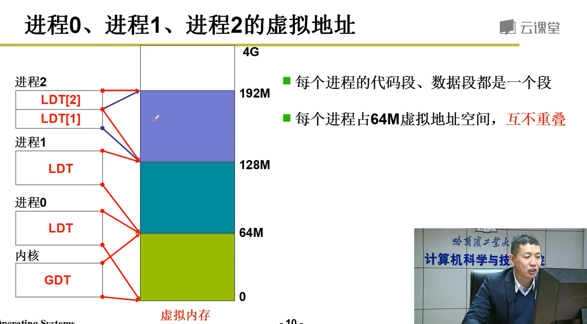
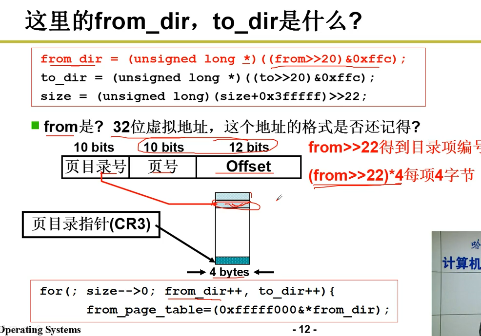
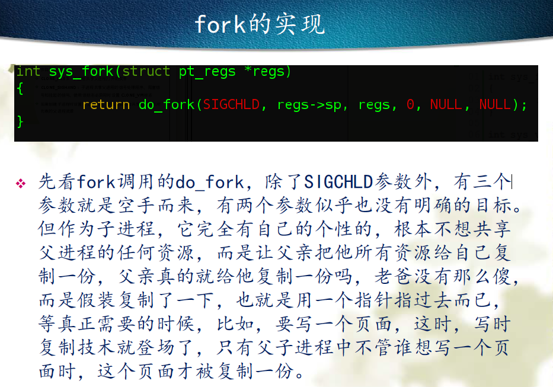
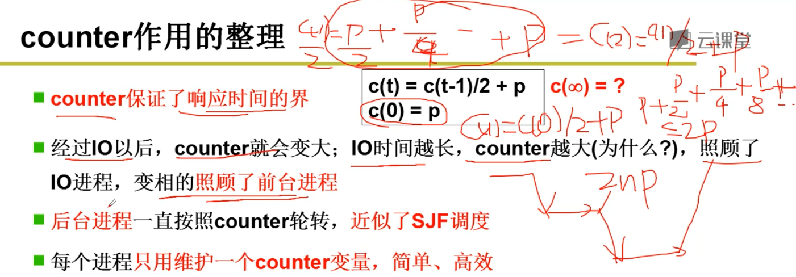
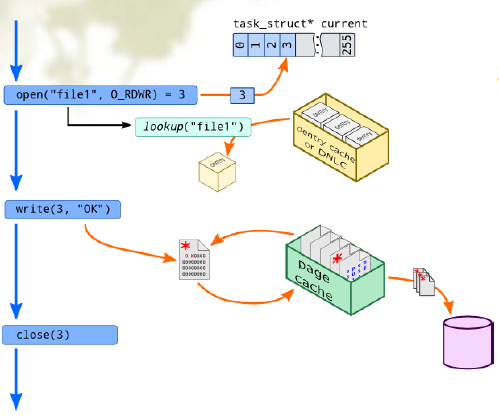
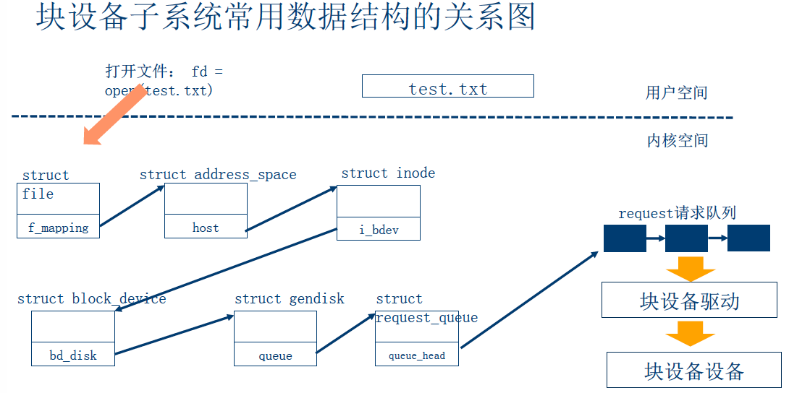

---


layout:     post                    # 使用的布局（不需要改）
title:      操作系统笔记               # 标题 
subtitle:   决定你的高度不在于搬砖，打好地基尤其重要 #副标题
date:       2018-10-24              # 时间
author:     BY  Seaside                    # 作者
header-img: img/blog/7.jpg    #这篇文章标题背景图片
catalog: true                       # 是否归档
tags:                               #标签
    - CS
    - OS
---

# 0.预备知识

## (1) 寄存器

### 通用寄存器


eax ebx ecx edx


ebp

esi

edi

esp


对于64位系统，

进行系统调用时，通过rdi,rsi,rdx,r10,r8,r9最多6个参数传递。


`argv` 在%rsi， `argc`在%rdi


### 段寄存器

286架构提出4个段寄存器：

- CS：代码段寄存器，存储指令。CPU取指令时根据CS+eip来确定指令的地址。
- DS：数据段寄存器，存储数据段的段值。
- SS：堆栈段寄存器，存储堆栈段的段值。
- ES：附加段寄存器，存储附加数据段的内容。


使用场景：

- CPU

CS:IP 两个寄存器指示了 CPU 当前将要读取的指令的地址，其中  CS  为代码段寄存器，而   IP  为指令指针寄存器 

设置  CS:IP  两个寄存器指向可执行文件的起始地址，此后  CPU  便从这个起始地址开始读取内存中的指令，并且执行，

比如我们在写汇编程序时，通常会使用  START  标记，其实这个标记就是用来标记起始地址的，

当将一个汇编程序编译，连接成可执行文件以后，再通过操作系统的  Shell  程序将可执行文件加载到内存中以后，这个  START  所标记处的地址就是整个可执行文件的起始地址了 。


386 架构提出2个新的段寄存器： 

**FS**（ exception handling chain）

**GS**.


### 系统寄存器


### 标志寄存器


### 内存管理寄存器


GDTR:
LDTR
IDTR

#### 中断描述符表


指令LIDT SIDT：加载和保存当前IDTR内容

用于寻址存放描述符表的段

TR：寻找特殊任务状态段TSS


### 控制寄存器

CR0 

PG位分页允许

CR1

CR2

CR3

页目录基址

### TLB

### TSS任务状态段

### 外设寄存器

也称为I/O端口，通常包括控制寄存器、状态寄存器和数据寄存器三类。

## 描述符表

段描述符表（或叫段表）

> 描述转换关系。段号描述的是虚拟地址空间段的编号，基地址是线性地址空间段的起始地址。段描述符表中的每一个表项叫做段描述符

## (2) 堆栈

### 刚进入保护模式时堆栈


### 汇编调用C函数堆栈

实际上是把参数都压到栈里，然后c程序就可以调用，用call来调用 
但是要注意c语言 调用结束后，要把栈里的参数删掉，即addl指令，把指针改一下，忽略那些参数

实际上是 
push 参数 
push 返回地址 
jmp 调用地址

c函数右括号会生成ret指令，会返回到返回地址！ 

这个时候要把没用的参数从栈里去掉，这就是为什么要调用addl 


### 任务内核态堆栈与用户态堆栈切换


调用`int 0x80`进入内核态

用户态堆栈 ss:esp压栈

返回位置压栈cs:eip压栈

iret退出

### 函数调用堆栈

堆栈是C语言程序运行时必须的一个记录调用路径和参数的空间

**堆栈的作用**

- 函数调用框架
- 传递参数
- 保存返回地址
- 提供局部变量空间

**堆栈相关的寄存器**

- esp，堆栈指针，指向栈顶
- ebp，基址指针，指向栈底，在C语言中用作记录当前函数调用基址。

**其他关键寄存器**

cs（代码段寄存器） : eip：总是指向下一条的指令地址

- 顺序执行：总是指向地址连续的下一条指令
- 跳转/分支：执行这样的指令的时候， cs : eip的值会根据程序需要被修改

**参数传递与局部变量**

- 建立框架（相当于 call 指令）

  ```
    push %ebp
    movl %esp,%ebp
  ```

- 拆除框架（相当于 ret 指令）

  ```
    movl %ebp,%esp
    pop  %ebp
  ```

函数返回时一定会拆除框架，建立和拆除是一一对应的。

- 传递参数

在建立子函数的框架之前，局部变量的值保存在调用者堆栈框架中，所以在子函数框架建立之前可以采用变址寻址的方式将变量值入栈。

函数的返回值通过eax寄存器传递


## (3) 内核数据结构

`linux/include/list.h & types.h`

### 链表

Linux内核对链表的实现方式与众不同，在链表中并不包含数据，其具体的定义如下：

```c
struct list_head {
	struct list_head *next, *prev;
};
```

这个链表结构常常被嵌入到其他结构中，比如：

```c
struct my_list{ 
    void *mydata; 
    struct list_head list;
}; 
```

说明：list域隐藏了链表的指针特性

以`struct list_head`为基本对象，可以对链表进行插入、删除、合并以及遍历等各种操作，这些操作位于内核的头文件`list.h`中。

**声明和初始化**

```C
#define LIST_HEAD_INIT(name) { &(name), &(name) }

#define LIST_HEAD(name) \
	struct list_head name = LIST_HEAD_INIT(name)

static inline void INIT_LIST_HEAD(struct list_head *list)
{
	WRITE_ONCE(list->next, list);
	list->prev = list;
}
```

**插入以及遍历**

在内核代码中，list_add() 和 list_add_tail() 均调用 \__list_add 真正实现头插和尾插，函数名前加两个下划线表示内部函数。

```c
static inline void list_add();
static inline void list_add_tail();

static inline void list_add(struct list_head *new, struct list_head *head){
    __list_add(new, head, head->next);
}
/*该函数向指定链表的head 结点后插入 new 结点 。因为 是循环链表，而且通常没有首尾结点的 概念 ，所以可以将任何结点传给 head 。若传 最后一 个元素给head ，该函数就可以实现一个栈。*/
```


### 哈希


```c
struct hlist_head {
	struct hlist_node *first;
};

struct hlist_node {
	struct hlist_node *next, **pprev;
};
```

# 1.启动引导

## 实模式

```
bootsect.s
 setup.s
      读取硬件参数
      读取system到内存0x00位置
      从16位模式 转到 32位模式，即从实时模式 转到 保护模式， 使得寻址方式发生了改变，跳转到0x00执行system，其实是转到head.s代码
      实时模式： 地址翻译 CS<<4 + IP
      保护模式 ：根据CS查表 + IP
 head.s
      初始化GDT，IDT表
      转到main（）函数，main（）是c函数
 main()

      各种初始化，包括mem_init 标记那些内存块被使用，哪些没有被使用

```

## 保护模式


## 内存地址转换


task_struct -> mm_struct -> PGD字段, 得到页全局目录地址 ， 赋值给cr3








### 缺页异常

cr2

#### 换入

#### 换出

页面置换算法

FIFO

MIN

LRU

- 时间戳
- 页码栈
- 近似实现 clock 引用位


## 系统调用


硬件上隔离用户段和内核段，DPL CPL来实现, 其实是把内存分段了，进行隔离保护 
从用户段访问内核段，必须通过中断0x80才能访问内核段 


# 2. CPU管理

## 2.1 进程及线程基本概念

- 进程：处于执行期的程序。包括代码段和打开的文件、挂起的信号、内核内部数据、处理器状态一个或多个具有内存映射的内存地址空间或执行线程等其他资源。
- 线程：是在进程中活动的对象。每个线程都有一个独立的程序计数器、进程栈和一组进程寄存器。内核调度的对象是线程而非进程。操作系统中进程提供两种虚拟机制：虚拟存储器和虚拟内存。
- 程序：本身并不是进程，进程是处于执行期的程序以及相关的资源的总称。不同的进程可以执行同一个程序。
- 在现代操作系统中，进程提供两种虚拟机制：虚拟处理器和虚拟内存。包含在同一个进程中的线程可以共享虚拟内存，但是每个都拥有各自的虚拟处理器。


## 进程描述符及任务结构

内核把进程的列表存放在叫做任务队列的双向循环链表中。链表中的每一项都是进程描述符。类型为task_struct，里面包含的数据有：它打开的文件、进程的地址空间、挂起的信号、进程的状态以及其他相关信息。

```c
struct task_struct {
    volatile long state; //进程状态
    int pid, uid, gid; 
    一些标识符
    struct task_struct *real_parent; //真正创建当前进程的进程
    struct task_struct *parent; //相当于养父
    struct list_head children; //子进程链表
    struct list_head sibling;  //兄弟进程链表
    struct task_struct *group_leader; //线程组的头进程
    ...
}
```


### 创建


三个系统调分别调用do_fork

```c
long do_fork(unsigned long clone_flags,
    unsigned long stack_start,
    unsigned long stack_size,
    int __user *parent_tidptr,
    int __user *child_tidptr
)
```




进程 和 线程 都是动态概念 
进程 = 资源 （包括寄存器值，PCB，内存映射表）+ 指令序列 
线程 = 指令序列

线程 的资源是共享的， 
进程 间的资源是分隔独立的，内存映射表不同，占用物理内存地址是分隔的

线程 的切换只是切换PC，切换了指令序列 
进程 的切换不仅要切换PC，还包括切换资源，即切换内存映射表

用户级线程：调用Yield函数，自己主动让出cpu，内核看不见，内核只能看见所属进程而看不见用户级线程，所以一个用户级线程需要等待，内核会切到别的进程上，不会切到该进程下的其他用户级线程！！！ 

内核级线程： 内核能看见内核级线程，一个线程需要等待，内核会切到所属进程下的其他内核级线程。

### 切换

### 线程

#### 内核线程


## 2.2 进程调度

**指标**
周转时间： 从开始申请执行任务，到执行任务完成 
响应时间： 从开始申请执行任务到开始执行任务

### 三种调度方法

1） 先来先服务 平均周转时间可能会很长 
2） 短作业优先（SJF） 
周转时间短，但是响应时间长 
适用于后台程序，如gcc的编译，快点把整个程序编译完 
3） 时间片轮转（RR） 
响应时间可以得到保证，nT，n为任务个数，T为时间片长度， 
适用于前台程序，IO操作多的 
4） 优先级轮转 

固定优先级，可能会造成又程序一直没法得到执行，需要动态调整优先级




## 2.3 中断机制

### 概念

Linux 内核需要对连接到计算机上的所有硬件设备进行管理，毫无疑问这是它的份内事。如果要管理这些设备，首先得和它们互相通信才行，一般有两种方案可实现这种功能：

1. **轮询（polling）** 让内核定期对设备的状态进行查询，然后做出相应的处理；
2. **中断（interrupt）** 让硬件在需要的时候向内核发出信号（变内核主动为硬件主动）。

第一种方案会让内核做不少的无用功，因为轮询总会周期性的重复执行，大量地耗用 CPU 时间，因此效率及其低下，所以一般都是采用第二种方案。

不同的设备对应的中断不同，而每个中断都通过一个唯一的数字标识，这些值通常被称为中断请求线。

---

中断可分为同步（*synchronous*）中断和异步（*asynchronous*）中断：

1.	同步中断是当指令执行时由 CPU 控制单元产生，之所以称为同步，是因为只有在一条指令执行完毕后 CPU 才会发出中断，而不是发生在代码指令执行期间，比如系统调用。

2.	异步中断是指由其他硬件设备依照 CPU 时钟信号随机产生，即意味着中断能够在指令之间发生，例如键盘中断。

根据 Intel 官方资料，同步中断称为异常（*exception*），异步中断被称为中断（*interrupt*）。

- 中断
  + 可屏蔽
  + 不可屏蔽

- 异常
  + fault： 缺页等可修复
  + trap：调试
  + abort
  + 编程异常

| 类别 | 原因              | 异步/同步 | 返回行为             |
| ---- | ----------------- | --------- | -------------------- |
| 中断 | 来自I/O设备的信号 | 异步      | 总是返回到下一条指令 |
| 陷阱 | 有意的异常        | 同步      | 总是返回到下一条指令 |
| 故障 | 潜在可恢复的错误  | 同步      | 返回到当前指令       |
| 终止 | 不可恢复的错误    | 同步      | 不会返回             |

X86 体系结构的每个中断都被赋予一个唯一的编号或者向量（8 位无符号整数）。非屏蔽中断和异常向量是固定的，而可屏蔽中断向量可以通过对中断控制器的编程来改变。

#### 术语解释

IRQ线

PIC可编程中断控制器

高级可编程中断控制器（APIC）

中断服务程序（例程）

#### 中断描述符表IDT

中断向量也叫门

中断门（Interrupt gate）

陷阱门（Trap gate）

系统门（System gate）

##### 初始化

- trap_init()

> 函数用于设置中断描述符表开头的 19个陷阱门和1系统门
>
> set_trap_gate(0, &divide_error);
> set_trap_gate (1, &debug);
>
> ...
>
> set_trap_gate (19, &simd_coprocessor_error);
> set_system_gate (SYSCALL_VECTOR, &system_call );

- init_IRQ()


#### 中断类型

IO中断


时钟中断


处理期间中断

### 异常处理

1. 内核堆栈保存寄存器内容
2. 高级函数处理异常
3. 通过ret_from_exception()返回

### 中断处理

我们期望让中断处理程序运行得快，并想让它完成的工作量多，这两个目标相互制约，如何解决——上下半部机制。

中断处理程序是上半部——接受中断，他就立即开始执行，但只有做严格时限的工作。上半部简单快速，执行时禁止一些或者全部中断。

下半部稍后执行，而且执行期间可以响应所有的中断。这种设计可以使系统处于中断屏蔽状态的时间尽可能的短，以此来提高系统的响应能力。

**上半部只有中断处理程序机制，而下半部的实现有软中断实现，tasklet实现和工作队列实现。**

我们用网卡来解释一下这两半。当网卡接受到数据包时，通知内核，触发中断，所谓的上半部就是，及时读取数据包到内存，防止因为延迟导致丢失，这是很急迫的工作。读到内存后，对这些数据的处理不再紧迫，此时内核可以去执行中断前运行的程序，而对网络数据包的处理则交给下半部处理。

#### 上半部机制流程

1. 中断和异常的硬件处理： 从硬件的角度看 CPU如何处理中断和异常

2. 中断请求队列的建立：方便外设共享中断线

3. 中断处理程序的执行： 中断处理程序， 中断服务例程（ ISR）

   > 中断处理程序：共享同一条中断线的所有中断请求，有一个总的中断处理程序
   >
   > 每个中断请求都有自己单独的中断服务例程

4. 从中断返回


#### 中断请求队列

irq_desc [NR_IRQS] 数组是 Linux 内核中维护 IRQ 资源的管理单元，它记录了某 IRQ 号对应的流控处理函数，中断控制器、中断服务程序、 IRQ 自身的属性、资源等信息，是内核中断子系统的一个核心数组。


- 中断线共享的数据结构 irqaction

  > 每个设备能共享一个单独的 IRQ ，因此内核要维护多个 irqaction 描述符，其中每个描述符涉及一个特定的硬件设备和一个特定的中断 。

```c
struct irqaction{
    void (*handler)(int, void *, struct pt_regs*);
	unsigned long flags; //指向一个具体IO设备中断服务例程
	unsigned long mask; //用一组标志描述中断线与 I/O 设备之间的关系。
	const char *name; //I/O 设备名
	void *dev_id; //指定 I/O 设备的主设备号和次设备号
	struct irqaction *next;
};
```

#### 注册和注销中断服务例程

- request_ irq()

> 函数将相应的中断服务例程挂入中断请求队列，即对其进行注册，其中，参数中的中断服务例程 handler 被挂入中断请求列表中。

```c
request_irq(unsigned int irq, irq_handler_t handler, unsigned long flags,
	    const char *name, void *dev){
	return request_threaded_irq(irq, handler, NULL, flags, name, dev);
}
```

- free_ irq()

#### 中断处理程序的执行

1. CPU从中断控制器的一个端口取得中断向量I

2. 根据I从中断描述符表IDT中找到相应的中断门

3. 从中断门获得中断处理程序的入口地址

4. 判断是否要进行堆栈切换

5. 调用do_IRQ()

6. 对所接收的中断进行应答，并禁止这条中断线

7. 调用handle_IRQ_event（）来运行对应的中断服务例程


#### 中断返回

ret_from_intr()

ret_from_exception()


### 中断后半程处理 

#### soft_irq

中断注册函数 request_irq 把中断服务例程添加到中断请求队列中。其执行是由 do_IRQ 完成的。与之对应， 通过 open_softirq 添加下半部对应的处理函数。而对其执行则是通过 do_softirq ，也就是软中断机制完成的。


#### tasklet


```c
struct tasklet_struct {
    struct tasklet_struct *next; //指向链表中的下一个结构
    unsigned long state; // 小任务的状态
    atomic_t count; // 引用计数器
    void (*func) (unsigned long); //要调用的函数
    unsigned long data; // 传递给函数的参数
}
```


#### workqueue

`struct  work_struct`

`struct workqueue_struct `

`struct cpu_workqueue_struct `


## 2.4 内核同步

### 并发原因

- 中断
- 内核抢占
- 睡眠
- 对称多处理器

**竞态条件与临界区**

1 ）使临界区的操作原子地进行。例如，使用原子指令
2 ）进入临界区后禁止抢占。例如，通过禁止中断、禁止下半部处理程序或者线程枪占等
3 ）串行的访问临界区。例如使用自选锁、互斥锁只允许一个内核任务访问临界区

### 同步原语

每CPU变量

原子操作

优化和内存屏障

中断屏蔽

自旋锁

顺序锁

RCU（读-拷贝-更新）

信号量

### 信号量


## 

## 2.4 系统调用


# 3. 内存管理

## 3.1 内存寻址


## 3.2 内存分配流程


### 地址空间


一个进程的用户地址空间主要由mm_struct结构和vm_area_structs结构来描述。`mm_typs.h`

- mm_struct结构对进程整个用户空间进行描述。

- vm_area_structs结构对用户空间中各个内存区进行描述。


### 文件映射


### 物理内存三级结构

> 分别使用pg_data_t，zone和page这三种数据结构依次描述节点，区和页框。

- 节点

- 区

  > 通过下面几个宏来标记物理内存不同的区：
  >
  > ZONE_DMA：标记适合DMA的内存区。
  >
  > ZONE_NORMAL：可以直接映射到内核空间的物理内存。
  >
  > ZONE_HIGHMEM：高端物理内存。

- 页框

  内存管理的基本单位，它可以存放任何种类的数据


### 物理内存管理机制

- 伙伴算法

  > 负责大块连续物理内存的分配和释放，以页框为基本单位。该机制可以避免外部碎片。

- per-CPU页框高速缓存

  > 内核经常请求和释放单个页框，该缓存包含预先分配的页框，用于满足本地CPU发出的单一页框请求。

- slab缓存

  > 负责小块物理内存的分配，并且它也作为高速缓存，主要针对内核中经常分配并释放的对象。

- vmalloc机制

  > vmalloc机制使得内核通过连续的线性地址来访问非连续的物理页框，这样可以最大限度的使用高端物理内存。


基于伙伴算法、每CPU高速缓存和slab高速缓存形成两种内存分配器。

第一种是分区页框分配器（zoned page frame allocator），处理对连续页框的内存分配请求。


第二种是slab分配器，它将各种分配对象分组放进高速缓存，即每个高速缓存都对同类型分配对象的一种“储备”


### 总结

页框管理

内存区管理

非连续内存区管理


# 3. 文件系统

## 3.1 虚拟文件系统(VFS）

VFS 相当于是一个总开关，各个文件系统相当于分支，进程通过 VFS 层的系统调用到达各个分支对具体的文件系统进行操作。


Linux内核采用 VFS 框架来组织文件系统，每个文件系统用一个超级块（ super_block ）数据结构来描述。一个文件系统如果想加入 VFS 的大家庭，都必须在 VFS进行注册。

> 注册方法`file_system_type`  : 此结构描述的是文件系统的名称以及一个指向对应 VFS 超级块读取例程的地址。

**通用文件模型**

- 通用接口
- 目录项高速缓存dentry cache


- **super_block**: 该对象用于存储特定文件系统的信息。

### 数据结构

Unix设计中抽象出四个概念：文件，目录项，索引节点和超级块。


**文件对象**是已打开的文件在内存中的表示，主要用于建立进程和磁盘上的文件的对应关系。它由 sys_open ()现场创建，由 sys_close() 销毁。文件对象和物理文件的关系有点像进程和程序的关系一样。当我们站在用户空间来看待 VFS ，我们只需与文件对象打交道，而无须关心超级块，索引节点或目录项。因为多个进程可以同时打开和操作同一个文件，所以同一个文件也可能存在多个对应的文件对象。文件对象仅仅在进程观点上代表已经打开的文件，它反过来指向目录项对象。一个文件对应的文件对象可能不是惟一的，但是其对应的索引节点和目录项对象无
疑是惟一的。

- 与进程相关的文件结构


进程通过task_struct 中的 files 域来了解它当前所打开的文件对象 通过 fs 域了解进程所在的文件系统 。文件对象通过域 f_dentry 找到它对应的 目录项 对象，再由目录项 对象的 d_inode 域 找到它对应的索引结点，这样就建立了文件对象与实际的物理文件的关联。最后，还有一点很重要的是 , 索引节点对象，目录项对象以及 文件对象所对应的操作函数列表是通过 相应的操作域得到的。


- 与文件系统相关的数据结构

文件系统类型`file_system_type`
超级块`supe_block `
安装点数据结构`vfsmount`

## 3.2 文件系统的缓冲区


- buffer内存缓冲区是各进程产生的文件临时存放区，**写请求**。

- cache内存缓存区经常被用在磁盘的 I/O 请求上. **读请求**。


1. Page cache实际上是针对文件系统的，是文件的缓存，在文件层面上的数据会缓存到 page cache

2. Buffer cache是针对磁盘块的缓存，也就是在没有文件系统的情况下，直接对磁盘进行操作的数据会缓存到buffer cache

3. dcache也就是 "dentry" 对象的 cache , 用于把路径转换为索引节点 。
4. inode cache 也就是 “ 对象的 cache , 用于表示文件系统中的文件或者目录。

### 打开文件流程




1. 在dentry cache 中查找相应的 dentry ，若找到则直接返回，若没有找到，则必须去底层文件系统查找对应的
   dentry 。
2. 调用底层文件系统对应的inode_operations 操作集的lookup 函数进行查找，首先在 inode cache 中查找是否存在对应的 inode ，如果有，则返回，如果没有，则必须去更底层的磁盘查找对应的 inode 信息。


- 目录项缓存的组织和查找

由于块设备速度比较慢，可能需要很长时间才能找到与一个文件名关联的 inode 信息，所以引入 dentry cache 。
**组织**
一个散列表，包含了所有活动的 dentry 对象。散列表由 dentry_hashtable 组织， dentry 通过 d_hash 字段链入散列表中
一个 LRU 链表，Dentry 结构体中由 d_lru 链表组织。
**查找**
缓存由 d_hash 计算散列值，通过值对应的索引从 dentry_hashtable中查找相应的队列，再从队列头循环查找对应的 dentry （也就是先从哈希表中查找，然后从 LRU 表中查找


- 索引节点缓存的组织和查找

 inode_hashtable


buffer Cache技术
应用于经常按块读取的元数据。例如在查找过程中，为了获取inode 的信息，需要首先从磁盘读取 super block 的信息。

### 页高速缓存以及读写

# 4. 设备驱动

**驱动程序从字面解释就是：“驱使硬件设备行动”。驱动程序直接与硬件打交道，按照硬件设备的具体形式，驱动设备的寄存器，完成设备的轮询、中断处理、DMA通信，最终让通信设备可以收发数据，让显示设备能够显示文字和画面，让音频设备可以完成声音的存储和播放。**

### 设备概念

设备都对应一个文件名，在内核中也就对应一个索引节点

对文件操作的系统调用大都适用于设备文件

从应用程序的角度看，设备文件逻辑上的空间是一个线性空间（起始地址为 0 ，每读取一个字节加 1 ）。从这个逻辑空间到具体设备物理空间（如磁盘的磁道、扇区）的映射则是由内核提供，并被划分为文件操作和设备驱动两个层次

索引节点中记载着与特定设备建立连接所需的信息。这种信息由三部分组成括设备的类型、主设备号和次设备号。

**设备类型**：姓名，在linux驱动中也就是设备文件名。

**主设备号**：用于标识驱动程序，相同的主设备号使用相同的驱动程序

**从设备号**：**用于标识同一驱动程序的不同硬件**


**类型**

网络设备


####  字符设备 

| 字符设备             | 块设备                                        |
| -------------------- | --------------------------------------------- |
| 1byte                | 块，硬件块各有不同，但是内核都使用512byte描述 |
| 顺序访问             | 随机访问                                      |
| 没有缓存，实时操作   | 有缓存buffer cache，不是实时操作              |
| 一般提供接口给应用层 | 块设备一般提供接口给文件系统                  |
| 是被用户程序调用     | 由文件系统程序调用                            |

`struct cdev` 来表示一个字符设备。其中，最关键的是 file_operations 结构，它是实现字符设备的操作集。


#### 块设备

+ 可mount文件系统，只相应内核请求
+ 应用层程序有两种方式访问一个块设备： 通过 /dev 目录和文件系统挂载点，前者和字符设备一样，通常用于配置，后者就是我们 mount 之后通过文件系统。

> 建立设备文件：通过主设备号就可以把设备文件与驱动程序关联起来, `sudo mknod /mycdev c 231`

**数据层次**

Page->Segment->Block->Sector VS Sector

VS左面的是数据交互中的内存部分，Page就是内存映射的最小单位; Segment就是一个Page中我们要操作的一部分，由若干个相邻的块组成; 

**Block**是逻辑上的进行数据存取的最小单位，是文件系统的抽象，逻辑块的大小是在格式化的时候确定的, 一个 Block 最多仅能容纳一个文件。**block是VFS和文件系统传送数据的基本单位**

**Sector是硬件设备传送数据的基本单位，**这个Sector就是512byte

### 设备管理

#### **I/O设备空间**


**I/O 内存**

访问方式：

> 寄存器参与内存统一编址，访问寄存器，通过访问一般的内存指令来访问寄存器。

**I/O端口**

设备驱动程序要直接访问外设或其接口卡上的物理电路，通常以寄存器的形式出现 访问；外设寄存器也称为
I/O端口，通常包括控制寄存器、状态寄存器和数据寄存器三 类。

访问方式：

> 将外设的寄存器看成一个独立的地址空间，对外设寄存器的读／写设置专用指令。

---

基于 **I/O 端口**和 **I/O 内存**的映射方式通称为“ I/O区域” 。通用的数据结构 resource 来描述各种 I/O 资源.`include/linux/ioport.h`


### platform 平台总线驱动模型


为了解决驱动代码和设备信息耦合Linux 提出了 platform bus平台总线 的概念，即使用虚拟总线将设备信息和驱动程序进行分离。

平台总线会维护两条链表，分别管理设备和驱动，当一个设备被注册到总线上的时候，总线会根据其名字搜索对应的驱动，如果找到就将设备信息导入驱动程序并执行驱动；当一个驱动被注册到平台总线的时候，总线也会搜索设备。总之，平台总线负责将设备信息和驱动代码匹配，这样就可以做到驱动和设备信息的分离。

与传统的bus/device/driver 机制相比， platform 由内核进行统一管理，在驱动中使用资源，提高了代码的安全性和可移植性。当硬件部分的时序变了或者芯片替换了，我们只需要修改硬件部分的代码，还有一部分代码是属于内核的稳定部分是不用修改的，这就是一种通用的接口。

### 块设备驱动

**架构**


- VFS层

> VFS 是对各种具体文件系统的一种封装是用户程序访问文件提供统一的接口 。
>
> 例如：read() 系统调用最终会调用一个适当的 VFS 函数。sys_ read()---->vfs_ read()，将文件描述符 fd 和文件内的偏移量 offset 传递给它。

- 缓存（ Cache ）层

> 数据不在缓存中，就必须要到具体的文件系统中读取数据 。

- 映射层（ Mapping Layer）

> 为了从物理磁盘中读取，确定该文件所在文件系统的块的大小，并根据文件块的大小计算数据的长度。
>
> 调用具体文件系统的函数来访问文件的 inode 磁盘节点，然后根据逻辑块号确定在磁盘上的位置。

- 通用块层 (generic block）

> 启动 IO 操作来传达所请求的数据，通常，一个 IO 操作只针对磁盘上一组连续的块。
>
> Linux 内核把块设备看做是由若干个扇区组成的数据空间，上层的读写请求在通用块层被构造成一个或多个 bio 结构 。

- I/O 调度层

磁盘调度算法

> IO 调度程序根据预先定义的内核策略将待处理的 IO 进行重排和合并
>
> 1. FCFS 先来先到顺序执行
> 2. Shortest-seek-time First短寻道优先，有饥饿问题
> 3. Scan调度。 SSTF+ 中途不回折。
> 4. C-SCAN即电梯算法。直接移到另一端，两端请求都很快处理

- 块设备驱动 

> 块设备驱动程序向磁盘控制器硬件接口发送适当的指令，对硬件进行数据访问





### 磁盘实例

**四层抽象**

1. 通过盘块号读写磁盘。

   > 磁盘驱动负责从block计算cyl, head, sec
   >
   > 从CHS到扇区号，从扇区到盘块

2. 多个进程使用磁盘


3. **磁盘文件, 从字符流到盘块集合的映射**


inode结构维护文件FCB信息，包含映射关系。三种方法： 连续，链式，索引。

Linux文件系统使用索引节点来记录文件信息，系统给每个索引节点分配了一个号码，称为索引节点号。文件系
统就是靠这个索引节点号来识别一个文件.


4. 文件系统


