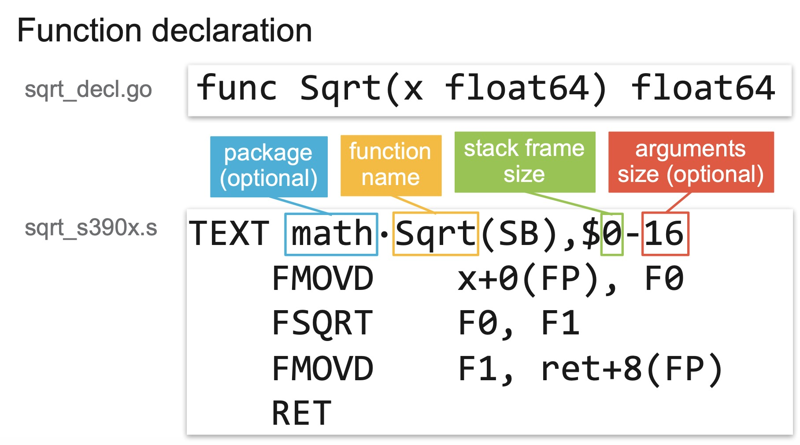

为什么要学习汇编

- 装逼


装逼是第一生产力，不服来打我

- 防骗：各种专家和架构师，江湖骗子，牛鬼蛇神，拿着 Go 语言以外的过往经验就忽悠上了

1. 你这么写效率不高，下面可能会有逃逸，你看得按我教你的这么写
2. 我们 java 赋值为 null 就能帮助 GC 判断，所以我也需要用完了 x = nil
3. 这个东西 runtime 里是这样这样那样那样实现的，我这么多年编程经验，你信我的准没错
4. Go 的 xxx 类型参数是引用传递的， yyy 类型参数是值传递的，哥当年研究 C艹 的研究了好久，哥的理解肯定比你权威
5. Go 的调度老牛逼了，稳得很
6. 按照编程语言的一般理论，这个地方肯定就是这么实现的，没错

# 1. 基本概念

## 1.1 图灵机和BF语言

图灵机是由图灵提出的一种抽象计算模型。机器有一条无限长的纸带，纸带分成了一个一个的小方格，每个方格有不同的颜色，这类似于计算机中的内存。同时机器有一个探头在纸带上移来移去，类似于通过内存地址来读写内存上的数据。机器头有一组内部计算状态，还有一些固定的程序（更像一个哈佛结构）。在每个时刻，机器头都要从当前纸带上读入一个方格信息，然后根据自己的内部状态和当前要执行的程序指令将信息输出到纸带方格上，同时更新自己的内部状态并进行移动。

图灵机虽然不容易编程，但是非常容易理解。有一种极小化的BrainFuck计算机语言，它的工作模式和图灵机非常相似。BrainFuck由Urban Müller在1993年创建的，简称为BF语言。Müller最初的设计目标是建立一种简单的、可以用最小的编译器来实现的、符合图灵完全思想的编程语言。这种语言由八种状态构成，早期为Amiga机器编写的编译器（第二版）只有240个字节大小！

就象它的名字所暗示的，brainfuck程序很难读懂。尽管如此，brainfuck图灵机一样可以完成任何计算任务。虽然brainfuck的计算方式如此与众不同，但它确实能够正确运行。这种语言基于一个简单的机器模型，除了指令，这个机器还包括：一个以字节为单位、被初始化为零的数组、一个指向该数组的指针（初始时指向数组的第一个字节）、以及用于输入输出的两个字节流。这是一种按照图灵完备的语言，它的主要设计思路是：用最小的概念实现一种“简单”的语言。BrainFuck 语言只有八种符号，所有的操作都由这八种符号的组合来完成。

下面是这八种状态的描述，其中每个状态由一个字符标识：

| 字符 | C语言类比         | 含义                                                         |
| ---- | ----------------- | ------------------------------------------------------------ |
| `>`  | `++ptr;`          | 指针加一                                                     |
| `<`  | `--ptr;`          | 指针减一                                                     |
| `+`  | `++*ptr;`         | 指针指向的字节的值加一                                       |
| `-`  | `--*ptr;`         | 指针指向的字节的值减一                                       |
| `.`  | `putchar(*ptr);`  | 输出指针指向的单元内容（ASCⅡ码）                             |
| `,`  | `*ptr = getch();` | 输入内容到指针指向的单元（ASCⅡ码）                           |
| `[`  | `while(*ptr) {}`  | 如果指针指向的单元值为零，向后跳转到对应的 `]` 指令的次一指令处 |
| `]`  |                   | 如果指针指向的单元值不为零，向前跳转到对应的 `[` 指令的次一指令处 |

下面是一个 brainfuck 程序，向标准输出打印"hi"字符串：

```
++++++++++[>++++++++++<-]>++++.+.
```

理论上我们可以将BF语言当作目标机器语言，将其它高级语言编译为BF语言后就可以在BF机器上运行了。

## 1.2 X86-64体系结构

X86其实是是80X86的简称（后面三个字母），包括Intel 8086、80286、80386以及80486等指令集合，因此其架构被称为x86架构。x86-64是AMD公司于1999年设计的x86架构的64位拓展，向后兼容于16位及32位的x86架构。X86-64目前正式名称为AMD64，也就是Go语言中GOARCH环境变量指定的AMD64。如果没有特殊说明的话，本章中的汇编程序都是针对64位的X86-64环境。

在使用汇编语言之前必须要了解对应的CPU体系结构。下面是X86/AMD架构图：


*图 3-2 AMD64架构*

左边是内存部分是常见的内存布局。其中text一般对应代码段，用于存储要执行指令数据，代码段一般是只读的。然后是rodata和data数据段，数据段一般用于存放全局的数据，其中rodata是只读的数据段。而heap段则用于管理动态的数据，stack段用于管理每个函数调用时相关的数据。在汇编语言中一般重点关注text代码段和data数据段，因此Go汇编语言中专门提供了对应TEXT和DATA命令用于定义代码和数据。

中间是X86提供的寄存器。寄存器是CPU中最重要的资源，每个要处理的内存数据原则上需要先放到寄存器中才能由CPU处理，同时寄存器中处理完的结果需要再存入内存。X86中除了状态寄存器FLAGS和指令寄存器IP两个特殊的寄存器外，还有AX、BX、CX、DX、SI、DI、BP、SP几个通用寄存器。在X86-64中又增加了八个以R8-R15方式命名的通用寄存器。因为历史的原因R0-R7并不是通用寄存器，它们只是X87开始引入的MMX指令专有的寄存器。在通用寄存器中BP和SP是两个比较特殊的寄存器：其中BP用于记录当前函数帧的开始位置，和函数调用相关的指令会隐式地影响BP的值；SP则对应当前栈指针的位置，和栈相关的指令会隐式地影响SP的值；而某些调试工具需要BP寄存器才能正常工作。

右边是X86的指令集。CPU是由指令和寄存器组成，指令是每个CPU内置的算法，指令处理的对象就是全部的寄存器和内存。我们可以将每个指令看作是CPU内置标准库中提供的一个个函数，然后基于这些函数构造更复杂的程序的过程就是用汇编语言编程的过程。

### 程序的编译阶段

```
编译 -> 汇编 -> 优化 -> 链接
```

汇编代码在汇编阶段生成，链接阶段会对生成的汇编代码进行修改。(eg0)

实际上优化过程是在所有过程中都有的，这里我们只说汇编优化。

链接阶段会对汇编结果做调整(如将函数地址从偏移量转换为逻辑地址)

### 机器码

所有汇编指令都可以转换为 0101 的序列，如：

```
>> mov rax,0x1
mnemonic : mov rax,0x1 => hex : 48c7c001000000
```
hex 是机器码的 16 进制编码。

### 指令集

RISC/CISC

intel? 难说。

risc 的新轮子 RISCV。

> https://github.com/riscv

CPU 优化指令集，如 x86 平台：SSE/SSE2/AVX。。。AVX512

> https://github.com/golang/go/wiki/AVX512

优化指令集往往能用来加速内存移动，指令运算。基本思想是用硬件方式来做 batch，减少指令数，加速计算。

通用的基础机器指令大概可以分为数据传输指令、算术运算和逻辑运算指令、控制流指令和其它指令等几类。因此我们可以尝试精简出一个X86-64指令集，以便于Go汇编语言的学习。

#### MOV指令。

其中MOV指令可以用于将字面值移动到寄存器、字面值移到内存、寄存器之间的数据传输、寄存器和内存之间的数据传输。需要注意的是，MOV传输指令的内存操作数只能有一个，可以通过某个临时寄存器达到类似目的。最简单的是忽略符号位的数据传输操作，386和AMD64指令一样，不同的1、2、4和8字节宽度有不同的指令：

| Data Type | 386/AMD64 | Comment       |
| --------- | --------- | ------------- |
| [1]byte   | MOVB      | B => Byte     |
| [2]byte   | MOVW      | W => Word     |
| [4]byte   | MOVL      | L => Long     |
| [8]byte   | MOVQ      | Q => Quadword |

MOV指令它不仅仅用于在寄存器和内存之间传输数据，而且还可以用于处理数据的扩展和截断操作。当数据宽度和寄存器的宽度不同又需要处理符号位时，386和AMD64有各自不同的指令：

| Data Type | 386     | AMD64   | Comment     |
| --------- | ------- | ------- | ----------- |
| int8      | MOVBLSX | MOVBQSX | sign extend |
| uint8     | MOVBLZX | MOVBQZX | zero extend |
| int16     | MOVWLSX | MOVWQSX | sign extend |
| uint16    | MOVWLZX | MOVWQZX | zero extend |

比如当需要将一个int64类型的数据转为bool类型时，则需要使用MOVBQZX指令处理。

### 寄存器

寄存器是中央处理器内的组成部分。寄存器是有限存贮容量的高速存贮部件，它们可用来暂存指令、数据和地址。

通用寄存器：
```
ah/al => 8 位
ax/bx => 16 位
eax/ebx => 32 位
rax/rbx => 64 位，8 byte

rax : 0x0000000000000000
```

指令寄存器：

```
pc/rip
```
表示当前我的代码运行到哪里了。


标志寄存器：
```
eflags
```

记录各种运算结果(是否为 0，是否发生溢出)的标志位。

在 dlv 中读取寄存器的值：

```
regs ------------------------ Print contents of CPU registers.
```

```
(dlv) regs
       rax = 0x0000000001053940
       rbx = 0x0000000000000000
       rcx = 0x000000c000000300
       rdx = 0x00000000010750c0
       rdi = 0x0000000000000000
       rsi = 0x0000000000000001
       rbp = 0x000000c0000427d0
       rsp = 0x000000c000042790
        r8 = 0x7fffffffffffffff
        r9 = 0xffffffffffffffff
       r10 = 0x00000000010c0478
       r11 = 0x0000000000000202
       r12 = 0x0000000000203000
       r13 = 0x0000000000000000
       r14 = 0x0000000000000178
       r15 = 0x0000000000000004
       rip = 0x000000000105394f
    rflags = 0x0000000000000202
        cs = 0x000000000000002b
        fs = 0x0000000000000000
        gs = 0x0000000000000000
     fctrl = 0x037f
     fstat = 0x0000
      ftag = 0x0000
       fop = 0x0000
     fioff = 0x00000000
     fiseg = 0x0000
     fooff = 0x00000000
     foseg = 0x0000
     mxcsr = 0x00001fa0	[RZ/RN=0 PM UM OM ZM DM IM PE]
 mxcsrmask = 0x0000ffff
     ST(0) = 0x7fff0000000000000000	-Inf
     ST(1) = 0x00000000000000000000	0
     ST(2) = 0x00000000000000000000	0
     ST(3) = 0x00000000000000000000	0
     ST(4) = 0x00000000000000000000	0
     ST(5) = 0x7fff00000000ff73ff84	-Inf
     ST(6) = 0x7fff00000000022f2d1c	-Inf
     ST(7) = 0x7fff00000000ffffd1fe	-Inf
      XMM0 = 0x00000000000000000000000000000000	v2_int={ 0000000000000000 0000000000000000 }	v4_int={ 00000000 00000000 00000000 00000000 }	v8_int={ 0000 0000 0000 0000 0000 0000 0000 0000 }	v16_int={ 00 00 00 00 00 00 00 00 00 00 00 00 00 00 00 00 }	v2_float={ 0 0 }	v4_float={ 0 0 0 0 }
      YMM0 = 0x00000000000000000000000000000000	v2_int={ 0000000000000000 0000000000000000 }	v4_int={ 00000000 00000000 00000000 00000000 }	v8_int={ 0000 0000 0000 0000 0000 0000 0000 0000 }	v16_int={ 00 00 00 00 00 00 00 00 00 00 00 00 00 00 00 00 }	v2_float={ 0 0 }	v4_float={ 0 0 0 0 }
      XMM1 = 0x00000000000000000000000000000000	v2_int={ 0000000000000000 0000000000000000 }	v4_int={ 00000000 00000000 00000000 00000000 }	v8_int={ 0000 0000 0000 0000 0000 0000 0000 0000 }	v16_int={ 00 00 00 00 00 00 00 00 00 00 00 00 00 00 00 00 }	v2_float={ 0 0 }	v4_float={ 0 0 0 0 }
      YMM1 = 0x00000000000000000000000000000000	v2_int={ 0000000000000000 0000000000000000 }	v4_int={ 00000000 00000000 00000000 00000000 }	v8_int={ 0000 0000 0000 0000 0000 0000 0000 0000 }	v16_int={ 00 00 00 00 00 00 00 00 00 00 00 00 00 00 00 00 }	v2_float={ 0 0 }	v4_float={ 0 0 0 0 }
      XMM2 = 0x00706565777367622e656d69746e7572	v2_int={ 2e656d69746e7572 0070656577736762 }	v4_int={ 746e7572 2e656d69 77736762 00706565 }	v8_int={ 7572 746e 6d69 2e65 6762 7773 6565 0070 }	v16_int={ 72 75 6e 74 69 6d 65 2e 62 67 73 77 65 65 70 00 }	v2_float={ 3.446835183876702e-85 1.4592995157673208e-306 }	v4_float={ 7.55706e+31 5.2165747e-11 4.9368164e+33 1.0321949e-38 }
      YMM2 = 0x00000000000000000000000000000000	v2_int={ 0000000000000000 0000000000000000 }	v4_int={ 00000000 00000000 00000000 00000000 }	v8_int={ 0000 0000 0000 0000 0000 0000 0000 0000 }	v16_int={ 00 00 00 00 00 00 00 00 00 00 00 00 00 00 00 00 }	v2_float={ 0 0 }	v4_float={ 0 0 0 0 }
      XMM3 = 0xff000000000000000000000000000000	v2_int={ 0000000000000000 ff00000000000000 }	v4_int={ 00000000 00000000 00000000 ff000000 }	v8_int={ 0000 0000 0000 0000 0000 0000 0000 ff00 }	v16_int={ 00 00 00 00 00 00 00 00 00 00 00 00 00 00 00 ff }	v2_float={ 0 -5.486124068793689e+303 }	v4_float={ 0 0 0 -1.7014118e+38 }
      YMM3 = 0x00000000000000000000000000000000	v2_int={ 0000000000000000 0000000000000000 }	v4_int={ 00000000 00000000 00000000 00000000 }	v8_int={ 0000 0000 0000 0000 0000 0000 0000 0000 }	v16_int={ 00 00 00 00 00 00 00 00 00 00 00 00 00 00 00 00 }	v2_float={ 0 0 }	v4_float={ 0 0 0 0 }
      XMM4 = 0x3a31303b33333d64633a31303b36333d	v2_int={ 633a31303b36333d 3a31303b33333d64 }	v4_int={ 3b36333d 633a3130 33333d64 3a31303b }	v8_int={ 333d 3b36 3130 633a 3d64 3333 303b 3a31 }	v16_int={ 3d 33 36 3b 30 31 3a 63 64 3d 33 33 3b 30 31 3a }	v2_float={ 9.884816049279249e+169 2.16948150441166e-28 }	v4_float={ 0.0027801536 3.4346387e+21 4.173252e-08 0.0006759201 }
      YMM4 = 0x00000000000000000000000000000000	v2_int={ 0000000000000000 0000000000000000 }	v4_int={ 00000000 00000000 00000000 00000000 }	v8_int={ 0000 0000 0000 0000 0000 0000 0000 0000 }	v16_int={ 00 00 00 00 00 00 00 00 00 00 00 00 00 00 00 00 }	v2_float={ 0 0 }	v4_float={ 0 0 0 0 }
      XMM5 = 0x333d67733a37303b30343b31333d7573	v2_int={ 30343b31333d7573 333d67733a37303b }	v4_int={ 333d7573 30343b31 3a37303b 333d6773 }	v8_int={ 7573 333d 3b31 3034 303b 3a37 6773 333d }	v16_int={ 73 75 3d 33 31 3b 34 30 3b 30 37 3a 73 67 3d 33 }	v2_float={ 1.747202215459339e-76 7.147741244431301e-62 }	v4_float={ 4.411181e-08 6.5567735e-10 0.0006988083 4.4099078e-08 }
      YMM5 = 0x00000000000000000000000000000000	v2_int={ 0000000000000000 0000000000000000 }	v4_int={ 00000000 00000000 00000000 00000000 }	v8_int={ 0000 0000 0000 0000 0000 0000 0000 0000 }	v16_int={ 00 00 00 00 00 00 00 00 00 00 00 00 00 00 00 00 }	v2_float={ 0 0 }	v4_float={ 0 0 0 0 }
      XMM6 = 0x30343b32333d77743a37303b30343b36	v2_int={ 3a37303b30343b36 30343b32333d7774 }	v4_int={ 30343b36 3a37303b 333d7774 30343b32 }	v8_int={ 3b36 3034 303b 3a37 7774 333d 3b32 3034 }	v16_int={ 36 3b 34 30 3b 30 37 3a 74 77 3d 33 32 3b 34 30 }	v2_float={ 2.926787950883477e-28 1.7472035332342394e-76 }	v4_float={ 6.556776e-10 0.0006988083 4.4113634e-08 6.556774e-10 }
      YMM6 = 0x00000000000000000000000000000000	v2_int={ 0000000000000000 0000000000000000 }	v4_int={ 00000000 00000000 00000000 00000000 }	v8_int={ 0000 0000 0000 0000 0000 0000 0000 0000 }	v16_int={ 00 00 00 00 00 00 00 00 00 00 00 00 00 00 00 00 }	v2_float={ 0 0 }	v4_float={ 0 0 0 0 }
      XMM7 = 0x3a37303b30343b33333d776f3a37303b	v2_int={ 333d776f3a37303b 3a37303b30343b33 }	v4_int={ 3a37303b 333d776f 30343b33 3a37303b }	v8_int={ 303b 3a37 776f 333d 3b33 3034 303b 3a37 }	v16_int={ 3b 30 37 3a 6f 77 3d 33 33 3b 34 30 3b 30 37 3a }	v2_float={ 7.162919315999914e-62 2.9267879508834756e-28 }	v4_float={ 0.0006988083 4.4113616e-08 6.5567746e-10 0.0006988083 }
      YMM7 = 0x00000000000000000000000000000000	v2_int={ 0000000000000000 0000000000000000 }	v4_int={ 00000000 00000000 00000000 00000000 }	v8_int={ 0000 0000 0000 0000 0000 0000 0000 0000 }	v16_int={ 00 00 00 00 00 00 00 00 00 00 00 00 00 00 00 00 }	v2_float={ 0 0 }	v4_float={ 0 0 0 0 }
      XMM8 = 0x6e6962732f6c61636f6c2f7273752f3a	v2_int={ 6f6c2f7273752f3a 6e6962732f6c6163 }	v4_int={ 73752f3a 6f6c2f72 2f6c6163 6e696273 }	v8_int={ 2f3a 7375 2f72 6f6c 6163 2f6c 6273 6e69 }	v16_int={ 3a 2f 75 73 72 2f 6c 6f 63 61 6c 2f 73 62 69 6e }	v2_float={ 5.34158331241814e+228 7.340685338891256e+223 }	v4_float={ 1.9425516e+31 7.309582e+28 2.1498674e-10 1.8057256e+28 }
      YMM8 = 0x00000000000000000000000000000000	v2_int={ 0000000000000000 0000000000000000 }	v4_int={ 00000000 00000000 00000000 00000000 }	v8_int={ 0000 0000 0000 0000 0000 0000 0000 0000 }	v16_int={ 00 00 00 00 00 00 00 00 00 00 00 00 00 00 00 00 }	v2_float={ 0 0 }	v4_float={ 0 0 0 0 }
      XMM9 = 0x2f3a6e69622f3a6e69622f7273752f3a	v2_int={ 69622f7273752f3a 2f3a6e69622f3a6e }	v4_int={ 73752f3a 69622f72 622f3a6e 2f3a6e69 }	v8_int={ 2f3a 7375 2f72 6962 3a6e 622f 6e69 2f3a }	v16_int={ 3a 2f 75 73 72 2f 62 69 6e 3a 2f 62 69 6e 3a 2f }	v2_float={ 4.3499931289042936e+199 3.4830493665207283e-81 }	v4_float={ 1.9425516e+31 1.7090081e+25 8.080976e+20 1.6955827e-10 }
      YMM9 = 0x00000000000000000000000000000000	v2_int={ 0000000000000000 0000000000000000 }	v4_int={ 00000000 00000000 00000000 00000000 }	v8_int={ 0000 0000 0000 0000 0000 0000 0000 0000 }	v16_int={ 00 00 00 00 00 00 00 00 00 00 00 00 00 00 00 00 }	v2_float={ 0 0 }	v4_float={ 0 0 0 0 }
     XMM10 = 0x2f3a6e6962732f3a6e6962732f727375	v2_int={ 6e6962732f727375 2f3a6e6962732f3a }	v4_int={ 2f727375 6e696273 62732f3a 2f3a6e69 }	v8_int={ 7375 2f72 6273 6e69 2f3a 6273 6e69 2f3a }	v16_int={ 75 73 72 2f 73 62 69 6e 3a 2f 73 62 69 6e 3a 2f }	v2_float={ 7.340685339299987e+223 3.4830493686057503e-81 }	v4_float={ 2.205079e-10 1.8057256e+28 1.12149046e+21 1.6955827e-10 }
     YMM10 = 0x00000000000000000000000000000000	v2_int={ 0000000000000000 0000000000000000 }	v4_int={ 00000000 00000000 00000000 00000000 }	v8_int={ 0000 0000 0000 0000 0000 0000 0000 0000 }	v16_int={ 00 00 00 00 00 00 00 00 00 00 00 00 00 00 00 00 }	v2_float={ 0 0 }	v4_float={ 0 0 0 0 }
     XMM11 = 0x6e69622f6f672f6c61636f6c2f727375	v2_int={ 61636f6c2f727375 6e69622f6f672f6c }	v4_int={ 2f727375 61636f6c 6f672f6c 6e69622f }	v8_int={ 7375 2f72 6f6c 6163 2f6c 6f67 622f 6e69 }	v16_int={ 75 73 72 2f 6c 6f 63 61 6c 2f 67 6f 2f 62 69 6e }	v2_float={ 1.3662107766268992e+161 7.340386390188806e+223 }	v4_float={ 2.205079e-10 2.6221498e+20 7.1548367e+28 1.8057176e+28 }
     YMM11 = 0x00000000000000000000000000000000	v2_int={ 0000000000000000 0000000000000000 }	v4_int={ 00000000 00000000 00000000 00000000 }	v8_int={ 0000 0000 0000 0000 0000 0000 0000 0000 }	v16_int={ 00 00 00 00 00 00 00 00 00 00 00 00 00 00 00 00 }	v2_float={ 0 0 }	v4_float={ 0 0 0 0 }
     XMM12 = 0x572f736e6f69746163696c7070412f3a	v2_int={ 63696c7070412f3a 572f736e6f697461 }	v4_int={ 70412f3a 63696c70 6f697461 572f736e }	v8_int={ 2f3a 7041 6c70 6369 7461 6f69 736e 572f }	v16_int={ 3a 2f 41 70 70 6c 69 63 61 74 69 6f 6e 73 2f 57 }	v2_float={ 7.675814073001636e+170 9.454564732925896e+111 }	v4_float={ 2.391508e+29 4.305905e+21 7.22507e+28 1.929103e+14 }
     YMM12 = 0x00000000000000000000000000000000	v2_int={ 0000000000000000 0000000000000000 }	v4_int={ 00000000 00000000 00000000 00000000 }	v8_int={ 0000 0000 0000 0000 0000 0000 0000 0000 }	v16_int={ 00 00 00 00 00 00 00 00 00 00 00 00 00 00 00 00 }	v2_float={ 0 0 }	v4_float={ 0 0 0 0 }
     XMM13 = 0x6e6f432f7070612e6b72616873657269	v2_int={ 6b72616873657269 6e6f432f7070612e }	v4_int={ 73657269 6b726168 7070612e 6e6f432f }	v8_int={ 7269 7365 6168 6b72 612e 7070 432f 6e6f }	v16_int={ 69 72 65 73 68 61 72 6b 2e 61 70 70 2f 43 6f 6e }	v2_float={ 3.776715943768552e+209 9.04044281118662e+223 }	v4_float={ 1.8178657e+31 2.9302004e+26 2.9757554e+29 1.8512034e+28 }
     YMM13 = 0x00000000000000000000000000000000	v2_int={ 0000000000000000 0000000000000000 }	v4_int={ 00000000 00000000 00000000 00000000 }	v8_int={ 0000 0000 0000 0000 0000 0000 0000 0000 }	v16_int={ 00 00 00 00 00 00 00 00 00 00 00 00 00 00 00 00 }	v2_float={ 0 0 }	v4_float={ 0 0 0 0 }
     XMM14 = 0x6573552f3a534f63614d2f73746e6574	v2_int={ 614d2f73746e6574 6573552f3a534f63 }	v4_int={ 746e6574 614d2f73 3a534f63 6573552f }	v8_int={ 6574 746e 2f73 614d 4f63 3a53 552f 6573 }	v16_int={ 74 65 6e 74 73 2f 4d 61 63 4f 53 3a 2f 55 73 65 }	v2_float={ 5.1289999310656885e+160 5.013847184688216e+180 }	v4_float={ 7.5550804e+31 2.365626e+20 0.0008060841 7.181915e+22 }
     YMM14 = 0x00000000000000000000000000000000	v2_int={ 0000000000000000 0000000000000000 }	v4_int={ 00000000 00000000 00000000 00000000 }	v8_int={ 0000 0000 0000 0000 0000 0000 0000 0000 }	v16_int={ 00 00 00 00 00 00 00 00 00 00 00 00 00 00 00 00 }	v2_float={ 0 0 }	v4_float={ 0 0 0 0 }
     XMM15 = 0x6e69622f6f672f6e69677261782f7372	v2_int={ 69677261782f7372 6e69622f6f672f6e }	v4_int={ 782f7372 69677261 6f672f6e 6e69622f }	v8_int={ 7372 782f 7261 6967 2f6e 6f67 622f 6e69 }	v16_int={ 72 73 2f 78 61 72 67 69 6e 2f 67 6f 2f 62 69 6e }	v2_float={ 5.608551565561017e+199 7.340386390188808e+223 }	v4_float={ 1.4234273e+34 1.7487625e+25 7.1548376e+28 1.8057176e+28 }
     YMM15 = 0x00000000000000000000000000000000	v2_int={ 0000000000000000 0000000000000000 }	v4_int={ 00000000 00000000 00000000 00000000 }	v8_int={ 0000 0000 0000 0000 0000 0000 0000 0000 }	v16_int={ 00 00 00 00 00 00 00 00 00 00 00 00 00 00 00 00 }	v2_float={ 0 0 }	v4_float={ 0 0 0 0 }
    trapno = 0x00000001
       err = 0x00000000
faultvaddr = 0x00000000010ee000
```

大部分不需要理解，知道通用寄存器和简单的扩展寄存器就好了。

### 基础指令

```
mov rax, 0x1 // rax = 1
add rax, 11  // rax = rax + 11
sub rax,1    // rax = rax - 1

// 在寄存器之间搬数据
mov rax, rbx // rax = rbx

// 在寄存器和内存之间搬数据
mov rax, [rbx] // 把 rbx 寄存器的值看作一个地址，把该物理地址的值取出，然后赋值给 rax，即 rax = *rbx

// 在内存之间搬数据
- 你想多了，不可以的

push rax => 将 rax 的值存储到栈顶，并将 rsp 上移 8 个字节
pop rax => 将 rsp 指向的内存位置的 8 个字节移动到 rax，并将 rax 从栈顶下移 8 个字节

jmp addr => 跳转到指定地址
```

### 函数 or 过程

函数调用在汇编上的本质：

```
jmp 跳进去
jmp 跳回来
```

cpu 很傻，跳回来的时候我必须到当前过程的下一条指令位置，难道我还需要在被调用过程里知道调用者的过程下一条指令位置？

```
call => push pc; jmp to callee addr;
ret => pop pc;
```

要点，在栈上记录下一条指令位置，即我们常说的 `return address`，理解成路标就行。在执行完被调用函数的时候，顺着路标回去继续向下走。

### 高级语言函数

函数栈：
```
                         +--------------+
                         |              |
                    +    |              |
                    |    +--------------+
                    |    |              |
                    |    |   arg(N-1)   |  starts from 7'th argument for x86_64
                    |    |              |
                    |    +--------------+
                    |    |              |
                    |    |     argN     |
                    |    |              |
                    |    +--------------+
                    |    |              |
                    |    |Return address|  %rbp + 8
Stack grows down    |    |              |
                    |    +--------------+
                    |    |              |
                    |    |     %rbp     |  Frame base pointer
                    |    |              |
                    |    +--------------+
                    |    |              |
                    |    |  local var1  |  %rbp - 8
                    |    |              |
                    |    +--------------+
                    |    |              |
                    |    | local var 2  | <-- %rsp
                    |    |              |
                    v    +--------------+
                         |              |
                         |              |
                         +--------------+
```

调用规约：

参考这里：
> https://github.com/cch123/llp-trans/blob/master/part3/translation-details/function-calling-sequence/calling-convention.md

主要是知道哪些寄存器是需要 caller save，哪些是 callee save。

### 和系统打交道

```
section .data
message: db 'hello, world!', 10

section .text
global _start

_start:
    mov     rax, 1              ; 'write' syscall number
    mov     rdi, 1              ; stdout descriptor
    mov     rsi, message        ; string address
    mov     rdx, 14             ; string length in bytes
    syscall   ; 重点在这里
```

更具体的可以参考 [这里](https://github.com/cch123/llp-trans/blob/d6b7f46c72e83ac9145d5534c6bc4e690da8d815/part1/assembly-language/writing-hello-world/basic-instructions.md)

和[这里](http://blog.rchapman.org/posts/Linux_System_Call_Table_for_x86_64/)

# 2. plan9 汇编入门

## 2.1 Go汇编中的伪寄存器

Go汇编为了简化汇编代码的编写，引入了PC、FP、SP、SB四个伪寄存器。四个伪寄存器加其它的通用寄存器就是Go汇编语言对CPU的重新抽象，该抽象的结构也适用于其它非X86类型的体系结构。

四个伪寄存器和X86/AMD64的内存和寄存器的相互关系如下图：


*图 3-3 Go汇编的伪寄存器*

在AMD64环境，

伪PC寄存器其实是IP指令计数器寄存器的别名。

伪FP寄存器对应的是函数的帧指针，一般用来访问函数的参数和返回值。

伪SP栈指针对应的是当前函数栈帧的底部（不包括参数和返回值部分），一般用于定位局部变量。伪SP是一个比较特殊的寄存器，因为还存在一个同名的SP真寄存器。真SP寄存器对应的是栈的顶部，一般用于定位调用其它函数的参数和返回值。

当需要区分伪寄存器和真寄存器的时候只需要记住一点：伪寄存器一般需要一个标识符和偏移量为前缀，如果没有标识符前缀则是真寄存器。比如`(SP)`、`+8(SP)`没有标识符前缀为真SP寄存器，而`a(SP)`、`b+8(SP)`有标识符为前缀表示伪寄存器。

- 寄存器名差别

```
rax -> AX
rbx -> BX
r8  -> R8
```

因为移动多少个字节是由指令而不是操作数决定的，所以稍微省心一些。

- 指令对应关系

```
MOVB $1, DI -> mov al, 0x44    // 1 byte
MOVW $0x10, BX -> mov ax, 0x10 // 2 bytes
MOVD $100, DX -> mov eax, 100  // 4 bytes
MOVQ $-10, AX -> mov rax, -10  // 8 bytes
```

可以看到，指令的操作数是反着的，大部分 plan9 和 intel 的指令确实是反着的关系，学习过汇编的同学可能会认为很好啊，这样 plan9 的操作数顺序应该是和 AT&T 一致了，遗憾的是也有例外：

```
Mnemonic | Go operands           | AT&T operands
================================================
BOUNDW   | m16&16, r16           | r16, m16&16
BOUNDL   | m32&32, r32           | r32, m32&32
CMPB     | AL, imm8              | imm8, AL
CMPW     | AX, imm16             | imm16, AX
CMPL     | EAX, imm32            | imm32, EAX
CMPQ     | RAX, imm32            | imm32, RAX
CMPW     | r/m16, imm16          | imm16, r/m16
CMPW     | r/m16, imm8           | imm8, r/m16
CMPW     | r/m16, r16            | r16, r/m16
CMPL     | r/m32, imm32          | imm32, r/m32
CMPL     | r/m32, imm8           | imm8, r/m32
CMPL     | r/m32, r32            | r32, r/m32
CMPQ     | r/m64, imm32          | imm32, r/m64
CMPQ     | r/m64, imm8           | imm8, r/m64
CMPQ     | r/m64, r64            | r64, r/m64
CMPB     | r/m8, imm8            | imm8, r/m8
CMPB     | r/m8, imm8            | imm8, r/m8
CMPB     | r/m8, r8              | r8, r/m8
CMPB     | r/m8, r8              | r8, r/m8
CMPW     | r16, r/m16            | r/m16, r16
CMPL     | r32, r/m32            | r/m32, r32
CMPQ     | r64, r/m64            | r/m64, r64
CMPB     | r8, r/m8              | r/m8, r8
CMPB     | r8, r/m8              | r/m8, r8
CMPPD    | imm8, xmm1, xmm2/m128 | imm8, xmm2/m128, xmm1
CMPPS    | imm8, xmm1, xmm2/m128 | imm8, xmm2/m128, xmm1
CMPSD    | imm8, xmm1, xmm2/m64  | imm8, xmm2/m64, xmm1
CMPSS    | imm8, xmm1, xmm2/m32  | imm8, xmm2/m32, xmm1
ENTER    | 0, imm16              | imm16, 0
ENTER    | 1, imm16              | imm16, 1
```

## 3. Go汇编知识快速入门

## 3.1 实现和声明

Go汇编语言并不是一个独立的语言，因为Go汇编程序无法独立使用。Go汇编代码必须以Go包的方式组织，同时包中至少要有一个Go语言文件用于指明当前包名等基本包信息。如果Go汇编代码中定义的变量和函数要被其它Go语言代码引用，还需要通过Go语言代码将汇编中定义的符号声明出来。用于变量的定义和函数的定义Go汇编文件类似于C语言中的.c文件，而用于导出汇编中定义符号的Go源文件类似于C语言的.h文件。

### 3.1.2 简单的小栗子

为了简单，我们先用Go语言定义并赋值一个整数变量，然后查看生成的汇编代码。

首先创建一个pkg.go文件，内容如下：

```go
package pkg

var Id = 9527
```

代码中只定义了一个int类型的包级变量，并进行了初始化。然后用以下命令查看的Go语言程序对应的伪汇编代码：

```
$ go tool compile -S pkg.go
"".Id SNOPTRDATA size=8
  0x0000 37 25 00 00 00 00 00 00                          '.......
```

其中`go tool compile`命令用于调用Go语言提供的底层命令工具，其中`-S`参数表示输出汇编格式。输出的汇编比较简单，其中`"".Id`对应Id变量符号，变量的内存大小为8个字节。变量的初始化内容为`37 25 00 00 00 00 00 00`，对应十六进制格式的0x2537，对应十进制为9527。SNOPTRDATA是相关的标志，其中NOPTR表示数据中不包含指针数据。

以上的内容只是目标文件对应的汇编，和Go汇编语言虽然相似当并不完全等价。Go语言官网自带了一个Go汇编语言的入门教程，地址在：<https://golang.org/doc/asm> 。

Go汇编语言提供了DATA命令用于初始化包变量，DATA命令的语法如下：

```
DATA symbol+offset(SB)/width, value
```

其中symbol为变量在汇编语言中对应的标识符，offset是符号开始地址的偏移量，width是要初始化内存的宽度大小，value是要初始化的值。其中当前包中Go语言定义的符号symbol，在汇编代码中对应`·symbol`，其中“·”中点符号为一个特殊的unicode符号。

我们采用以下命令可以给Id变量初始化为十六进制的0x2537，对应十进制的9527（常量需要以美元符号$开头表示）：

```
DATA ·Id+0(SB)/1,$0x37
DATA ·Id+1(SB)/1,$0x25
```

变量定义好之后需要导出以供其它代码引用。Go汇编语言提供了GLOBL命令用于将符号导出：

```
GLOBL symbol(SB), width
```

其中symbol对应汇编中符号的名字，width为符号对应内存的大小。用以下命令将汇编中的·Id变量导出：

```
GLOBL ·Id, $8
```

现在已经初步完成了用汇编定义一个整数变量的工作。

为了便于其它包使用该Id变量，我们还需要在Go代码中声明该变量，同时也给变量指定一个合适的类型。修改pkg.go的内容如下：

```go
package pkg

var Id int
```

现状Go语言的代码不再是定义一个变量，语义变成了声明一个变量（声明一个变量时不能再进行初始化操作）。而Id变量的定义工作已经在汇编语言中完成了。

我们将完整的汇编代码放到pkg_amd64.s文件中：

```
GLOBL ·Id(SB),$8

DATA ·Id+0(SB)/1,$0x37
DATA ·Id+1(SB)/1,$0x25
DATA ·Id+2(SB)/1,$0x00
DATA ·Id+3(SB)/1,$0x00
DATA ·Id+4(SB)/1,$0x00
DATA ·Id+5(SB)/1,$0x00
DATA ·Id+6(SB)/1,$0x00
DATA ·Id+7(SB)/1,$0x00
```

文件名pkg_amd64.s的后缀名表示AMD64环境下的汇编代码文件。

虽然pkg包是用汇编实现，但是用法和之前的Go语言版本完全一样：

```go
package main

import pkg "pkg包的路径"

func main() {
    println(pkg.Id)
}
```

对于Go包的用户来说，用Go汇编语言或Go语言实现并无任何区别。

### 3.1.3 定义字符串变量

在前一个例子中，我们通过汇编定义了一个整数变量。现在我们提高一点难度，尝试通过汇编定义一个字符串变量。虽然从Go语言角度看，定义字符串和整数变量的写法基本相同，但是字符串底层却有着比单个整数更复杂的数据结构。

实验的流程和前面的例子一样，还是先用Go语言实现类似的功能，然后观察分析生成的汇编代码，最后用Go汇编语言仿写。首先创建pkg.go文件，用Go语言定义字符串：

```go
package pkg

var Name = "gopher"
```

然后用以下命令查看的Go语言程序对应的伪汇编代码：

```
$ go tool compile -S pkg.go
go.string."gopher" SRODATA dupok size=6
  0x0000 67 6f 70 68 65 72                                gopher
"".Name SDATA size=16
  0x0000 00 00 00 00 00 00 00 00 06 00 00 00 00 00 00 00  ................
  rel 0+8 t=1 go.string."gopher"+0
```

输出中出现了一个新的符号go.string."gopher"，根据其长度和内容分析可以猜测是对应底层的"gopher"字符串数据。因为Go语言的字符串并不是值类型，Go字符串其实是一种只读的引用类型。如果多个代码中出现了相同的"gopher"只读字符串时，程序链接后可以引用的同一个符号go.string."gopher"。因此，该符号有一个SRODATA标志表示这个数据在只读内存段，dupok表示出现多个相同标识符的数据时只保留一个就可以了。

而真正的Go字符串变量Name对应的大小却只有16个字节了。其实Name变量并没有直接对应“gopher”字符串，而是对应16字节大小的reflect.StringHeader结构体：

```go
type reflect.StringHeader struct {
    Data uintptr
    Len  int
}
```

从汇编角度看，Name变量其实对应的是reflect.StringHeader结构体类型。前8个字节对应底层真实字符串数据的指针，也就是符号go.string."gopher"对应的地址。后8个字节对应底层真实字符串数据的有效长度，这里是6个字节。

现在创建pkg_amd64.s文件，尝试通过汇编代码重新定义并初始化Name字符串：

```
GLOBL ·NameData(SB),$8
DATA  ·NameData(SB)/8,$"gopher"

GLOBL ·Name(SB),$16
DATA  ·Name+0(SB)/8,$·NameData(SB)
DATA  ·Name+8(SB)/8,$6
```

因为在Go汇编语言中，go.string."gopher"不是一个合法的符号，因此我们无法通过手工创建（这是给编译器保留的部分特权，因为手工创建类似符号可能打破编译器输出代码的某些规则）。因此我们新创建了一个·NameData符号表示底层的字符串数据。然后定义·Name符号内存大小为16字节，其中前8个字节用·NameData符号对应的地址初始化，后8个字节为常量6表示字符串长度。

当用汇编定义好字符串变量并导出之后，还需要在Go语言中声明该字符串变量。然后就可以用Go语言代码测试Name变量了：

```go
package main

import pkg "path/to/pkg"

func main() {
    println(pkg.Name)
}
```

不幸的是这次运行产生了以下错误：

```
pkgpath.NameData: missing Go //type information for global symbol: size 8
```

错误提示汇编中定义的NameData符号没有类型信息。其实Go汇编语言中定义的数据并没有所谓的类型，每个符号只不过是对应一块内存而已，因此NameData符号也是没有类型的。但是Go语言是再带垃圾回收器的语言，而Go汇编语言是工作在自动垃圾回收体系框架内的。档Go语言的垃圾回收器在扫描到NameData变量的时候，无法知晓该变量内部是否包含指针，因此就出现了这种错误。错误的根本原因并不是NameData没有类型，而是NameData变量没有标注是否会含有指针信息。

通过给NameData变量增加一个NOPTR标志，表示其中不会包含指针数据可以修复该错误：

```
#include "textflag.h"

GLOBL ·NameData(SB),NOPTR,$8
```

通过给·NameData增加NOPTR标志档方式表示其中不含指针数据。我们也可以通过给·NameData变量在Go语言中增加一个不含指针并且大小为8个字节的类型来修改该错误：

```go
package pkg

var NameData [8]byte
var Name string
```

我们将NameData声明为长度为8的字节数组。编译器可以通过类型分析出该变量不会包含指针，因此汇编代码中可以省略NOPTR标志。现在垃圾回收器在遇到该变量的时候就会停止内部数据的扫描。

在这个实现中，Name字符串底层其实引用的是NameData内存对应的“gopher”字符串数据。因此，如果NameData发生变化，Name字符串的数据也会跟着变化。

```go
func main() {
    println(pkg.Name)

    pkg.NameData[0] = '?'
    println(pkg.Name)
}
```

当然这和字符串的只读定义是冲突的，正常的代码需要避免出现这种情况。最好的方法是不要导出内部的NameData变量，这样可以避免内部数据被无意破坏。

在用汇编定义字符串时我们可以换一种思维：将底层的字符串数据和字符串头结构体定义在一起，这样可以避免引入NameData符号：

```
GLOBL ·Name(SB),$24

DATA ·Name+0(SB)/8,$·Name+16(SB)
DATA ·Name+8(SB)/8,$6
DATA ·Name+16(SB)/8,$"gopher"
```

在新的结构中，Name符号对应的内存从16字节变为24字节，多出的8个字节存放底层的“gopher”字符串。·Name符号前16个字节依然对应reflect.StringHeader结构体：Data部分对应`$·Name+16(SB)`，表示数据的地址为Name符号往后偏移16个字节的位置；Len部分依然对应6个字节的长度。这是C语言程序员经常使用档技巧。

### 3.1.4 定义main函数

前面的例子已经展示了如何通过汇编定义整型和字符串类型变量。我们现在将尝试用汇编实现函数，然后输出一个字符串。

先创建main.go文件，创建并初始化字符串变量，同时声明main函数：

```go
package main

var helloworld = "你好, 世界"

func main()
```

然后创建main_amd64.s文件，里面对应main函数的实现：

```
TEXT ·main(SB), $16-0
    MOVQ ·helloworld+0(SB), AX; MOVQ AX, 0(SP)
    MOVQ ·helloworld+8(SB), BX; MOVQ BX, 8(SP)
    CALL runtime·printstring(SB)
    CALL runtime·printnl(SB)
    RET
```

`TEXT ·main(SB), $16-0`用于定义`main`函数，其中`$16-0`表示`main`函数的帧大小是16个字节（对应string头部结构体的大小，用于给`runtime·printstring`函数传递参数），`0`表示`main`函数没有参数和返回值。`main`函数内部通过调用运行时内部的`runtime·printstring(SB)`函数来打印字符串。然后调用`runtime·printnl`打印换行符号。

Go语言函数在函数调用时，完全通过栈传递调用参数和返回值。先通过MOVQ指令，将helloworld对应的字符串头部结构体的16个字节复制到栈指针SP对应的16字节的空间，然后通过CALL指令调用对应函数。最后使用RET指令表示当前函数返回。

# 3.3 常量和全局变量

程序中的一切变量的初始值都直接或间接地依赖常量或常量表达式生成。在Go语言中很多变量是默认零值初始化的，但是Go汇编中定义的变量最好还是手工通过常量初始化。有了常量之后，就可以衍生定义全局变量，并使用常量组成的表达式初始化其它各种变量。本节将简单讨论Go汇编语言中常量和全局变量的用法。

## 3.3.1 常量

Go汇编语言中常量以$美元符号为前缀。常量的类型有整数常量、浮点数常量、字符常量和字符串常量等几种类型。以下是几种类型常量的例子：

```
$1           // 十进制
$0xf4f8fcff  // 十六进制
$1.5         // 浮点数
$'a'         // 字符
$"abcd"      // 字符串
```

其中整数类型常量默认是十进制格式，也可以用十六进制格式表示整数常量。所有的常量最终都必须和要初始化的变量内存大小匹配。

对于数值型常量，可以通过常量表达式构成新的常量：

```
$2+2      // 常量表达式
$3&1<<2   // == $4
$(3&1)<<2 // == $4
```

其中常量表达式中运算符的优先级和Go语言保持一致。

Go汇编语言中的常量其实不仅仅只有编译时常量，还包含运行时常量。比如包中全局的变量和全局函数在运行时地址也是固定不变的，这里地址不会变量的包变量和函数的地址也是一种汇编常量。

下面是本章第一节用汇编定义的字符串代码：

```
GLOBL ·NameData(SB),$8
DATA  ·NameData(SB)/8,$"gopher"

GLOBL ·Name(SB),$16
DATA  ·Name+0(SB)/8,$·NameData(SB)
DATA  ·Name+8(SB)/8,$6
```

其中`$·NameData(SB)`也是以$美元符号为前缀，因此也可以将它看作是一个常量，它对应的是NameData包变量的地址。在汇编指令中，我们也可以通过LEA指令来获取NameData变量的地址。

## 3.3.2 全局变量

在Go语言中，变量根据作用域和生命周期有全局变量和局部变量之分。全局变量是包一级的变量，全局变量一般有着较为固定的内存地址，声明周期跨越整个程序运行时间。而局部变量一般是函数内定义的的变量，只有在函数被执行的时间才被在栈上创建，当函数调用完成后将回收（暂时不考虑闭包对局部变量捕获的问题）。

从Go汇编语言角度来看，全局变量和局部变量有着非常大的差异。在Go汇编中全局变量和全局函数更为相似，都是通过一个人为定义的符号来引用对应的内存，区别只是内存中存放是数据还是要执行的指令。因为在冯诺伊曼系统结构的计算机中指令也是数据，而且指令和数据存放在统一编址的内存中。因为指令和数据并没有本质的差别，因此我们甚至可以像操作数据那样动态生成指令（这是所有JIT技术的原理）。而局部变量则需在了解了汇编函数之后，才能通过SP栈空间来隐式定义。

在Go汇编语言中，内存是通过SB伪寄存器定位。SB是Static base pointer的缩写，意为静态内存的开始地址。我们可以将SB想象为一个和内容容量有相同大小的字节数组，所有的静态全局符号通常可以通过SB加一个偏移量定位，而我们定义的符号其实就是相对于SB内存开始地址偏移量。对于SB伪寄存器，全局变量和全局函数的符号并没有任何区别。

要定义全局变量，首先要声明一个变量对应的符号，以及变量对应的内存大小。导出变量符号的语法如下：

```
GLOBL symbol(SB), width
```

GLOBL汇编指令用于定义名为symbol的变量，变量对应的内存宽度为width，内存宽度部分必须用常量初始化。下面的代码通过汇编定义一个int32类型的count变量：

```
GLOBL ·count(SB),$4
```

其中符号`·count`以中点开头表示是当前包的变量，最终符号名为被展开为`path/to/pkg.count`。count变量的大小是4个字节，常量必须以$美元符号开头。内存的宽度必须是2的指数倍，编译器最终会保证变量的真实地址对齐到机器字倍数。需要注意的是，在Go汇编中我们无法为count变量指定具体的类型。在汇编中定义全局变量时，我们只关心变量的名字和内存大小，变量最终的类型只能在Go语言中声明。

变量定义之后，我们可以通过DATA汇编指令指定对应内存中的数据，语法如下：

```
DATA symbol+offset(SB)/width, value
```

具体的含义是从symbol+offset偏移量开始，width宽度的内存，用value常量对应的值初始化。DATA初始化内存时，width必须是1、2、4、8几个宽度之一，因为再大的内存无法一次性用一个uint64大小的值表示。

对于int32类型的count变量来说，我们既可以逐个字节初始化，也可以一次性初始化：

```
DATA ·count+0(SB)/1,$1
DATA ·count+1(SB)/1,$2
DATA ·count+2(SB)/1,$3
DATA ·count+3(SB)/1,$4

// or

DATA ·count+0(SB)/4,$0x04030201
```

因为X86处理器是小端序，因此用十六进制0x04030201初始化全部的4个字节，和用1、2、3、4逐个初始化4个字节是一样的效果。

最后还需要在Go语言中声明对应的变量（和C语言头文件声明变量的作用类似），这样垃圾回收器会根据变量的类型来管理其中的指针相关的内存数据。

### 3.3.2.1 数组类型

汇编中数组也是一种非常简单的类型。Go语言中数组是一种有着扁平内存结构的基础类型。因此`[2]byte`类型和`[1]uint16`类型有着相同的内存结构。只有当数组和结构体结合之后情况才会变的稍微复杂。

下面我们尝试用汇编定义一个`[2]int`类型的数组变量num：

```go
var num [2]int
```

然后在汇编中定义一个对应16字节大小的变量，并用零值进行初始化：

```
GLOBL ·num(SB),$16
DATA ·num+0(SB)/8,$0
DATA ·num+8(SB)/8,$0
```

下图是Go语句和汇编语句定义变量时的对应关系：


*图 3-4 变量定义*

汇编代码中并不需要NOPTR标志，因为Go编译器会从Go语言语句声明的`[2]int`类型中推导出该变量内部没有指针数据。

### 3.3.2.2 bool型变量

Go汇编语言定义变量无法指定类型信息，因此需要先通过Go语言声明变量的类型。以下是在Go语言中声明的几个bool类型变量：

```go
var (
    boolValue  bool
    trueValue  bool
    falseValue bool
)
```

在Go语言中声明的变量不能含有初始化语句。然后下面是amd64环境的汇编定义：

```
GLOBL ·boolValue(SB),$1   // 未初始化

GLOBL ·trueValue(SB),$1   // var trueValue = true
DATA ·trueValue(SB)/1,$1  // 非 0 均为 true

GLOBL ·falseValue(SB),$1  // var falseValue = true
DATA ·falseValue(SB)/1,$0
```

bool类型的内存大小为1个字节。并且汇编中定义的变量需要手工指定初始化值，否则将可能导致产生未初始化的变量。当需要将1个字节的bool类型变量加载到8字节的寄存器时，需要使用MOVBQZX指令将不足的高位用0填充。

### 3.3.2.3 int型变量

所有的整数类型均有类似的定义的方式，比较大的差异是整数类型的内存大小和整数是否是有符号。下面是声明的int32和uint32类型变量：

```go
var int32Value int32

var uint32Value uint32
```

在Go语言中声明的变量不能含有初始化语句。然后下面是amd64环境的汇编定义：

```
GLOBL ·int32Value(SB),$4
DATA ·int32Value+0(SB)/1,$0x01  // 第0字节
DATA ·int32Value+1(SB)/1,$0x02  // 第1字节
DATA ·int32Value+2(SB)/2,$0x03  // 第3-4字节

GLOBL ·uint32Value(SB),$4
DATA ·uint32Value(SB)/4,$0x01020304 // 第1-4字节
```

汇编定义变量时初始化数据并不区分整数是否有符号。只有在CPU指令处理该寄存器数据时，才会根据指令的类型来取分数据的类型或者是否带有符号位。

### 3.3.2.4 float型变量

Go汇编语言通常无法区分变量是否是浮点数类型，与之相关的浮点数机器指令会将变量当作浮点数处理。Go语言的浮点数遵循IEEE754标准，有float32单精度浮点数和float64双精度浮点数之分。

IEEE754标准中，最高位1bit为符号位，然后是指数位（指数为采用移码格式表示），然后是有效数部分（其中小数点左边的一个bit位被省略）。下图是IEEE754中float32类型浮点数的bit布局：


*图 3-5 IEEE754浮点数结构*

IEEE754浮点数还有一些奇妙的特性：比如有正负两个0；除了无穷大和无穷小Inf还有非数NaN；同时如果两个浮点数有序那么对应的有符号整数也是有序的（反之则不一定成立，因为浮点数中存在的非数是不可排序的）。浮点数是程序中最难琢磨的角落，因为程序中很多手写的浮点数字面值常量根本无法精确表达，浮点数计算涉及到的误差舍入方式可能也的随机的。

下面是在Go语言中声明两个浮点数（如果没有在汇编中定义变量，那么声明的同时也会定义变量）。

```go
var float32Value float32

var float64Value float64
```

然后在汇编中定义并初始化上面声明的两个浮点数：

```
GLOBL ·float32Value(SB),$4
DATA ·float32Value+0(SB)/4,$1.5      // var float32Value = 1.5

GLOBL ·float64Value(SB),$8
DATA ·float64Value(SB)/8,$0x01020304 // bit 方式初始化
```

我们在上一节精简的算术指令中都是针对整数，如果要通过整数指令处理浮点数的加减法必须根据浮点数的运算规则进行：先对齐小数点，然后进行整数加减法，最后再对结果进行归一化并处理精度舍入问题。不过在目前的主流CPU中，都提针对浮点数提供了专有的计算指令。

### 3.3.2.5 string类型变量

从Go汇编语言角度看，字符串只是一种结构体。string的头结构定义如下：

```go
type reflect.StringHeader struct {
    Data uintptr
    Len  int
}
```

在amd64环境中StringHeader有16个字节大小，因此我们先在Go代码声明字符串变量，然后在汇编中定义一个16字节大小的变量：

```go
var helloworld string
GLOBL ·helloworld(SB),$16
```

同时我们可以为字符串准备真正的数据。在下面的汇编代码中，我们定义了一个text当前文件内的私有变量（以`<>`为后缀名），内容为“Hello World!”：

```
GLOBL text<>(SB),NOPTR,$16
DATA text<>+0(SB)/8,$"Hello Wo"
DATA text<>+8(SB)/8,$"rld!"
```

虽然`text<>`私有变量表示的字符串只有12个字符长度，但是我们依然需要将变量的长度扩展为2的指数倍数，这里也就是16个字节的长度。其中`NOPTR`表示`text<>`不包含指针数据。

然后使用text私有变量对应的内存地址对应的常量来初始化字符串头结构体中的Data部分，并且手工指定Len部分为字符串的长度：

```
DATA ·helloworld+0(SB)/8,$text<>(SB) // StringHeader.Data
DATA ·helloworld+8(SB)/8,$12         // StringHeader.Len
```

需要注意的是，字符串是只读类型，要避免在汇编中直接修改字符串底层数据的内容。

### 3.3.2.6 slice类型变量

slice变量和string变量相似，只不过是对应的是切片头结构体而已。切片头的结构如下：

```go
type reflect.SliceHeader struct {
    Data uintptr
    Len  int
    Cap  int
}
```

对比可以发现，切片的头的前2个成员字符串是一样的。因此我们可以在前面字符串变量的基础上，再扩展一个Cap成员就成了切片类型了：

```go
var helloworld []byte
GLOBL ·helloworld(SB),$24            // var helloworld []byte("Hello World!")
DATA ·helloworld+0(SB)/8,$text<>(SB) // StringHeader.Data
DATA ·helloworld+8(SB)/8,$12         // StringHeader.Len
DATA ·helloworld+16(SB)/8,$16        // StringHeader.Cap

GLOBL text<>(SB),$16
DATA text<>+0(SB)/8,$"Hello Wo"      // ...string data...
DATA text<>+8(SB)/8,$"rld!"          // ...string data...
```

因为切片和字符串的相容性，我们可以将切片头的前16个字节临时作为字符串使用，这样可以省去不必要的转换。

### 3.3.2.7 map/channel类型变量

map/channel等类型并没有公开的内部结构，它们只是一种未知类型的指针，无法直接初始化。在汇编代码中我们只能为类似变量定义并进行0值初始化：

```go
var m map[string]int

var ch chan int
GLOBL ·m(SB),$8  // var m map[string]int
DATA  ·m+0(SB)/8,$0

GLOBL ·ch(SB),$8 // var ch chan int
DATA  ·ch+0(SB)/8,$0
```

其实在runtime包中为汇编提供了一些辅助函数。比如在汇编中可以通过runtime.makemap和runtime.makechan内部函数来创建map和chan变量。辅助函数的签名如下：

```go
func makemap(mapType *byte, hint int, mapbuf *any) (hmap map[any]any)
func makechan(chanType *byte, size int) (hchan chan any)
```

需要注意的是，makemap是一种范型函数，可以创建不同类型的map，map的具体类型是通过mapType参数指定。

## 3.3.3 变量的内存布局

我们已经多次强调，在Go汇编语言中变量是没有类型的。因此在Go语言中有着不同类型的变量，底层可能对应的是相同的内存结构。深刻理解每个变量的内存布局是汇编编程时的必备条件。

首先查看前面已经见过的`[2]int`类型数组的内存布局：


*图 3-6 变量定义*

变量在data段分配空间，数组的元素地址依次从低向高排列。

然后再查看下标准库图像包中`image.Point`结构体类型变量的内存布局：


*图 3-7 结构体变量定义*

变量也时在data段分配空间，变量结构体成员的地址也是依次从低向高排列。

因此`[2]int`和`image.Point`类型底层有着近似相同的内存布局。

## 3.3.4 标识符规则和特殊标志

Go语言的标识符可以由绝对的包路径加标识符本身定位，因此不同包中的标识符即使同名也不会有问题。Go汇编是通过特殊的符号来表示斜杠和点符号，因为这样可以简化汇编器词法扫描部分代码的编写，只要通过字符串替换就可以了。

下面是汇编中常见的几种标识符的使用方式（通常也适用于函数标识符）：

```
GLOBL ·pkg_name1(SB),$1
GLOBL main·pkg_name2(SB),$1
GLOBL my/pkg·pkg_name(SB),$1
```

此外，Go汇编中可以定义仅当前文件可以访问的私有标识符（类似C语言中文件内static修饰的变量），以`<>`为后缀名：

```
GLOBL file_private<>(SB),$1
```

这样可以减少私有标识符对其它文件内标识符命名的干扰。

此外，Go汇编语言还在"textflag.h"文件定义了一些标志。其中用于变量的标志有DUPOK、RODATA和NOPTR几个。DUPOK表示该变量对应的标识符可能有多个，在链接时只选择其中一个即可（一般用于合并相同的常量字符串，减少重复数据占用的空间）。RODATA标志表示将变量定义在只读内存段，因此后续任何对此变量的修改操作将导致异常（recover也无法捕获）。NOPTR则表示此变量的内部不含指针数据，让垃圾回收器忽略对该变量的扫描。如果变量已经在Go代码中声明过的话，Go编译器会自动分析出该变量是否包含指针，这种时候可以不用手写NOPTR标志。

比如下面的例子是通过汇编来定义一个只读的int类型的变量：

```go
var const_id int // readonly
#include "textflag.h"

GLOBL ·const_id(SB),NOPTR|RODATA,$8
DATA  ·const_id+0(SB)/8,$9527
```

我们使用#include语句包含定义标志的"textflag.h"头文件（和C语言中预处理相同）。然后GLOBL汇编命令在定义变量时，给变量增加了NOPTR和RODATA两个标志（多个标志之间采用竖杠分割），表示变量中没有指针数据同时定义在只读数据段。

变量一般也叫可取地址的值，但是const_id虽然可以取地址，但是确实不能修改。不能修改的限制并不是由编译器提供，而是因为对该变量的修改会导致对只读内存段进行写，从而导致异常。

## 3.3.5 小结

以上我们初步展示了通过汇编定义全局变量的用法。但是真实的环境中我们并不推荐通过汇编定义变量——因为用Go语言定义变量更加简单和安全。在Go语言中定义变量，编译器可以帮助我们计算好变量的大小，生成变量的初始值，同时也包含了足够的类型信息。汇编语言的优势是挖掘机器的特性和性能，用汇编定义变量则无法发挥这些优势。因此在理解了汇编定义变量的用法后，建议大家谨慎使用。

# 3.4 函数

终于到函数了！因为Go汇编语言中，可以也建议通过Go语言来定义全局变量，那么剩下的也就是函数了。只有掌握了汇编函数的基本用法，才能真正算是Go汇编语言入门。本章将简单讨论Go汇编中函数的定义和用法。

## 3.4.1 基本语法

函数标识符通过TEXT汇编指令定义，表示该行开始的指令定义在TEXT内存段。TEXT语句后的指令一般对应函数的实现，但是对于TEXT指令本身来说并不关心后面是否有指令。因此TEXT和LABEL定义的符号是类似的，区别只是LABEL是用于跳转标号，但是本质上他们都是通过标识符映射一个内存地址。

函数的定义的语法如下：

```
TEXT symbol(SB), [flags,] $framesize[-argsize]
```

函数的定义部分由5个部分组成：TEXT指令、函数名、可选的flags标志、函数帧大小和可选的函数参数大小。

其中TEXT用于定义函数符号，函数名中当前包的路径可以省略。函数的名字后面是`(SB)`，表示是函数名符号相对于SB伪寄存器的偏移量，二者组合在一起最终是绝对地址。作为全局的标识符的全局变量和全局函数的名字一般都是基于SB伪寄存器的相对地址。标志部分用于指示函数的一些特殊行为，标志在`textlags.h`文件中定义，常见的`NOSPLIT`主要用于指示叶子函数不进行栈分裂。framesize部分表示函数的局部变量需要多少栈空间，其中包含调用其它函数时准备调用参数的隐式栈空间。最后是可以省略的参数大小，之所以可以省略是因为编译器可以从Go语言的函数声明中推导出函数参数的大小。

我们首先从一个简单的Swap函数开始。Swap函数用于交互输入的两个参数的顺序，然后通过返回值返回交换了顺序的结果。如果用Go语言中声明Swap函数，大概这样的：

```go
package main

//go:nosplit
func Swap(a, b int) (int, int)
```

下面是main包中Swap函数在汇编中两种定义方式：

```
// func Swap(a, b int) (int, int)
TEXT ·Swap(SB), NOSPLIT, $0-32

// func Swap(a, b int) (int, int)
TEXT ·Swap(SB), NOSPLIT, $0
```

下图是Swap函数几种不同写法的对比关系图：


*图 3-8 函数定义*

第一种是最完整的写法：函数名部分包含了当前包的路径，同时指明了函数的参数大小为32个字节（对应参数和返回值的4个int类型）。第二种写法则比较简洁，省略了当前包的路径和参数的大小。如果有NOSPLIT标注，会禁止汇编器为汇编函数插入栈分裂的代码。NOSPLIT对应Go语言中的`//go:nosplit`注释。

目前可能遇到的函数标志有NOSPLIT、WRAPPER和NEEDCTXT几个。其中NOSPLIT不会生成或包含栈分裂代码，这一般用于没有任何其它函数调用的叶子函数，这样可以适当提高性能。WRAPPER标志则表示这个是一个包装函数，在panic或runtime.caller等某些处理函数帧的地方不会增加函数帧计数。最后的NEEDCTXT表示需要一个上下文参数，一般用于闭包函数。

需要注意的是函数也没有类型，上面定义的Swap函数签名可以下面任意一种格式：

```
func Swap(a, b, c int) int
func Swap(a, b, c, d int)
func Swap() (a, b, c, d int)
func Swap() (a []int, d int)
// ...
```

对于汇编函数来说，只要是函数的名字和参数大小一致就可以是相同的函数了。而且在Go汇编语言中，输入参数和返回值参数是没有任何的区别的。

## 3.4.2 函数参数和返回值

对于函数来说，最重要的是函数对外提供的API约定，包含函数的名称、参数和返回值。当这些都确定之后，如何精确计算参数和返回值的大小是第一个需要解决的问题。

比如有一个Swap函数的签名如下：

```go
func Swap(a, b int) (ret0, ret1 int)
```

对于这个函数，我们可以轻易看出它需要4个int类型的空间，参数和返回值的大小也就是32个字节：

```
TEXT ·Swap(SB), $0-32
```

那么如何在汇编中引用这4个参数呢？为此Go汇编中引入了一个FP伪寄存器，表示函数当前帧的地址，也就是第一个参数的地址。因此我们以通过`+0(FP)`、`+8(FP)`、`+16(FP)`和`+24(FP)`来分别引用a、b、ret0和ret1四个参数。

但是在汇编代码中，我们并不能直接以`+0(FP)`的方式来使用参数。为了编写易于维护的汇编代码，Go汇编语言要求，任何通过FP伪寄存器访问的变量必和一个临时标识符前缀组合后才能有效，一般使用参数对应的变量名作为前缀。

下图是Swap函数中参数和返回值在内存中的布局图：


*图 3-9 函数定义*

下面的代码演示了如何在汇编函数中使用参数和返回值：

```
TEXT ·Swap(SB), $0
    MOVQ a+0(FP), AX     // AX = a
    MOVQ b+8(FP), BX     // BX = b
    MOVQ BX, ret0+16(FP) // ret0 = BX
    MOVQ AX, ret1+24(FP) // ret1 = AX
    RET
```

从代码可以看出a、b、ret0和ret1的内存地址是依次递增的，FP伪寄存器是第一个变量的开始地址。

## 3.4.3 参数和返回值的内存布局

如果是参数和返回值类型比较复杂的情况该如何处理呢？下面我们再尝试一个更复杂的函数参数和返回值的计算。比如有以下一个函数：

```go
func Foo(a bool, b int16) (c []byte)
```

函数的参数有不同的类型，而且返回值中含有更复杂的切片类型。我们该如何计算每个参数的位置和总的大小呢？

其实函数参数和返回值的大小以及对齐问题和结构体的大小和成员对齐问题是一致的，函数的第一个参数和第一个返回值会分别进行一次地址对齐。我们可以用诡代思路将全部的参数和返回值以同样的顺序分别放到两个结构体中，将FP伪寄存器作为唯一的一个指针参数，而每个成员的地址也就是对应原来参数的地址。

用这样的策略可以很容易计算前面的Foo函数的参数和返回值的地址和总大小。为了便于描述我们定义一个`Foo_args_and_returns`临时结构体类型用于诡代原始的参数和返回值：

```go
type Foo_args struct {
    a bool
    b int16
    c []byte
}
type Foo_returns struct {
    c []byte
}
```

然后将Foo原来的参数替换为结构体形式，并且只保留唯一的FP作为参数：

```go
func Foo(FP *SomeFunc_args, FP_ret *SomeFunc_returns) {
    // a = FP + offsetof(&args.a)
    _ = unsafe.Offsetof(FP.a) + uintptr(FP) // a
    // b = FP + offsetof(&args.b)

    // argsize = sizeof(args)
    argsize = unsafe.Offsetof(FP)

    // c = FP + argsize + offsetof(&return.c)
    _ = uintptr(FP) + argsize + unsafe.Offsetof(FP_ret.c)

    // framesize = sizeof(args) + sizeof(returns)
    _ = unsafe.Offsetof(FP) + unsafe.Offsetof(FP_ret)

    return
}
```

代码完全和Foo函数参数的方式类似。唯一的差异是每个函数的偏移量，通过`unsafe.Offsetof`函数自动计算生成。因为Go结构体中的每个成员已经满足了对齐要求，因此采用通用方式得到每个参数的偏移量也是满足对齐要求的。序言注意的是第一个返回值地址需要重新对齐机器字大小的倍数。

Foo函数的参数和返回值的大小和内存布局：


*图 3-10 函数的参数*

下面的代码演示了Foo汇编函数参数和返回值的定位：

```
TEXT ·Foo(SB), $0
    MOVEQ a+0(FP),       AX // a
    MOVEQ b+2(FP),       BX // b
    MOVEQ c_dat+8*1(FP), CX // c.Data
    MOVEQ c_len+8*2(FP), DX // c.Len
    MOVEQ c_cap+8*3(FP), DI // c.Cap
    RET
```

其中a和b参数之间出现了一个字节的空洞，b和c之间出现了4个字节的空洞。出现空洞的原因是要保证每个参数变量地址都要对齐到相应的倍数。

## 3.4.4 函数中的局部变量

从Go语言函数角度讲，局部变量是函数内明确定义的变量，同时也包含函数的参数和返回值变量。但是从Go汇编角度看，局部变量是指函数运行时，在当前函数栈帧所对应的内存内的变量，不包含函数的参数和返回值（因为访问方式有差异）。函数栈帧的空间主要由函数参数和返回值、局部变量和被调用其它函数的参数和返回值空间组成。为了便于理解，我们可以将汇编函数的局部变量类比为Go语言函数中显式定义的变量，不包含参数和返回值部分。

为了便于访问局部变量，Go汇编语言引入了伪SP寄存器，对应当前栈帧的底部。因为在当前栈帧时栈的底部是固定不变的，因此局部变量的相对于伪SP的偏移量也就是固定的，这可以简化局部变量的维护工作。SP真伪寄存器的区分只有一个原则：如果使用SP时有一个临时标识符前缀就是伪SP，否则就是真SP寄存器。比如`a(SP)`和`b+8(SP)`有a和b临时前缀，这里都是伪SP，而前缀部分一般用于表示局部变量的名字。而`(SP)`和`+8(SP)`没有临时标识符作为前缀，它们都是真SP寄存器。

在X86平台，函数的调用栈是从高地址向低地址增长的，因此伪SP寄存器对应栈帧的底部其实是对应更大的地址。当前栈的顶部对应真实存在的SP寄存器，对应当前函数栈帧的栈顶，对应更小的地址。如果整个内存用Memory数组表示，那么`Memory[0(SP):end-0(SP)]`就是对应当前栈帧的切片，其中开始位置是真SP寄存器，结尾部分是伪SP寄存器。真SP寄存器一般用于表示调用其它函数时的参数和返回值，真SP寄存器对应内存较低的地址，所以被访问变量的偏移量是正数；而伪SP寄存器对应高地址，对应的局部变量的偏移量都是负数。

为了便于对比，我们将前面Foo函数的参数和返回值变量改成局部变量：

```go
func Foo() {
    var c []byte
    var b int16
    var a bool
}
```

然后通过汇编语言重新实现Foo函数，并通过伪SP来定位局部变量：

```
TEXT ·Foo(SB), $32-0
    MOVQ a-32(SP),      AX // a
    MOVQ b-30(SP),      BX // b
    MOVQ c_data-24(SP), CX // c.Data
    MOVQ c_len-16(SP),  DX // c.Len
    MOVQ c_cap-8(SP),   DI // c.Cap
    RET
```

Foo函数有3个局部变量，但是没有调用其它的函数，因为对齐和填充的问题导致函数的栈帧大小为32个字节。因为Foo函数没有参数和返回值，因此参数和返回值大小为0个字节，当然这个部分可以省略不写。而局部变量中先定义的变量c离伪SP寄存器对应的地址最远，最后定义的变量a离伪SP寄存器最近。有两个因素导致出现这种逆序的结果：一个从Go语言函数角度理解，先定义的c变量地址要比后定义的变量的地址更小；另一个是伪SP寄存器对应栈帧的底部，而X86中栈是从高向地生长的，所以最先定义有着更小地址的c变量离栈的底部伪SP更远。

我们同样可以通过结构体来模拟局部变量的布局：

```go
func Foo() {
    var local [1]struct{
        a bool
        b int16
        c []byte
    }
    var SP = &local[1];

    _ = -(unsafe.Sizeof(local)-unsafe.Offsetof(local.a)) + uintptr(&SP) // a
    _ = -(unsafe.Sizeof(local)-unsafe.Offsetof(local.b)) + uintptr(&SP) // b
    _ = -(unsafe.Sizeof(local)-unsafe.Offsetof(local.c)) + uintptr(&SP) // c
}
```

我们将之前的三个局部变量挪到一个结构体中。然后构造一个SP变量对应伪SP寄存器，对应局部变量结构体的顶部。然后根据局部变量总大小和每个变量对应成员的偏移量计算相对于伪SP的距离，最终偏移量是一个负数。

通过这种方式可以处理复杂的局部变量的偏移，同时也能保证每个变量地址的对齐要求。当然，除了地址对齐外，局部变量的布局并没有顺序要求。对于汇编比较熟悉同学可以根据自己的习惯组织变量的布局。

下面是Foo函数的局部变量的大小和内存布局：


*图 3-11 函数的局部变量*

从图中可以看出Foo函数局部变量和前一个例子中参数和返回值的内存布局是完全一样的，这也是我们故意设计的结果。但是参数和返回值是通过伪FP寄存器定位的，FP寄存器对应第一个参数的开始地址（第一个参数地址较低），因此每个变量的偏移量是正数。而局部变量是通过伪SP寄存器定位的，而伪SP寄存器对应的是第一个局部变量的结束地址（第一个局部变量地址较大），因此每个局部变量的偏移量都是负数。

## 3.4.5 调用其它函数

常见的用Go汇编实现的函数都是叶子函数，也就是被其它函数调用的函数，但是很少调用其它函数。这主要是因为叶子函数比较简单，可以简化汇编函数的编写；同时一般性能或特性的瓶颈也处于叶子函数。但是能够调用其它函数和能够被其它函数调用同样重要，否则Go汇编就不是一个完整的汇编语言。

在前文中我们已经学习了一些汇编实现的函数参数和返回值处理的规则。那么一个显然的问题是，汇编函数的参数是从哪里来的？答案同样明显，被调用函数的参数是由调用方准备的：调用方在栈上设置好空间和数据后调用函数，被调用方在返回前将返回值放在对应的位置，函数通过RET指令返回调用方函数之后，调用方再从返回值对应的栈内存位置取出结果。Go语言函数的调用参数和返回值均是通过栈传输的，这样做的优点是函数调用栈比较清晰，缺点是函数调用有一定的性能损耗（Go编译器是通过函数内联来缓解这个问题的影响）。

为了便于展示，我们先使用Go语言来构造三个逐级调用的函数：

```go
func main() {
    printsum(1, 2)
}

func printsum(a, b int) {
    var ret = sum(a, b)
    println(ret)
}

func sum(a, b int) int {
    return a+b
}
```

其中main函数通过字面值常量直接调用printsum函数，printsum函数输出两个整数的和。而printsum函数内部又通过调用sum函数计算两个数的和，并最终调用打印函数进行输出。因为printsum既是被调用函数又是调用函数，所以它是我们要重点分析的函数。

下图展示了三个函数逐级调用时内存中函数参数和返回值的布局：


*图 3-12 函数帧*

为了便于理解，我们对真实的内存布局进行了简化。要记住的是调用函数时，被调用函数的参数和返回值内存空间都必须由调用者提供。因此函数的局部变量和为调用其它函数准备的栈空间总和就确定了函数帧的大小。调用其它函数前调用方要选择保存相关寄存器到栈中，并在调用函数返回后选择要恢复的寄存器进行保存。最终通过CALL指令调用函数的过程和调用我们熟悉的调用println函数输出的过程类似。

Go语言中函数调用是一个复杂的问题，因为Go函数不仅仅要了解函数调用参数的布局，还会涉及到栈的跳转，栈上局部变量的生命周期管理。本节只是简单了解函数调用参数的布局规则，在后续的章节中会更详细的讨论函数的细节。

## 3.4.6 宏函数

宏函数并不是Go汇编语言所定义，而是Go汇编引入的预处理特性自带的特性。

在C语言中我们可以通过带参数的宏定义一个交换2个数的宏函数：

```c
#define SWAP(x, y) do{ int t = x; x = y; y = t; }while(0)
```

我们可以用类似的方式定义一个交换两个寄存器的宏：

```c
#define SWAP(x, y, t) MOVQ x, t; MOVQ y, x; MOVQ t, y
```

因为汇编语言中无法定义临时变量，我们增加一个参数用于临时寄存器。下面是通过SWAP宏函数交换AX和BX寄存器的值，然后返回结果：

```
// func Swap(a, b int) (int, int)
TEXT ·Swap(SB), $0-32
    MOVQ a+0(FP), AX // AX = a
    MOVQ b+8(FP), BX // BX = b

    SWAP(AX, BX, CX)     // AX, BX = b, a

    MOVQ AX, ret0+16(FP) // return
    MOVQ BX, ret1+24(FP) //
    RET
```

因为预处理器可以通过条件编译针对不同的平台定义宏的实现，这样可以简化平台带来的差异。

# 3.5 控制流

程序主要有顺序、分支和循环几种执行流程。本节主要讨论如何将Go语言的控制流比较直观地转译为汇编程序，或者说如何以汇编思维来编写Go语言代码。

## 3.5.1 顺序执行

顺序执行是我们比较熟悉的工作模式，类似俗称流水账编程。所有不含分支、循环和goto语句，并且没有递归调用的Go函数一般都是顺序执行的。

比如有如下顺序执行的代码：

```go
func main() {
    var a = 10
    println(a)

    var b = (a+a)*a
    println(b)
}
```

我们尝试用Go汇编的思维改写上述函数。因为X86指令中一般只有2个操作数，因此在用汇编改写时要求出现的变量表达式中最多只能有一个运算符。同时对于一些函数调用，也需要用汇编中可以调用的函数来改写。

第一步改写依然是使用Go语言，只不过是用汇编的思维改写：

```
func main() {
    var a, b int

    a = 10
    runtime.printint(a)
    runtime.printnl()

    b = a
    b += b
    b *= a
    runtime.printint(b)
    runtime.printnl()
}
```

首选模仿C语言的处理方式在函数入口处声明全部的局部变量。然后根据MOV、ADD、MUL等指令的风格，将之前的变量表达式展开为用`=`、`+=`和`*=`几种运算表达的多个指令。最后用runtime包内部的printint和printnl函数代替之前的println函数输出结果。

经过用汇编的思维改写过后，上述的Go函数虽然看着繁琐了一点，但是还是比较容易理解的。下面我们进一步尝试将改写后的函数继续转译为汇编函数：

```
TEXT ·main(SB), $24-0
    MOVQ $0, a-8*2(SP) // a = 0
    MOVQ $0, b-8*1(SP) // b = 0

    // 将新的值写入a对应内存
    MOVQ $10, AX       // AX = 10
    MOVQ AX, a-8*2(SP) // a = AX

    // 以a为参数调用函数
    MOVQ AX, 0(SP)
    CALL runtime·printint(SB)
    CALL runtime·printnl(SB)

    // 函数调用后, AX/BX 寄存器可能被污染, 需要重新加载
    MOVQ a-8*2(SP), AX // AX = a
    MOVQ b-8*1(SP), BX // BX = b

    // 计算b值, 并写入内存
    MOVQ AX, BX        // BX = AX  // b = a
    ADDQ BX, BX        // BX += BX // b += a
    IMULQ AX, BX       // BX *= AX // b *= a
    MOVQ BX, b-8*1(SP) // b = BX

    // 以b为参数调用函数
    MOVQ BX, 0(SP)
    CALL runtime·printint(SB)
    CALL runtime·printnl(SB)

    RET
```

汇编实现main函数的第一步是要计算函数栈帧的大小。因为函数内有a、b两个int类型变量，同时调用的runtime·printint函数参数是一个int类型并且没有返回值，因此main函数的栈帧是3个int类型组成的24个字节的栈内存空间。

在函数的开始处先将变量初始化为0值，其中`a-8*2(SP)`对应a变量、`a-8*1(SP)`对应b变量（因为a变量先定义，因此a变量的地址更小）。

然后给a变量分配一个AX寄存器，并且通过AX寄存器将a变量对应的内存设置为10，AX也是10。为了输出a变量，需要将AX寄存器的值放到`0(SP)`位置，这个位置的变量将在调用runtime·printint函数时作为它的参数被打印。因为我们之前已经将AX的值保存到a变量内存中了，因此在调用函数前并不需要再进行寄存器的备份工作。

在调用函数返回之后，全部的寄存器将被视为可能被调用的函数修改，因此我们需要从a、b对应的内存中重新恢复寄存器AX和BX。然后参考上面Go语言中b变量的计算方式更新BX对应的值，计算完成后同样将BX的值写入到b对应的内存。

需要说明的是，上面的代码中`IMULQ AX, BX`使用了`IMULQ`指令来计算乘法。没有使用`MULQ`指令的原因是`MULQ`指令默认使用`AX`保存结果。读者可以自己尝试用`MULQ`指令改写上述代码。

最后以b变量作为参数再次调用runtime·printint函数进行输出工作。所有的寄存器同样可能被污染，不过main函数马上就返回了，因此不再需要恢复AX、BX等寄存器了。

重新分析汇编改写后的整个函数会发现里面很多的冗余代码。我们并不需要a、b两个临时变量分配两个内存空间，而且也不需要在每个寄存器变化之后都要写入内存。下面是经过优化的汇编函数：

```
TEXT ·main(SB), $16-0
    // var temp int

    // 将新的值写入a对应内存
    MOVQ $10, AX        // AX = 10
    MOVQ AX, temp-8(SP) // temp = AX

    // 以a为参数调用函数
    CALL runtime·printint(SB)
    CALL runtime·printnl(SB)

    // 函数调用后, AX 可能被污染, 需要重新加载
    MOVQ temp-8*1(SP), AX // AX = temp

    // 计算b值, 不需要写入内存
    MOVQ AX, BX        // BX = AX  // b = a
    ADDQ BX, BX        // BX += BX // b += a
    IMULQ AX, BX       // BX *= AX // b *= a

    // ...
```

首先是将main函数的栈帧大小从24字节减少到16字节。唯一需要保存的是a变量的值，因此在调用runtime·printint函数输出时全部的寄存器都可能被污染，我们无法通过寄存器备份a变量的值，只有在栈内存中的值才是安全的。然后在BX寄存器并不需要保存到内存。其它部分的代码基本保持不变。

## 3.5.2 if/goto跳转

Go语言刚刚开源的时候并没有goto语句，后来Go语言虽然增加了goto语句，但是并不推荐在编程中使用。有一个和cgo类似的原则：如果可以不使用goto语句，那么就不要使用goto语句。Go语言中的goto语句是有严格限制的：它无法跨越代码块，并且在被跨越的代码中不能含有变量定义的语句。虽然Go语言不推荐goto语句，但是goto确实每个汇编语言码农的最爱。因为goto近似等价于汇编语言中的无条件跳转指令JMP，配合if条件goto就组成了有条件跳转指令，而有条件跳转指令正是构建整个汇编代码控制流的基石。

为了便于理解，我们用Go语言构造一个模拟三元表达式的If函数：

```go
func If(ok bool, a, b int) int {
    if ok { return a } else { return b }
}
```

比如求两个数最大值的三元表达式`(a>b)?a:b`用If函数可以这样表达：`If(a>b, a, b)`。因为语言的限制，用来模拟三元表达式的If函数不支持泛型（可以将a、b和返回类型改为空接口，不过使用会繁琐一些）。

这个函数虽然看似只有简单的一行，但是包含了if分支语句。在改用汇编实现前，我们还是先用汇编的思维来重新审视If函数。在改写时同样要遵循每个表达式只能有一个运算符的限制，同时if语句的条件部分必须只有一个比较符号组成，if语句的body部分只能是一个goto语句。

用汇编思维改写后的If函数实现如下：

```go
func If(ok int, a, b int) int {
    if ok == 0 { goto L }
    return a
L:
    return b
}
```

因为汇编语言中没有bool类型，我们改用int类型代替bool类型（真实的汇编是用byte表示bool类型，可以通过MOVBQZX指令加载byte类型的值，这里做了简化处理）。当ok参数非0时返回变量a，否则返回变量b。我们将ok的逻辑反转下：当ok参数为0时，表示返回b，否则返回变量a。在if语句中，当ok参数为0时goto到L标号指定的语句，也就是返回变量b。如果if条件不满足，也就是ok参数非0，执行后面的语句返回变量a。

上述函数的实现已经非常接近汇编语言，下面是改为汇编实现的代码：

```
TEXT ·If(SB), NOSPLIT, $0-32
    MOVQ ok+8*0(FP), CX // ok
    MOVQ a+8*1(FP), AX  // a
    MOVQ b+8*2(FP), BX  // b

    CMPQ CX, $0         // test ok
    JZ   L              // if ok == 0, goto L
    MOVQ AX, ret+24(FP) // return a
    RET

L:
    MOVQ BX, ret+24(FP) // return b
    RET
```

首先是将三个参数加载到寄存器中，ok参数对应CX寄存器，a、b分别对应AX、BX寄存器。然后使用CMPQ比较指令将CX寄存器和常数0进行比较。如果比较的结果为0，那么下一条JZ为0时跳转指令将跳转到L标号对应的语句，也就是返回变量b的值。如果比较的结果不为0，那么JZ指令将没有效果，继续执行后面的指令，也就是返回变量a的值。

在跳转指令中，跳转的目标一般是通过一个标号表示。不过在有些通过宏实现的函数中，更希望通过相对位置跳转，这时候可以通过PC寄存器的偏移量来计算临近跳转的位置。

## 3.5.3 for循环

Go语言的for循环有多种用法，我们这里只选择最经典的for结构来讨论。经典的for循环由初始化、结束条件、迭代步长三个部分组成，再配合循环体内部的if条件语言，这种for结构可以模拟其它各种循环类型。

基于经典的for循环结构，我们定义一个LoopAdd函数，可以用于计算任意等差数列的和：

```go
func LoopAdd(cnt, v0, step int) int {
    result := v0
    for i := 0; i < cnt; i++ {
        result += step
    }
    return result
}
```

比如`1+2+...+100`等差数列可以这样计算`LoopAdd(100, 1, 1)`，而`10+8+...+0`等差数列则可以这样计算`LoopAdd(5, 10, -2)`。在用汇编彻底重写之前先采用前面`if/goto`类似的技术来改造for循环。

新的LoopAdd函数只有if/goto语句构成：

```go
func LoopAdd(cnt, v0, step int) int {
    var i = 0
    var result = 0

LOOP_BEGIN:
    result = v0

LOOP_IF:
    if i < cnt { goto LOOP_BODY }
    goto LOOP_END

LOOP_BODY
    i = i+1
    result = result + step
    goto LOOP_IF

LOOP_END:

    return result
}
```

函数的开头先定义两个局部变量便于后续代码使用。然后将for语句的初始化、结束条件、迭代步长三个部分拆分为三个代码段，分别用LOOP_BEGIN、LOOP_IF、LOOP_BODY三个标号表示。其中LOOP_BEGIN循环初始化部分只会执行一次，因此该标号并不会被引用，可以省略。最后LOOP_END语句表示for循环的结束。四个标号分隔出的三个代码段分别对应for循环的初始化语句、循环条件和循环体，其中迭代语句被合并到循环体中了。

下面用汇编语言重新实现LoopAdd函数

```
#include "textflag.h"

// func LoopAdd(cnt, v0, step int) int
TEXT ·LoopAdd(SB), NOSPLIT,  $0-32
    MOVQ cnt+0(FP), AX   // cnt
    MOVQ v0+8(FP), BX    // v0/result
    MOVQ step+16(FP), CX // step

LOOP_BEGIN:
    MOVQ $0, DX          // i

LOOP_IF:
    CMPQ DX, AX          // compare i, cnt
    JL   LOOP_BODY       // if i < cnt: goto LOOP_BODY
    JMP LOOP_END

LOOP_BODY:
    ADDQ $1, DX          // i++
    ADDQ CX, BX          // result += step
    JMP LOOP_IF

LOOP_END:

    MOVQ BX, ret+24(FP)  // return result
    RET
```

其中v0和result变量复用了一个BX寄存器。在LOOP_BEGIN标号对应的指令部分，用MOVQ将DX寄存器初始化为0，DX对应变量i，循环的迭代变量。在LOOP_IF标号对应的指令部分，使用CMPQ指令比较DX和AX，如果循环没有结束则跳转到LOOP_BODY部分，否则跳转到LOOP_END部分结束循环。在LOOP_BODY部分，更新迭代变量并且执行循环体中的累加语句，然后直接跳转到LOOP_IF部分进入下一轮循环条件判断。LOOP_END标号之后就是返回累加结果的语句。

循环是最复杂的控制流，循环中隐含了分支和跳转语句。掌握了循环的写法基本也就掌握了汇编语言的基础写法。更极客的玩法是通过汇编语言打破传统的控制流，比如跨越多层函数直接返回，比如参考基因编辑的手段直接执行一个从C语言构建的代码片段等。总之掌握规律之后，你会发现其实汇编语言编程会变得异常简单和有趣。

# 4. 应用

### 程序的基本分段

```
.data : 有初始化值的全局变量；定义常量。
.bss : 没有初始化值的全局变量。
.text : 代码段。
.rodata: 只读数据段。
```

代码在 .text 段中，大概知道就行。Go 语言用户程序的入口为 main.main。

可以使用 objdump 来看 intel 指令的反汇编结果：

```go
package main

func main() {
	println("hello")
}

000000000044c150 <main.main>:
  44c150:       64 48 8b 0c 25 f8 ff    mov    rcx,QWORD PTR fs:0xfffffffffffffff8
  44c157:       ff ff
  44c159:       48 3b 61 10             cmp    rsp,QWORD PTR [rcx+0x10]
  44c15d:       76 3b                   jbe    44c19a <main.main+0x4a>
  44c15f:       48 83 ec 18             sub    rsp,0x18
  44c163:       48 89 6c 24 10          mov    QWORD PTR [rsp+0x10],rbp
  44c168:       48 8d 6c 24 10          lea    rbp,[rsp+0x10]
  44c16d:       e8 8e 59 fd ff          call   421b00 <runtime.printlock>
  44c172:       48 8d 05 ba dc 01 00    lea    rax,[rip+0x1dcba]        # 469e33 <go.string.*+0x1e3>
  44c179:       48 89 04 24             mov    QWORD PTR [rsp],rax
  44c17d:       48 c7 44 24 08 06 00    mov    QWORD PTR [rsp+0x8],0x6
  44c184:       00 00
  44c186:       e8 b5 62 fd ff          call   422440 <runtime.printstring>
  44c18b:       e8 f0 59 fd ff          call   421b80 <runtime.printunlock>
  44c190:       48 8b 6c 24 10          mov    rbp,QWORD PTR [rsp+0x10]
  44c195:       48 83 c4 18             add    rsp,0x18
  44c199:       c3                      ret
  44c19a:       e8 d1 83 ff ff          call   444570 <runtime.morestack_noctxt>
  44c19f:       eb af                   jmp    44c150 <main.main>
  44c1a1:       cc                      int3
```

### Go 反汇编工具

```
go tool compile -S
```

输出的汇编代码还没有链接，呈现的地址都是偏移量。

```
go tool objdump
```

相当于反汇编你的程序，会丢失很多信息。

```go
package main

func main() {
	println("hello")
}

TEXT main.main(SB) /home/vagrant/a.go
  a.go:3                0x44c150                64488b0c25f8ffffff      MOVQ FS:0xfffffff8, CX
  a.go:3                0x44c159                483b6110                CMPQ 0x10(CX), SP
  a.go:3                0x44c15d                763b                    JBE 0x44c19a
  a.go:3                0x44c15f                4883ec18                SUBQ $0x18, SP
  a.go:3                0x44c163                48896c2410              MOVQ BP, 0x10(SP)
  a.go:3                0x44c168                488d6c2410              LEAQ 0x10(SP), BP
  a.go:4                0x44c16d                e88e59fdff              CALL runtime.printlock(SB)
  a.go:4                0x44c172                488d05badc0100          LEAQ 0x1dcba(IP), AX
  a.go:4                0x44c179                48890424                MOVQ AX, 0(SP)
  a.go:4                0x44c17d                48c744240806000000      MOVQ $0x6, 0x8(SP)
  a.go:4                0x44c186                e8b562fdff              CALL runtime.printstring(SB)
  a.go:4                0x44c18b                e8f059fdff              CALL runtime.printunlock(SB)
  a.go:5                0x44c190                488b6c2410              MOVQ 0x10(SP), BP
  a.go:5                0x44c195                4883c418                ADDQ $0x18, SP
  a.go:5                0x44c199                c3                      RET
  a.go:3                0x44c19a                e8d183ffff              CALL runtime.morestack_noctxt(SB)
  a.go:3                0x44c19f                ebaf                    JMP main.main(SB)
```

当你手写汇编时，与 `go tool compile -S` 和 `objdump` 的是不一样的，不要直接照着这个结果来写！

### 查看 Go 语言的函数调用规约

```
                                                                                                                              
                                       caller                                                                                 
                                 +------------------+                                                                         
                                 |                  |                                                                         
       +---------------------->  --------------------                                                                         
       |                         |                  |                                                                         
       |                         | caller parent BP |                                                                         
       |           BP(pseudo SP) --------------------                                                                         
       |                         |                  |                                                                         
       |                         |   Local Var0     |                                                                         
       |                         --------------------                                                                         
       |                         |                  |                                                                         
       |                         |   .......        |                                                                         
       |                         --------------------                                                                         
       |                         |                  |                                                                         
       |                         |   Local VarN     |                                                                         
                                 --------------------                                                                         
 caller stack frame              |                  |                                                                         
                                 |   callee arg2    |                                                                         
       |                         |------------------|                                                                         
       |                         |                  |                                                                         
       |                         |   callee arg1    |                                                                         
       |                         |------------------|                                                                         
       |                         |                  |                                                                         
       |                         |   callee arg0    |                                                                         
       |                         ----------------------------------------------+   FP(virtual register)                       
       |                         |                  |                          |                                              
       |                         |   return addr    |  parent return address   |                                              
       +---------------------->  +------------------+---------------------------    <-------------------------------+         
                                                    |  caller BP               |                                    |         
                                                    |  (caller frame pointer)  |                                    |         
                                     BP(pseudo SP)  ----------------------------                                    |         
                                                    |                          |                                    |         
                                                    |     Local Var0           |                                    |         
                                                    ----------------------------                                    |         
                                                    |                          |                                              
                                                    |     Local Var1           |                                              
                                                    ----------------------------                            callee stack frame
                                                    |                          |                                              
                                                    |       .....              |                                              
                                                    ----------------------------                                    |         
                                                    |                          |                                    |         
                                                    |     Local VarN           |                                    |         
                                  SP(Real Register) ----------------------------                                    |         
                                                    |                          |                                    |         
                                                    |                          |                                    |         
                                                    |                          |                                    |         
                                                    |                          |                                    |         
                                                    |                          |                                    |         
                                                    +--------------------------+    <-------------------------------+         
                                                                                                                              
                                                              callee
```


### 确定应用层代码被翻译为哪些 runtime 函数

#### 例，查看 defer 的执行过程：

```go
package main

func f() int {
	var res = 0
	defer func() {
		res++
	}()
	return res
}

func main() {}
```

```
"".f STEXT size=137 args=0x8 locals=0x28
	0x0000 00000 (defer.go:3)	TEXT	"".f(SB), $40-8
	0x0000 00000 (defer.go:3)	MOVQ	(TLS), CX
	0x0009 00009 (defer.go:3)	CMPQ	SP, 16(CX)
	0x000d 00013 (defer.go:3)	JLS	127
	0x000f 00015 (defer.go:3)	SUBQ	$40, SP
	0x0013 00019 (defer.go:3)	MOVQ	BP, 32(SP)
	0x0018 00024 (defer.go:3)	LEAQ	32(SP), BP
	0x001d 00029 (defer.go:3)	FUNCDATA	$0, gclocals·33cdeccccebe80329f1fdbee7f5874cb(SB)
	0x001d 00029 (defer.go:3)	FUNCDATA	$1, gclocals·33cdeccccebe80329f1fdbee7f5874cb(SB)
	0x001d 00029 (defer.go:3)	FUNCDATA	$3, gclocals·9fb7f0986f647f17cb53dda1484e0f7a(SB)
	0x001d 00029 (defer.go:3)	PCDATA	$2, $0
	0x001d 00029 (defer.go:3)	PCDATA	$0, $0
	0x001d 00029 (defer.go:3)	MOVQ	$0, "".~r0+48(SP)
	0x0026 00038 (defer.go:4)	MOVQ	$0, "".res+24(SP)
	0x002f 00047 (defer.go:7)	PCDATA	$2, $1
	0x002f 00047 (defer.go:7)	LEAQ	"".res+24(SP), AX
	0x0034 00052 (defer.go:7)	PCDATA	$2, $0
	0x0034 00052 (defer.go:7)	MOVQ	AX, 16(SP)
	0x0039 00057 (defer.go:5)	MOVL	$8, (SP)
	0x0040 00064 (defer.go:5)	PCDATA	$2, $1
	0x0040 00064 (defer.go:5)	LEAQ	"".f.func1·f(SB), AX
	0x0047 00071 (defer.go:5)	PCDATA	$2, $0
	0x0047 00071 (defer.go:5)	MOVQ	AX, 8(SP)
	0x004c 00076 (defer.go:5)	CALL	runtime.deferproc(SB)
	0x0051 00081 (defer.go:5)	TESTL	AX, AX
	0x0053 00083 (defer.go:5)	JNE	111
	0x0055 00085 (defer.go:8)	MOVQ	"".res+24(SP), AX
	0x005a 00090 (defer.go:8)	MOVQ	AX, "".~r0+48(SP)
	0x005f 00095 (defer.go:8)	XCHGL	AX, AX
	0x0060 00096 (defer.go:8)	CALL	runtime.deferreturn(SB)
	0x0065 00101 (defer.go:8)	MOVQ	32(SP), BP
	0x006a 00106 (defer.go:8)	ADDQ	$40, SP
	0x006e 00110 (defer.go:8)	RET
	0x006f 00111 (defer.go:5)	XCHGL	AX, AX
	0x0070 00112 (defer.go:5)	CALL	runtime.deferreturn(SB)
	0x0075 00117 (defer.go:5)	MOVQ	32(SP), BP
	0x007a 00122 (defer.go:5)	ADDQ	$40, SP
	0x007e 00126 (defer.go:5)	RET
	0x007f 00127 (defer.go:5)	NOP
	0x007f 00127 (defer.go:3)	PCDATA	$0, $-1
	0x007f 00127 (defer.go:3)	PCDATA	$2, $-1
	0x007f 00127 (defer.go:3)	CALL	runtime.morestack_noctxt(SB)
	0x0084 00132 (defer.go:3)	JMP	0
```

defer 提供给你是用来关闭各种资源，恢复 panic 程序现场的。

不是给你炫技或者面试别人的。

劝君善良。

#### 例，查看 map 被翻译为的 runtime 函数

```go
package main

import "fmt"

func main() {
	var a = map[int]int{}
	a[1] = 1
	fmt.Println(a)
}
```

```shell
go tool compile -S map.go | grep 'map.go:6'
```

```
	0x0021 00033 (map.go:6)	PCDATA	$2, $0
	0x0021 00033 (map.go:6)	PCDATA	$0, $0
	0x0021 00033 (map.go:6)	CALL	runtime.makemap_small(SB)
	0x0026 00038 (map.go:6)	PCDATA	$2, $1
	0x0026 00038 (map.go:6)	MOVQ	(SP), AX
	0x002a 00042 (map.go:6)	PCDATA	$0, $1
	0x002a 00042 (map.go:6)	MOVQ	AX, "".a+48(SP)
```

只要再去 runtime 源代码中寻找 makemap_small 的定义即可。

#### 例，查看内存是否在堆上分配：

```go
package main

import "fmt"

func main() {
	var a = new([]int)
	fmt.Println(a)
}
```

```
	0x001d 00029 (alloc.go:6)	PCDATA	$0, $0
	0x001d 00029 (alloc.go:6)	LEAQ	type.[]int(SB), AX
	0x0024 00036 (alloc.go:6)	PCDATA	$2, $0
	0x0024 00036 (alloc.go:6)	MOVQ	AX, (SP)
	0x0028 00040 (alloc.go:6)	CALL	runtime.newobject(SB)
	0x002d 00045 (alloc.go:6)	PCDATA	$2, $1
	0x002d 00045 (alloc.go:6)	MOVQ	8(SP), AX
```

#### 例，查看 Go 语言的编译器是否进行了尾递归优化：

```go
package main

func f(i int) int {
	if i == 0 || i == 1 {
		return i
	}
	return f(i - 1)
}

func main() {
	println(f(666665535))
}
```

```go
"".f STEXT size=99 args=0x10 locals=0x18
	0x0000 00000 (recur.go:3)	TEXT	"".f(SB), $24-16
	0x0000 00000 (recur.go:3)	MOVQ	(TLS), CX
	0x0009 00009 (recur.go:3)	CMPQ	SP, 16(CX)
	0x000d 00013 (recur.go:3)	JLS	92
	0x000f 00015 (recur.go:3)	SUBQ	$24, SP
	0x0013 00019 (recur.go:3)	MOVQ	BP, 16(SP)
	0x0018 00024 (recur.go:3)	LEAQ	16(SP), BP
	0x001d 00029 (recur.go:3)	FUNCDATA	$0, gclocals·33cdeccccebe80329f1fdbee7f5874cb(SB)
	0x001d 00029 (recur.go:3)	FUNCDATA	$1, gclocals·33cdeccccebe80329f1fdbee7f5874cb(SB)
	0x001d 00029 (recur.go:3)	FUNCDATA	$3, gclocals·33cdeccccebe80329f1fdbee7f5874cb(SB)
	0x001d 00029 (recur.go:4)	PCDATA	$2, $0
	0x001d 00029 (recur.go:4)	PCDATA	$0, $0
	0x001d 00029 (recur.go:4)	MOVQ	"".i+32(SP), AX
	0x0022 00034 (recur.go:4)	TESTQ	AX, AX
	0x0025 00037 (recur.go:4)	JNE	54
	0x0027 00039 (recur.go:5)	MOVQ	AX, "".~r1+40(SP)
	0x002c 00044 (recur.go:5)	MOVQ	16(SP), BP
	0x0031 00049 (recur.go:5)	ADDQ	$24, SP
	0x0035 00053 (recur.go:5)	RET
	0x0036 00054 (recur.go:4)	CMPQ	AX, $1
	0x003a 00058 (recur.go:4)	JEQ	39
	0x003c 00060 (recur.go:7)	DECQ	AX
	0x003f 00063 (recur.go:7)	MOVQ	AX, (SP)
	0x0043 00067 (recur.go:7)	CALL	"".f(SB)
	0x0048 00072 (recur.go:7)	MOVQ	8(SP), AX
	0x004d 00077 (recur.go:7)	MOVQ	AX, "".~r1+40(SP)
	0x0052 00082 (recur.go:7)	MOVQ	16(SP), BP
	0x0057 00087 (recur.go:7)	ADDQ	$24, SP
	0x005b 00091 (recur.go:7)	RET
	0x005c 00092 (recur.go:7)	NOP
	0x005c 00092 (recur.go:3)	PCDATA	$0, $-1
	0x005c 00092 (recur.go:3)	PCDATA	$2, $-1
	0x005c 00092 (recur.go:3)	CALL	runtime.morestack_noctxt(SB)
	0x0061 00097 (recur.go:3)	JMP	0
```

嗯，显然目前依然是没有优化的。

运行一下，bang!

```
~/asmshare ❯❯❯ go run recur.go                                                                     master ✖ ✱ ◼
runtime: goroutine stack exceeds 1000000000-byte limit
fatal error: stack overflow

runtime stack:
runtime.throw(0x106b632, 0xe)
	/usr/local/go/src/runtime/panic.go:608 +0x72
runtime.newstack()
	/usr/local/go/src/runtime/stack.go:1008 +0x729
runtime.morestack()
	/usr/local/go/src/runtime/asm_amd64.s:429 +0x8f
```

相反我们看看 C 语言的：

```c
#include "stdio.h"

int f(int i) {
    if( i == 0 || i == 1) {
        return i;
    }
    return f(i-1);
}

int main() {
    printf("%d\n", f(666665535));
    return 1;
}
```

```
~/asmshare ❯❯❯ clang -O2 c.c
~/asmshare ❯❯❯ ./a.out 
1
```

老哥，稳！

#### 例，查看目前版本的 Go 在函数头和函数尾插入的调度相关指令：

```
"".f2 STEXT size=92 args=0x0 locals=0x10
    ---------------------- header startend  -------------------------
	0x0000 00000 (shadow_example.go:17)	TEXT	"".f2(SB), $16-0
	0x0000 00000 (shadow_example.go:17)	MOVQ	(TLS), CX
	0x0009 00009 (shadow_example.go:17)	CMPQ	SP, 16(CX)
	0x000d 00013 (shadow_example.go:17)	JLS	85
    ---------------------- header end -------------------------

	0x000f 00015 (shadow_example.go:17)	SUBQ	$16, SP
	0x0013 00019 (shadow_example.go:17)	MOVQ	BP, 8(SP)
	0x0018 00024 (shadow_example.go:17)	LEAQ	8(SP), BP
	0x001d 00029 (shadow_example.go:17)	FUNCDATA	$0, gclocals·33cdeccccebe80329f1fdbee7f5874cb(SB)
	0x001d 00029 (shadow_example.go:17)	FUNCDATA	$1, gclocals·33cdeccccebe80329f1fdbee7f5874cb(SB)
	0x001d 00029 (shadow_example.go:17)	FUNCDATA	$3, gclocals·33cdeccccebe80329f1fdbee7f5874cb(SB)
	0x001d 00029 (shadow_example.go:21)	PCDATA	$2, $0
	0x001d 00029 (shadow_example.go:21)	PCDATA	$0, $0
	0x001d 00029 (shadow_example.go:21)	CALL	runtime.printlock(SB)
	0x0022 00034 (shadow_example.go:21)	MOVQ	$1, (SP)
	0x002a 00042 (shadow_example.go:21)	CALL	runtime.printint(SB)
	0x002f 00047 (shadow_example.go:21)	CALL	runtime.printsp(SB)
	0x0034 00052 (shadow_example.go:21)	MOVQ	$2, (SP)
	0x003c 00060 (shadow_example.go:21)	CALL	runtime.printint(SB)
	0x0041 00065 (shadow_example.go:21)	CALL	runtime.printnl(SB)
	0x0046 00070 (shadow_example.go:21)	CALL	runtime.printunlock(SB)
	0x004b 00075 (shadow_example.go:22)	MOVQ	8(SP), BP
	0x0050 00080 (shadow_example.go:22)	ADDQ	$16, SP
	0x0054 00084 (shadow_example.go:22)	RET
	0x0055 00085 (shadow_example.go:22)	NOP

    --------------------- tail start ----------------------------
	0x0055 00085 (shadow_example.go:17)	PCDATA	$0, $-1
	0x0055 00085 (shadow_example.go:17)	PCDATA	$2, $-1
	0x0055 00085 (shadow_example.go:17)	CALL	runtime.morestack_noctxt(SB)
	0x005a 00090 (shadow_example.go:17)	JMP	0
    --------------------- tail end ----------------------------
```

# 5. 编写汇编代码

不要怂，就是干

### 基本汇编函数结构



你们可能看英文头疼，补一个中文的

```go

                              参数及返回值大小
                                  | 
 TEXT pkgname·add(SB),NOSPLIT,$32-32
       |        |               |
      包名     函数名         栈帧大小(局部变量+可能需要的额外调用函数的参数空间的总大小，但不包括调用其它函数时的 ret address 的大小)

```

### 补充知识：伪寄存器

Go 的汇编还引入了 4 个伪寄存器，援引官方文档的描述:

>- `FP`: Frame pointer: arguments and locals.
>- `PC`: Program counter: jumps and branches.
>- `SB`: Static base pointer: global symbols.
>- `SP`: Stack pointer: top of stack.

官方的描述稍微有一些问题，我们对这些说明进行一点扩充:

- FP:  使用形如 `symbol+offset(FP)` 的方式，引用函数的输入参数。例如 `arg0+0(FP)`，`arg1+8(FP)`，使用 FP 不加 symbol 时，无法通过编译，在汇编层面来讲，symbol 并没有什么用，加 symbol 主要是为了提升代码可读性。另外，官方文档虽然将伪寄存器 FP 称之为 frame pointer，实际上它根本不是 frame pointer，按照传统的 x86 的习惯来讲，frame pointer 是指向整个 stack frame 底部的 BP 寄存器。假如当前的 callee 函数是 add，在 add 的代码中引用 FP，该 FP 指向的位置不在 callee 的 stack frame 之内，而是在 caller 的 stack frame 上。具体可参见之后的 **栈结构** 一章。
- PC: 实际上就是在体系结构的知识中常见的 pc 寄存器，在 x86 平台下对应 ip 寄存器，amd64 上则是 rip。除了个别跳转之外，手写 plan9 代码与 PC 寄存器打交道的情况较少。
- SB: 全局静态基指针，一般用来声明函数或全局变量，在之后的函数知识和示例部分会看到具体用法。
- SP: plan9 的这个 SP 寄存器指向当前栈帧的局部变量的开始位置，使用形如 `symbol+offset(SP)` 的方式，引用函数的局部变量。offset 的合法取值是 [-framesize, 0)，注意是个左闭右开的区间。假如局部变量都是 8 字节，那么第一个局部变量就可以用 `localvar0-8(SP)` 来表示。这也是一个词不表意的寄存器。与硬件寄存器 SP 是两个不同的东西，在栈帧 size 为 0 的情况下，伪寄存器 SP 和硬件寄存器 SP 指向同一位置。手写汇编代码时，如果是 `symbol+offset(SP)` 形式，则表示伪寄存器 SP。如果是 `offset(SP)` 则表示硬件寄存器 SP。务必注意。对于编译输出(go tool compile -S / go tool objdump)的代码来讲，目前所有的 SP 都是硬件寄存器 SP，无论是否带 symbol。

我们这里对容易混淆的几点简单进行说明：

1. 伪 SP 和硬件 SP 不是一回事，在手写代码时，伪 SP 和硬件 SP 的区分方法是看该 SP 前是否有 symbol。如果有 symbol，那么即为伪寄存器，如果没有，那么说明是硬件 SP 寄存器。
2. SP 和 FP 的相对位置是会变的，所以不应该尝试用伪 SP 寄存器去找那些用 FP + offset 来引用的值，例如函数的入参和返回值。
3. 官方文档中说的伪 SP 指向 stack 的 top，是有问题的。其指向的局部变量位置实际上是整个栈的栈底(除 caller BP 之外)，所以说 bottom 更合适一些。
4. 在 go tool objdump/go tool compile -S 输出的代码中，是没有伪 SP 和 FP 寄存器的，我们上面说的区分伪 SP 和硬件 SP 寄存器的方法，对于上述两个命令的输出结果是没法使用的。在编译和反汇编的结果中，只有真实的 SP 寄存器。
5. FP 和 Go 的官方源代码里的 framepointer 不是一回事，源代码里的 framepointer 指的是 caller BP 寄存器的值，在这里和 caller 的伪 SP 是值是相等的。

以上说明看不懂也没关系，在熟悉了函数的栈结构之后再反复回来查看应该就可以明白了。个人意见，这些是 Go 官方挖的坑。。

### 例1：实现一个简单的 a+b

a.go

```go
package main

import "fmt"

func add(a, b int) int // 汇编函数声明

func main() {
    fmt.Println(add(10, 11))
}
```

```go
#include "textflag.h"

// func add(a, b int) int
TEXT ·add(SB), NOSPLIT, $0-24
    MOVQ a+0(FP), AX // 参数 a
    MOVQ b+8(FP), BX // 参数 b
    ADDQ BX, AX    // AX += BX
    MOVQ AX, ret+16(FP) // 返回
    RET
```

你能解释这里为什么是 $0-24 吗？

### 例2：进阶，实现 slice 求和

```go
package main

func sum([]int64) int64

func main() {
    println(sum([]int64{1, 2, 3, 4, 5}))
}
```

```go
#include "textflag.h"

// func sum(sl []int64) int64
TEXT ·sum(SB), NOSPLIT, $0-32
    MOVQ $0, SI
    MOVQ sl+0(FP), BX // &sl[0], addr of the first elem
    MOVQ sl+8(FP), CX // len(sl)
    INCQ CX           // CX++, 因为要循环 len 次

start:
    DECQ CX       // CX--
    JZ   done
    ADDQ (BX), SI // SI += *BX
    ADDQ $8, BX   // 指针移动
    JMP  start

done:
    MOVQ SI, ret+24(FP)
    RET
```

问题，返回值的 ret+24(FP)，这里的 24 是怎么算出来的呢？

### 突破编译器限制

访问结构体的私有变量：

https://github.com/cch123/goroutineid

### 使用汇编来优化，SIMD

留给你去探索了，我不会。

实际上也不难，看你工作有多么不饱和了。

### Go 未支持的优化指令编写

```go
TEXT ·_MultiplyAndAdd(SB), $0-32

	MOVQ vec1+0(FP), DI
	MOVQ vec2+8(FP), SI
	MOVQ vec3+16(FP), DX
	MOVQ result+24(FP), CX

	LONG $0x0710fcc5             // vmovups    ymm0, yword [rdi]
	LONG $0x0e10fcc5             // vmovups    ymm1, yword [rsi]
	LONG $0xa87de2c4; BYTE $0x0a // vfmadd213ps    ymm1, ymm0, yword [rdx]
	LONG $0x0911fcc5             // vmovups    yword [rcx], ymm1

	VZEROUPPER
	RET
```

用 LONG，BYTE 来写这些未支持的指令，需要自己计算，或者用其它工具进行转换。

目前 Go 在 64 位 intel 平台上已支持 AVX512，一般情况下不需要写这种恶心的东西了。

## 一些和汇编相关的轮子

c2goasm，把 C 代码转成 plan9 asm 代码

```
https://github.com/minio/c2goasm
```

avo，写 Go 代码，生成 asm 代码，防止写错

```
https://github.com/mmcloughlin/avo
```

asm2plan9s:

```
https://github.com/minio/asm2plan9s
```

就是干我上面说的这件恶心的事情的：

```
For instance:

                                 \ // VPADDQ  XMM0,XMM1,XMM8
will be assembled into

    LONG $0xd471c1c4; BYTE $0xc0 \ // VPADDQ  XMM0,XMM1,XMM8

```

理解汇编指令和栈结构的利器，作者是我(思路是抄的)：

https://github.com/cch123/asm-cli

如果你信仰不够坚定，也可以看看我翻译的 rust 版，支持栈上下滚动哦~

https://github.com/cch123/asm-cli-rust


# 实战：Goroutine ID

在操作系统中，每个进程都会有一个唯一的进程编号，每个线程也有自己唯一的线程编号。同样在Go语言中，每个Goroutine也有自己唯一的Go程编号，这个编号在panic等场景下经常遇到。虽然Goroutine有内在的编号，但是Go语言却刻意没有提供获取该编号的接口。本节我们尝试通过Go汇编语言获取Goroutine ID。

## 3.8.1 故意设计没有goid

根据官方的相关资料显示，Go语言刻意没有提供goid的原因是为了避免被滥用。因为大部分用户在轻松拿到goid之后，在之后的编程中会不自觉地编写出强依赖goid的代码。强依赖goid将导致这些代码不好移植，同时也会导致并发模型复杂化。同时，Go语言中可能同时存在海量的Goroutine，但是每个Goroutine何时被销毁并不好实时监控，这也会导致依赖goid的资源无法很好地自动回收（需要手工回收）。不过如果你是Go汇编语言用户，则完全可以忽略这些借口。

## 3.8.2 纯Go方式获取goid

为了便于理解，我们先尝试用纯Go的方式获取goid。使用纯Go的方式获取goid的方式虽然性能较低，但是代码有着很好的移植性，同时也可以用于测试验证其它方式获取的goid是否正确。

每个Go语言用户应该都知道panic函数。调用panic函数将导致Goroutine异常，如果panic在传递到Goroutine的根函数还没有被recover函数处理掉，那么运行时将打印相关的异常和栈信息并退出Goroutine。

下面我们构造一个简单的例子，通过panic来输出goid：

```go
package main

func main() {
    panic("goid")
}
```

运行后将输出以下信息：

```
panic: goid

goroutine 1 [running]:
main.main()
    /path/to/main.go:4 +0x40
```

我们可以猜测Panic输出信息`goroutine 1 [running]`中的1就是goid。但是如何才能在程序中获取panic的输出信息呢？其实上述信息只是当前函数调用栈帧的文字化描述，runtime.Stack函数提供了获取该信息的功能。

我们基于runtime.Stack函数重新构造一个例子，通过输出当前栈帧的信息来输出goid：

```go
package main

import "runtime"

func main() {
    var buf = make([]byte, 64)
    var stk = buf[:runtime.Stack(buf, false)]
    print(string(stk))
}
```

运行后将输出以下信息：

```
goroutine 1 [running]:
main.main()
    /path/to/main.g
```

因此从runtime.Stack获取的字符串中就可以很容易解析出goid信息：

```go
func GetGoid() int64 {
    var (
        buf [64]byte
        n   = runtime.Stack(buf[:], false)
        stk = strings.TrimPrefix(string(buf[:n]), "goroutine ")
    )

    idField := strings.Fields(stk)[0]
    id, err := strconv.Atoi(idField)
    if err != nil {
        panic(fmt.Errorf("can not get goroutine id: %v", err))
    }

    return int64(id)
}
```

GetGoid函数的细节我们不再赘述。需要补充说明的是`runtime.Stack`函数不仅仅可以获取当前Goroutine的栈信息，还可以获取全部Goroutine的栈信息（通过第二个参数控制）。同时在Go语言内部的 [net/http2.curGoroutineID](https://github.com/golang/net/blob/master/http2/gotrack.go) 函数正是采用类似方式获取的goid。

## 3.8.3 从g结构体获取goid

根据官方的Go汇编语言文档，每个运行的Goroutine结构的g指针保存在当前运行Goroutine的系统线程的局部存储TLS中。可以先获取TLS线程局部存储，然后再从TLS中获取g结构的指针，最后从g结构中取出goid。

下面是参考runtime包中定义的get_tls宏获取g指针：

```
get_tls(CX)
MOVQ g(CX), AX     // Move g into AX.
```

其中get_tls是一个宏函数，在 [runtime/go_tls.h](https://github.com/golang/go/blob/master/src/runtime/go_tls.h) 头文件中定义。

对于AMD64平台，get_tls宏函数定义如下：

```
#ifdef GOARCH_amd64
#define    get_tls(r)    MOVQ TLS, r
#define    g(r)    0(r)(TLS*1)
#endif
```

将get_tls宏函数展开之后，获取g指针的代码如下：

```
MOVQ TLS, CX
MOVQ 0(CX)(TLS*1), AX
```

其实TLS类似线程局部存储的地址，地址对应的内存里的数据才是g指针。我们还可以更直接一点:

```
MOVQ (TLS), AX
```

基于上述方法可以包装一个getg函数，用于获取g指针：

```
// func getg() unsafe.Pointer
TEXT ·getg(SB), NOSPLIT, $0-8
    MOVQ (TLS), AX
    MOVQ AX, ret+0(FP)
    RET
```

然后在Go代码中通过goid成员在g结构体中的偏移量来获取goid的值：

```go
const g_goid_offset = 152 // Go1.10

func GetGroutineId() int64 {
    g := getg()
    p := (*int64)(unsafe.Pointer(uintptr(g) + g_goid_offset))
    return *p
}
```

其中 `g_goid_offset` 是 goid 成员的偏移量，g 结构参考 [runtime/runtime2.go](https://github.com/golang/go/blob/master/src/runtime/runtime2.go)。

在Go1.10版本，goid的偏移量是152字节。因此上述代码只能正确运行在goid偏移量也是152字节的Go版本中。根据汤普森大神的神谕，枚举和暴力穷举是解决一切疑难杂症的万金油。我们也可以将goid的偏移保存到表格中，然后根据Go版本号查询goid的偏移量。

下面是改进后的代码：

```go
var offsetDictMap = map[string]int64{
    "go1.10": 152,
    "go1.9":  152,
    "go1.8":  192,
}

var g_goid_offset = func() int64 {
    goversion := runtime.Version()
    for key, off := range offsetDictMap {
        if goversion == key || strings.HasPrefix(goversion, key) {
            return off
        }
    }
    panic("unsupport go verion:"+goversion)
}()
```

现在的goid偏移量已经终于可以自动适配已经发布的Go语言版本。

## 3.8.4 获取g结构体对应的接口对象

枚举和暴力穷举虽然够直接，但是对于正在开发中的未发布的Go版本支持并不好，我们无法提前知晓开发中的某个版本的goid成员的偏移量。

如果是在runtime包内部，我们可以通过`unsafe.OffsetOf(g.goid)`直接获取成员的偏移量。也可以通过反射获取g结构体的类型，然后通过类型查询某个成员的偏移量。因为g结构体是一个内部类型，Go代码无法从外部包获取g结构体的类型信息。但是在Go汇编语言中，我们是可以看到全部的符号的，因此理论上我们也可以获取g结构体的类型信息。

在任意的类型被定义之后，Go语言都会为该类型生成对应的类型信息。比如g结构体会生成一个`type·runtime·g`标识符表示g结构体的值类型信息，同时还有一个`type·*runtime·g`标识符表示指针类型的信息。如果g结构体带有方法，那么同时还会生成`go.itab.runtime.g`和`go.itab.*runtime.g`类型信息，用于表示带方法的类型信息。

如果我们能够拿到表示g结构体类型的`type·runtime·g`和g指针，那么就可以构造g对象的接口。下面是改进的getg函数，返回g指针对象的接口：

```
// func getg() interface{}
TEXT ·getg(SB), NOSPLIT, $32-16
    // get runtime.g
    MOVQ (TLS), AX
    // get runtime.g type
    MOVQ $type·runtime·g(SB), BX

    // convert (*g) to interface{}
    MOVQ AX, 8(SP)
    MOVQ BX, 0(SP)
    CALL runtime·convT2E(SB)
    MOVQ 16(SP), AX
    MOVQ 24(SP), BX

    // return interface{}
    MOVQ AX, ret+0(FP)
    MOVQ BX, ret+8(FP)
    RET
```

其中AX寄存器对应g指针，BX寄存器对应g结构体的类型。然后通过runtime·convT2E函数将类型转为接口。因为我们使用的不是g结构体指针类型，因此返回的接口表示的g结构体值类型。理论上我们也可以构造g指针类型的接口，但是因为Go汇编语言的限制，我们无法使用`type·*runtime·g`标识符。

基于g返回的接口，就可以容易获取goid了：

```go
func GetGoid() int64 {
    g := getg()
    gid := reflect.ValueOf(g).FieldByName("goid").Int()
    return goid
}
```

上述代码通过反射直接获取goid，理论上只要反射的接口和goid成员的名字不发生变化，代码都可以正常运行。经过实际测试，以上的代码可以在Go1.8、Go1.9和Go1.10版本中正确运行。乐观推测，如果g结构体类型的名字不发生变化，Go语言反射的机制也不发生变化，那么未来Go语言版本应该也是可以运行的。

反射虽然具备一定的灵活性，但是反射的性能一直是被大家诟病的地方。一个改进的思路是通过反射获取goid的偏移量，然后通过g指针和偏移量获取goid，这样反射只需要在初始化阶段执行一次。

下面是g_goid_offset变量的初始化代码：

```go
var g_goid_offset uintptr = func() uintptr {
    g := GetGroutine()
    if f, ok := reflect.TypeOf(g).FieldByName("goid"); ok {
        return f.Offset
    }
    panic("can not find g.goid field")
}()
```

有了正确的goid偏移量之后，采用前面讲过的方式获取goid：

```go
func GetGroutineId() int64 {
    g := getg()
    p := (*int64)(unsafe.Pointer(uintptr(g) + g_goid_offset))
    return *p
}
```

至此我们获取goid的实现思路已经足够完善了，不过汇编的代码依然有严重的安全隐患。

虽然getg函数是用NOSPLIT标志声明的禁止栈分裂的函数类型，但是getg内部又调用了更为复杂的runtime·convT2E函数。runtime·convT2E函数如果遇到栈空间不足，可能触发栈分裂的操作。而栈分裂时，GC将要挪动栈上所有函数的参数和返回值和局部变量中的栈指针。但是我们的getg函数并没有提供局部变量的指针信息。

下面是改进后的getg函数的完整实现：

```
// func getg() interface{}
TEXT ·getg(SB), NOSPLIT, $32-16
    NO_LOCAL_POINTERS

    MOVQ $0, ret_type+0(FP)
    MOVQ $0, ret_data+8(FP)
    GO_RESULTS_INITIALIZED

    // get runtime.g
    MOVQ (TLS), AX

    // get runtime.g type
    MOVQ $type·runtime·g(SB), BX

    // convert (*g) to interface{}
    MOVQ AX, 8(SP)
    MOVQ BX, 0(SP)
    CALL runtime·convT2E(SB)
    MOVQ 16(SP), AX
    MOVQ 24(SP), BX

    // return interface{}
    MOVQ AX, ret_type+0(FP)
    MOVQ BX, ret_data+8(FP)
    RET
```

其中NO_LOCAL_POINTERS表示函数没有局部指针变量。同时对返回的接口进行零值初始化，初始化完成后通过GO_RESULTS_INITIALIZED告知GC。这样可以在保证栈分裂时，GC能够正确处理返回值和局部变量中的指针。

## 3.8.5 goid的应用: 局部存储

有了goid之后，构造Goroutine局部存储就非常容易了。我们可以定义一个gls包提供goid的特性：

```go
package gls

var gls struct {
    m map[int64]map[interface{}]interface{}
    sync.Mutex
}

func init() {
    gls.m = make(map[int64]map[interface{}]interface{})
}
```

gls包变量简单包装了map，同时通过`sync.Mutex`互斥量支持并发访问。

然后定义一个getMap内部函数，用于获取每个Goroutine字节的map：

```go
func getMap() map[interface{}]interface{} {
    gls.Lock()
    defer gls.Unlock()

    goid := GetGoid()
    if m, _ := gls.m[goid]; m != nil {
        return m
    }

    m := make(map[interface{}]interface{})
    gls.m[goid] = m
    return m
}
```

获取到Goroutine私有的map之后，就是正常的增、删、改操作接口了：

```go
func Get(key interface{}) interface{} {
    return getMap()[key]
}
func Put(key interface{}, v interface{}) {
    getMap()[key] = v
}
func Delete(key interface{}) {
    delete(getMap(), key)
}
```

最后我们再提供一个Clean函数，用于释放Goroutine对应的map资源：

```go
func Clean() {
    gls.Lock()
    defer gls.Unlock()

    delete(gls.m, GetGoid())
}
```

这样一个极简的Goroutine局部存储gls对象就完成了。

下面是使用局部存储简单的例子：

```go
import (
    gls "path/to/gls"
)

func main() {
    var wg sync.WaitGroup
    for i := 0; i < 5; i++ {
        wg.Add(1)
        go func(idx int) {
            defer wg.Done()
            defer gls.Clean()

            defer func() {
                fmt.Printf("%d: number = %d\n", idx, gls.Get("number"))
            }()
            gls.Put("number", idx+100)
        }(i)
    }
    wg.Wait()
}
```

通过Goroutine局部存储，不同层次函数之间可以共享存储资源。同时为了避免资源泄漏，需要在Goroutine的根函数中，通过defer语句调用gls.Clean()函数释放资源。

#  参考

[plan9 assembly 完全解析](<https://github.com/cch123/golang-notes/blob/master/assembly.md>)