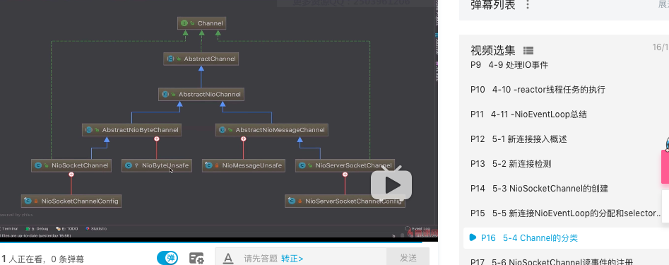

# 第五章 新连接接入


### 入口

```java
//
private void processSelectedKey(SelectionKey k, AbstractNioChannel ch) {
    final AbstractNioChannel.NioUnsafe unsafe = ch.unsafe();
    if (!k.isValid()) {
        final EventLoop eventLoop;
        try {
            eventLoop = ch.eventLoop();
        } catch (Throwable ignored) {
            // If the channel implementation throws an exception because there is no event loop, we ignore this
            // because we are only trying to determine if ch is registered to this event loop and thus has authority
            // to close ch.
            return;
        }
        // Only close ch if ch is still registerd to this EventLoop. ch could have deregistered from the event loop
        // and thus the SelectionKey could be cancelled as part of the deregistration process, but the channel is
        // still healthy and should not be closed.
        // See https://github.com/netty/netty/issues/5125
        if (eventLoop != this || eventLoop == null) {
            return;
        }
        // close the channel if the key is not valid anymore
        unsafe.close(unsafe.voidPromise());
        return;
    }

    try {
        int readyOps = k.readyOps();
        // We first need to call finishConnect() before try to trigger a read(...) or write(...) as otherwise
        // the NIO JDK channel implementation may throw a NotYetConnectedException.
        if ((readyOps & SelectionKey.OP_CONNECT) != 0) {
            // remove OP_CONNECT as otherwise Selector.select(..) will always return without blocking
            // See https://github.com/netty/netty/issues/924
            int ops = k.interestOps();
            ops &= ~SelectionKey.OP_CONNECT;
            k.interestOps(ops);

            unsafe.finishConnect();
        }

        // Process OP_WRITE first as we may be able to write some queued buffers and so free memory.
        if ((readyOps & SelectionKey.OP_WRITE) != 0) {
            // Call forceFlush which will also take care of clear the OP_WRITE once there is nothing left to write
            ch.unsafe().forceFlush();
        }

        // Also check for readOps of 0 to workaround possible JDK bug which may otherwise lead
        // to a spin loop
        if ((readyOps & (SelectionKey.OP_READ | SelectionKey.OP_ACCEPT)) != 0 || readyOps == 0) {
            
            //NioMessageUnsafe读取
            unsafe.read();
            if (!ch.isOpen()) {
                // Connection already closed - no need to handle write.
                return;
            }
        }
    } 
}
```


```java
@Override
        public void read() {
            assert eventLoop().inEventLoop();
            final ChannelConfig config = config();
            final ChannelPipeline pipeline = pipeline();
            final RecvByteBufAllocator.Handle allocHandle = unsafe().recvBufAllocHandle();
            allocHandle.reset(config);

            boolean closed = false;
            Throwable exception = null;
            try {
                try {
                    do {
                        int localRead = doReadMessages(readBuf);
                        if (localRead == 0) {
                            break;
                        }
                        if (localRead < 0) {
                            closed = true;
                            break;
                        }

                        allocHandle.incMessagesRead(localRead);
                    } while (allocHandle.continueReading());
                } catch (Throwable t) {
                    exception = t;
                }

                int size = readBuf.size();
                for (int i = 0; i < size; i ++) {
                    readPending = false;
                    pipeline.fireChannelRead(readBuf.get(i));
                }
                readBuf.clear();
                allocHandle.readComplete();
                pipeline.fireChannelReadComplete();

                if (exception != null) {
                    closed = closeOnReadError(exception);

                    pipeline.fireExceptionCaught(exception);
                }

                if (closed) {
                    inputShutdown = true;
                    if (isOpen()) {
                        close(voidPromise());
                    }
                }
            } finally {
                // Check if there is a readPending which was not processed yet.
                // This could be for two reasons:
                // * The user called Channel.read() or ChannelHandlerContext.read() in channelRead(...) method
                // * The user called Channel.read() or ChannelHandlerContext.read() in channelReadComplete(...) method
                //
                // See https://github.com/netty/netty/issues/2254
                if (!readPending && !config.isAutoRead()) {
                    removeReadOp();
                }
            }
        }
    }
```


```java
protected int doReadMessages(List<Object> buf) throws Exception {
    SocketChannel ch = javaChannel().accept();
    try {
        if (ch != null) {
            // create a new channel from an accepted socket，创建入口；客户端ch
            buf.add(new NioSocketChannel(this, ch));
            return 1;
        }
    } 
    return 0;
}
```


## 创建NioSocketChannel

```java
/**
     * Create a new instance
     *
     * @param parent    the {@link Channel} which created this instance or {@code null} if it was created by the user
     * @param socket    the {@link SocketChannel} which will be used
     */
public NioSocketChannel(Channel parent, SocketChannel socket) {
    //调用父类AbstractNioChannel
    super(parent, socket);
    config = new NioSocketChannelConfig(this, socket.socket());
}


protected AbstractNioChannel(Channel parent, SelectableChannel ch, int readInterestOp) {
    //调用AbstractChannel
    super(parent);
    this.ch = ch;
    this.readInterestOp = readInterestOp;
    try {
        //设置阻塞模式
        ch.configureBlocking(false);
    } 
}

protected AbstractChannel(Channel parent) {
    this.parent = parent;
    id = newId();
    unsafe = newUnsafe();
    pipeline = newChannelPipeline();
}
```


## 新连接NioEventloop分配和selector注册

`ServerBootstrapAcceptor`

```java
public void channelRead(ChannelHandlerContext ctx, Object msg) {
    final Channel child = (Channel) msg;

    child.pipeline().addLast(childHandler);

    for (Entry<ChannelOption<?>, Object> e: childOptions) {
        try {
            if (!child.config().setOption((ChannelOption<Object>) e.getKey(), e.getValue())) {
                logger.warn("Unknown channel option: " + e);
            }
        } catch (Throwable t) {
            logger.warn("Failed to set a channel option: " + child, t);
        }
    }

    for (Entry<AttributeKey<?>, Object> e: childAttrs) {
        child.attr((AttributeKey<Object>) e.getKey()).set(e.getValue());
    }

    try {
        childGroup.register(child).addListener(new ChannelFutureListener() {
            @Override
            public void operationComplete(ChannelFuture future) throws Exception {
                if (!future.isSuccess()) {
                    forceClose(child, future.cause());
                }
            }
        });
    } 
}
```


## channel 分类


## NioSocketChannel读事件注册


```java
private void register0(ChannelPromise promise) {
    try {
        // check if the channel is still open as it could be closed in the mean time when the register
        // call was outside of the eventLoop
        if (!promise.setUncancellable() || !ensureOpen(promise)) {
            return;
        }
        boolean firstRegistration = neverRegistered;
        doRegister();
        neverRegistered = false;
        registered = true;

        // Ensure we call handlerAdded(...) before we actually notify the promise. This is needed as the
        // user may already fire events through the pipeline in the ChannelFutureListener.
        pipeline.invokeHandlerAddedIfNeeded();

        safeSetSuccess(promise);
        pipeline.fireChannelRegistered();
        // Only fire a channelActive if the channel has never been registered. This prevents firing
        // multiple channel actives if the channel is deregistered and re-registered.
        if (isActive()) {
            if (firstRegistration) {
                pipeline.fireChannelActive();
            } else if (config().isAutoRead()) {
                // This channel was registered before and autoRead() is set. This means we need to begin read
                // again so that we process inbound data.
                //
                // See https://github.com/netty/netty/issues/4805
                beginRead();
            }
        }
    } catch (Throwable t) {
        // Close the channel directly to avoid FD leak.
        closeForcibly();
        closeFuture.setClosed();
        safeSetFailure(promise, t);
    }
}
```

