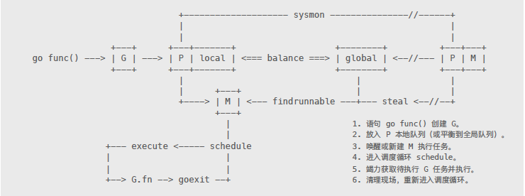

# 一切的起点

### 汇编引导

### 初始化

命令⾏参数整理，环境变量设置，以及内存分配器、垃圾回收器和并发调度器的⼯作现场准备

#### 调度器初始化

schedinit：要关注的所有运⾏时环境初始化构造都在这⾥被调⽤, `proc.go` ;

```go
// call osinit
// call schedinit
// make & queue new G
// call runtime·mstart

```

包初始化函数 init 的执⾏`proc.go`

# 内存分配

## 2.1 概述

#### 2.1.1 内存块种类

span

> 分配器以页为单位向操作系统申请大块内存。这些大块内存由 n 个地址连续的页组成，并用名为 span 的对象进行管理。
>
> 按照特定size class进行切分。

object

> 当需要时，span 所管理内存被切分成多个大小相等的小块，每个小块可存储一个对象，故称作 object。

分配器以 32KB 为界，将对象分为大小两种。

```go
MaxSmallSize = 32<<10,
```

大对象直接找一个大小合适的 span，这个无需多言。小对象则以 8 的倍数分为不同大小等级 (size class)。比如 class1 为 8 字节，可存储 1 ~ 8 字节大小的对象。

```go
NumSizeClasses = 67,
```

当然，实际的对应规则并不是连续和固定的，会根据一些经验和测试结果进行调整，以获得最佳的性能和内存利用率。


#### 2.2.2 分配器三级组件

heap

> 全局根对象。负责向操作系统申请内存，> 1M
>
> 管理由未使用的或者垃圾回收器收回的空闲 span 内存块。

central 

> 从 heap 获取空闲 span，并按需要将其切分成 object 块。不同size class请求被分散到不同central组件，减小锁粒度
>
> heap 管理着多个central 对象，每个 central 负责处理一种等级的内存分配需求。

cache

> 运行期，每个 cache 都与某个具体线程相绑定，实现无锁内存分配操作。
>
> 其内部有个以等级为序号的数组，持有多个切分好的 span 对象。缺少空间时，向等级对应的 central 获取新的 span 即可。

## 2.2 初始化

#### 2.2.1 问题分析

Q1: 如何在对象没有额外附加字段，可内存分配和垃圾回收却要设置管理状态，并且如何存储和高效检索？

思路：根据对象地址，计算索引号，并利用专门数组存储以访问。

Q2: 分配对象如何同时确保其对应有管理状态的元数据数组能同时分配？并且地址不被占用？

思路：指定二者所需虚拟地址空间，采用线性分配策略

#### 2.2.2 内存布局

分配器管理算法依赖连续内存地址。因此，在初始化时，分配器会预留一块巨大的虚拟地址空间。该空间被成三个部分：

- arena: 用户内存实际分配范围。
- bitmap: 为每个地址提供 4bit 标记位，用于垃圾回收操作。
- spans: 记录每个页所对应 span 地址，用于反查和合并操作。


在 64 位系统下，arena 最大容量是 128GB，bitmap 8GB，spans 128MB。这些内存并非一次性分配，而是随着 arena 线性增加，每个区域都有指针标记当前分配位置。

```go
type mheap struct {
    spans []*mspan
    
    bitmap uintptr // Points to one byte past the end of the bitmap
    bitmap_mapped uintptr
    
    arena_start uintptr
    arena_used uintptr // Set with setArenaUsed.
    arena_alloc uintptr
    arena_end uintptr
}
```


`mallocinit`函数进行初始化


## 分配

流程：

- 通过 size class 反查表计算待分配对象等级。
- 从 cache.alloc[sizeclass] 找到等级相同的 span。
- 从 span 切分好的链表中提取可用 object。
- 如 span 没剩余空间，则从 heap.central[sizeclass] 找到对应 central，获取 span。
- 如 central 没可用 span，则向 heap 申请，并切割成所需等级的 object 链表。
- 如 heap 也没有多余 span，那么就向操作系统申请新的内存。

### 零长度对象

### 大对象

#### 管理方式

- 数组free
- 树freelarge

#### 获取

#### 分割

#### 合并

#### 申请

### 小对象


## 回收

流程：

- 垃圾回收器或其他行为引发内存回收操作。
- 将可回收 object 交还给所属 span。
- 将 span 交给对应 central 管理，以便某个 cache 重新获取。
- 如 span 内存全部收回，那么将其返还给 heap，以便被重新切分复用。
- 垃圾回收器定期扫描 heap 所管理的空闲 spans，释放超期不用的物理内存。

从 heap 申请和回收 span 的过程中，分配器会尝试合并地址相邻的 span 块，以形成更大内存块，减少碎片。

## 释放


# 垃圾回收

## 三色标记和写屏障


# 并发调度

## 概述

内置运⾏时，在进程和线程的基础上做更⾼层次的抽象是现代语⾔最流⾏的做法。虽然算不上激进，但 Golang 也设计了全新架构模型，将⼀切都基于并发体系之上，以适应多核时代。刻意模糊线程或协程概念，通过三种基本对象相互协作，来实现在⽤户空间管理和调度并发任务。

基本关系⽰意图：



⾸先是 Processor（简称 P），其作⽤类似 CPU 核，⽤来控制可同时并发执⾏的任务数量。每个⼯作线程都必须绑定⼀个有效 P 才被允许执⾏任务，否则只能休眠，直到有空闲 P 时被唤醒。P 还为线程提供执⾏资源，⽐如对象分配内存、本地任务队列等。线程独享所绑定的 P 资源，可在⽆锁状态下执⾏⾼效操作。

基本上，进程内的⼀切都在以 goroutine（简称 G）⽅式运⾏，包括运⾏时相关服务，以及main.main ⼊⼜函数。需要指出，G 并⾮执⾏体，它仅仅保存并发任务状态，为任务执⾏提供所需栈内存空间。G 任务创建后被放置在 P 本地队列或全局队列，等待⼯作线程调度执⾏。

实际执⾏体是系统线程（简称 M），它和 P 绑定，以调度循环⽅式不停执⾏ G 并发任务。M 通过修改寄存器，将执⾏栈指向 G ⾃带栈内存，并在此空间内分配堆栈帧，执⾏任务函数。当需要中途切换时，只要将相关寄存器值保存回 G 空间即可维持状态，任何 M 都可据此恢复执⾏。线程仅负责执⾏，不再持有状态，这是并发任务跨线程调度，实现多路复⽤的根本所在。

尽管 P/M 构成执⾏组合体，但两者数量并⾮⼀⼀对应。通常情况下，P 数量相对恒定，默认与 CPU 核数量相同，但也可能更多或更少，⽽ M 则是调度器按需创建。举例来说，当M 因陷⼊系统调⽤⽽长时间阻塞时，P 就会被监控线程抢回，去新建（或唤醒）⼀个 M 执⾏其他任务，如此 M 的数量就会增长。

因为 G 初始栈仅有 2KB，且创建操作只是在⽤户空间简单的对象分配，远⽐进⼊内核态分配线程要简单得多。调度器让多个 M 进⼊调度循环，不停获取并执⾏任务，所以我们才能创建成千上万个并发任务。

## 初始化


## 任务


## 线程


## 缓冲池

### 初始化

```go
type Pool struct {
	noCopy noCopy

	local     unsafe.Pointer // local fixed-size per-P pool, actual type is [P]poolLocal, 其数组指针
	localSize uintptr        // size of the local array

	// New optionally specifies a function to generate
	// a value when Get would otherwise return nil.
	// It may not be changed concurrently with calls to Get.
	New func() interface{}
}

// Local per-P Pool appendix.
type poolLocalInternal struct {
	private interface{}   // 私有缓冲区，Can be used only by the respective P.
	shared  []interface{} // Can be used by any P.
	Mutex                 // Protects shared.
}

```

Pool ⽤ local 和 localSize 维护⼀个动态 poolLocal 数组。⽆论是 Get，还是 Put 操作都会
通过 pin 来返回与当前 P 绑定的 poolLocal 对象，这⾥⾯就有初始化的关键。

```go
// pin pins the current goroutine to P, disables preemption and returns poolLocal pool for the P.
// Caller must call runtime_procUnpin() when done with the pool.
func (p *Pool) pin() *poolLocal {
	pid := runtime_procPin()  //返回当前pid
	// In pinSlow we store to localSize and then to local, here we load in opposite order.
	// Since we've disabled preemption, GC cannot happen in between.
	// Thus here we must observe local at least as large localSize.
	// We can observe a newer/larger local, it is fine (we must observe its zero-initialized-ness).
	s := atomic.LoadUintptr(&p.localSize) // load-acquire
	l := p.local                          // load-consume
    //如果不超出数组大小，则返回
	if uintptr(pid) < s {
		return indexLocal(l, pid)
	}
    //否则重新分配数组内存，添加到全局列表
	return p.pinSlow()
}

func (p *Pool) pinSlow() *poolLocal {
	// Retry under the mutex.
	// Can not lock the mutex while pinned.
	runtime_procUnpin()
	allPoolsMu.Lock()
	defer allPoolsMu.Unlock()
	pid := runtime_procPin()
    
	// poolCleanup won't be called while we are pinned.
	s := p.localSize
	l := p.local
	if uintptr(pid) < s {
		return indexLocal(l, pid)
	}
	if p.local == nil {
		allPools = append(allPools, p)
	}
	// If GOMAXPROCS changes between GCs, we re-allocate the array and lose the old one.
	size := runtime.GOMAXPROCS(0)
	local := make([]poolLocal, size)
    
	atomic.StorePointer(&p.local, unsafe.Pointer(&local[0])) // store-release
	atomic.StoreUintptr(&p.localSize, uintptr(size))         // store-release
    
	return &local[pid]
}

func indexLocal(l unsafe.Pointer, i int) *poolLocal {
	lp := unsafe.Pointer(uintptr(l) + uintptr(i)*unsafe.Sizeof(poolLocal{}))
	return (*poolLocal)(lp)
}
```


### 操作

和调度器对 P.runq 队列处理⽅式类似。每个 poolLocal 有两个缓存区域，其中 private 完全私有，⽆需任何锁操作，优先级最⾼。另⼀区域 share，允许被其他 poolLocal 访问，⽤来平衡调度缓存对象，需要加锁处理。不过调度并⾮时刻发⽣，这个锁多数时候仅⾯对当前线程，所以对性能影响并不⼤。


- Get 

```go
// Get selects an arbitrary item from the Pool, removes it from the
// Pool, and returns it to the caller.
// Get may choose to ignore the pool and treat it as empty.
// Callers should not assume any relation between values passed to Put and
// the values returned by Get.
//
// If Get would otherwise return nil and p.New is non-nil, Get returns
// the result of calling p.New.
func (p *Pool) Get() interface{} {
	if race.Enabled {
		race.Disable()
	}
	l := p.pin()  //1. 获取当前线程poolLocal，也就是p.local[pid]
    
    //2. 优先从private选择
	x := l.private  
	l.private = nil
	runtime_procUnpin()
    //3. 判断临时变量x是否有值，有则立即返回
    //4. 没有值则到本地共享缓存列表取
	if x == nil {  
		l.Lock() 
		last := len(l.shared) - 1 //从share尾部提取缓存对象
		if last >= 0 {  
			x = l.shared[last]
			l.shared = l.shared[:last]  //share去掉取出的值
		}
		l.Unlock()
        
		if x == nil {  //5. 当本线程缓存对象无，去其他线程取值
			x = p.getSlow()
		}
	}
    
	if race.Enabled {
		race.Enable()
		if x != nil {
			race.Acquire(poolRaceAddr(x))
		}
	}
    //6. 其他线程也没有，就new一个新的
	if x == nil && p.New != nil {
		x = p.New()
	}
	return x
}

//如果从本地获取缓存失败，则考虑从其他 poolLocal 借调（就是惯偷）⼀个过来。实在不⾏，调⽤ New 函数新建（最终⼿段）
func (p *Pool) getSlow() (x interface{}) {
	// See the comment in pin regarding ordering of the loads.
	size := atomic.LoadUintptr(&p.localSize) // load-acquire
	local := p.local                         // load-consume
    
	// Try to steal one element from other procs.
	pid := runtime_procPin() //当前P.id
	runtime_procUnpin()
    //从其他poolLocal偷一个缓存对象
	for i := 0; i < int(size); i++ {
        //获取目标local且不是自身
		l := indexLocal(local, (pid+i+1)%int(size))
		l.Lock() //目标加锁访问share
		last := len(l.shared) - 1
		if last >= 0 {
			x = l.shared[last]
			l.shared = l.shared[:last]
			l.Unlock()
			break
		}
		l.Unlock()
	}
	return x
}
```


- Put

```go
// Put adds x to the pool.
func (p *Pool) Put(x interface{}) {
	if x == nil {
		return
	}
	if race.Enabled {
		if fastrand()%4 == 0 {
			// Randomly drop x on floor.
			return
		}
		race.ReleaseMerge(poolRaceAddr(x))
		race.Disable()
	}
    //获取poolLocal
	l := p.pin()
	if l.private == nil { //优先放在私有
		l.private = x
		x = nil
	}
	runtime_procUnpin()
    //private不能放，则share
	if x != nil {
		l.Lock()
		l.shared = append(l.shared, x)
		l.Unlock()
	}
	if race.Enabled {
		race.Enable()
	}
}
```


### 清理

清理操作对已被 Get 的可达对象没有任何影响，因为两者之间并没有引⽤关联，留下的缓存对象都属于仅被 Pool 引⽤的可移除 “⽩⾊对象”。或许我们希望设置⼀个阈值，仅清理超出数量限制的缓存对象。如此，可避免在垃圾回收后频繁执⾏ New 操作。但考虑到此时还有⼀批可能的⿊⾊缓存对象存在，所以需求也不是那么急切。只是，这个 Pool 的设计显然有进⼀步改进的余地。

```go
func poolCleanup() {
	// This function is called with the world stopped, at the beginning of a garbage collection.
	// It must not allocate and probably should not call any runtime functions.
	// Defensively zero out everything, 2 reasons:
	// 1. To prevent false retention of whole Pools.
	// 2. If GC happens while a goroutine works with l.shared in Put/Get,
	//    it will retain whole Pool. So next cycle memory consumption would be doubled.
	
    //遍历所有pool实例
    for i, p := range allPools {
		allPools[i] = nil  //解除引用
        
        //遍历poolLocal数组
		for i := 0; i < int(p.localSize); i++ {
			l := indexLocal(p.local, i)
            //清除private share引用
			l.private = nil
			for j := range l.shared {
				l.shared[j] = nil
			}
			l.shared = nil
		}
        
		p.local = nil
		p.localSize = 0
	}
	allPools = []*Pool{}
}
```

