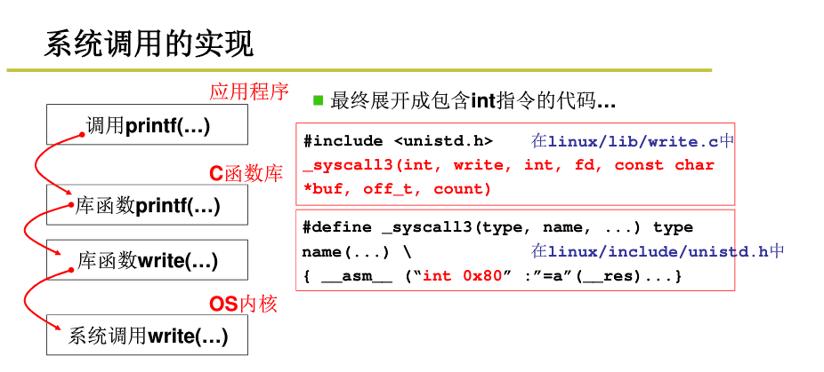

# 寄存器

## 通用寄存器


eax ebx ecx edx


ebp

esi

edi

esp


### 段寄存器

286架构提出4个段寄存器：

- CS：代码段寄存器，存储指令。CPU取指令时根据CS+eip来确定指令的地址。
- DS：数据段寄存器，存储数据段的段值。
- SS：堆栈段寄存器，存储堆栈段的段值。
- ES：附加段寄存器，存储附加数据段的内容。

386 架构提出2个新的段寄存器： 

**FS**（ exception handling chain）

**GS**.

### 系统寄存器


### 标志寄存器


### 内存管理寄存器


GDTR:
LDTR
IDTR

#### 中断描述符表


指令LIDT SIDT：加载和保存当前IDTR内容

用于寻址存放描述符表的段

TR：寻找特殊任务状态段TSS


### 控制寄存器

CR0 

CR1

CR2

CR3


# 堆栈

## 刚进入保护模式时堆栈


## 汇编调用C函数堆栈

实际上是把参数都压到栈里，然后c程序就可以调用，用call来调用 
但是要注意c语言 调用结束后，要把栈里的参数删掉，即addl指令，把指针改一下，忽略那些参数

实际上是 
push 参数 
push 返回地址 
jmp 调用地址

c函数右括号会生成ret指令，会返回到返回地址！ 

这个时候要把没用的参数从栈里去掉，这就是为什么要调用addl 


## 任务内核态堆栈与用户态堆栈切换


调用`int 0x80`进入内核态

用户态堆栈 ss:esp压栈

返回位置压栈cs:eip压栈

iret退出

## 函数调用堆栈

堆栈是C语言程序运行时必须的一个记录调用路径和参数的空间

**堆栈的作用**

- 函数调用框架
- 传递参数
- 保存返回地址
- 提供局部变量空间

**堆栈相关的寄存器**

- esp，堆栈指针，指向栈顶
- ebp，基址指针，指向栈底，在C语言中用作记录当前函数调用基址。

**其他关键寄存器**

cs（代码段寄存器） : eip：总是指向下一条的指令地址

- 顺序执行：总是指向地址连续的下一条指令
- 跳转/分支：执行这样的指令的时候， cs : eip的值会根据程序需要被修改

**参数传递与局部变量**

- 建立框架（相当于 call 指令）

  ```
    push %ebp
    movl %esp,%ebp
  ```

- 拆除框架（相当于 ret 指令）

  ```
    movl %ebp,%esp
    pop  %ebp
  ```

函数返回时一定会拆除框架，建立和拆除是一一对应的。

- 传递参数

在建立子函数的框架之前，局部变量的值保存在调用者堆栈框架中，所以在子函数框架建立之前可以采用变址寻址的方式将变量值入栈。

函数的返回值通过eax寄存器传递


# 启动引导

### 实模式

```
bootsect.s
 setup.s
      读取硬件参数
      读取system到内存0x00位置
      从16位模式 转到 32位模式，即从实时模式 转到 保护模式， 使得寻址方式发生了改变，跳转到0x00执行system，其实是转到head.s代码
      实时模式： 地址翻译 CS<<4 + IP
      保护模式 ：根据CS查表 + IP
 head.s
      初始化GDT，IDT表
      转到main（）函数，main（）是c函数
 main()

      各种初始化，包括mem_init 标记那些内存块被使用，哪些没有被使用

```


### 保护模式


## 系统调用


硬件上隔离用户段和内核段，DPL CPL来实现, 其实是把内存分段了，进行隔离保护 
从用户段访问内核段，必须通过中断0x80才能访问内核段 





# 多进程

进程 和 线程 都是动态概念 
进程 = 资源 （包括寄存器值，PCB，内存映射表）+ 指令序列 
线程 = 指令序列

线程 的资源是共享的， 
进程 间的资源是分隔独立的，内存映射表不同，占用物理内存地址是分隔的

线程 的切换只是切换PC，切换了指令序列 
进程 的切换不仅要切换PC，还包括切换资源，即切换内存映射表

用户级线程：调用Yield函数，自己主动让出cpu，内核看不见，内核只能看见所属进程而看不见用户级线程，所以一个用户级线程需要等待，内核会切到别的进程上，不会切到该进程下的其他用户级线程！！！ 

内核级线程： 内核能看见内核级线程，一个线程需要等待，内核会切到所属进程下的其他内核级线程。


## 线程

### 用户态线程


### 内核线程


# 进程管理

- 进程：处于执行期的程序。包括代码段和打开的文件、挂起的信号、内核内部数据、处理器状态一个或多个具有内存映射的内存地址空间或执行线程等其他资源。
- 线程：是在进程中活动的对象。每个线程都有一个独立的程序计数器、进程栈和一组进程寄存器。内核调度的对象是线程而非进程。操作系统中进程提供两种虚拟机制：虚拟存储器和虚拟内存。
- 程序：本身并不是进程，进程是处于执行期的程序以及相关的资源的总称。不同的进程可以执行同一个程序。
- 在现代操作系统中，进程提供两种虚拟机制：虚拟处理器和虚拟内存。包含在同一个进程中的线程可以共享虚拟内存，但是每个都拥有各自的虚拟处理器。

## 进程描述符及任务结构

内核把进程的列表存放在叫做任务队列的双向循环链表中。链表中的每一项都是进程描述符。类型为task_struct，里面包含的数据有：它打开的文件、进程的地址空间、挂起的信号、进程的状态以及其他相关信息。


#### 分配进程描述符

Linux通过slab分配器分配task_struct结构——能达到对象复用和缓存着色的目的。

由于通过slab分配器动态生成，只需在栈底或者栈顶创建一个新的结构struct thread_info。

每个任务的thread_info结构在它的内核栈的尾端分配。

结构中task域中存放的是指向该任务实际task_struct的指针。


#### 进程描述符的存放

内核通过一个唯一的进程标识值**PID**来标识每个进程。

pid类型为pid_t，实际上就是一个int类型。内核把每个进程的pid存放在各自的进程描述符中。

pid最大值默认设置为32768，通过修改/proc/sys/kernel/pid_max可以提高上限。

获得指向task_struct指针的方法：

```
通过current宏查找到当前正在运行进程的进程描述符。
在内核栈的尾端创建thread_info结构
current通过current_thread_info()把栈指针的后13个有效位屏蔽用来计算出thread_info的偏移。
从thread_info的task域中提取并返回task_struct的地址。
```

#### 进程状态

进程描述符中的state域描述了进程的当前状态。系统中的每个进程都必然属于下列的五种状态之一：

- TASK_RUNNING（运行）：进程是可执行的，或者正在执行，或者在运行队列中等待执行。是进程在用户空间中执行的唯一可能的状态。
- TASK_INTERRUPTIBLE（可中断）：进程正在睡眠/被阻塞。处于此状态的进程会因为收到信号而被唤醒从而准备投入运行。
- TASK_UNINTERRUPTIBLE（不可中断）：睡眠/被阻塞进程不被信号唤醒。这个状态通常在进程必须等待时不受干扰或等待时间很快就会发生时出现。
- TASK_TRACED：被其他进程跟踪的进程。
- TASK_STOPPED（停止）：进程停止执行；进程没有投入运行也不能投入运行。接收到SIGSTOP、SIGTSTP、SIGTTIN、SIGTTOU等信号时，或者调试时收到任何信号，都可以进入这种状态。


#### 设置当前进程状态

内核需要使用set_task_state(task,state)函数来调整某个进程的状态。

```
set_task_state(task,state); //将任务task的状态设置为state
一般情况下等价于task->state=state;

set_current_state(state)//等价于set_task_state(current,state)
```

#### 进程上下文

程序执行系统调用或者触发异常后，会陷入内核空间，这时候内核代表进程执行，并且处于进程上下文中。

进程对内核的访问必须通过接口：系统调用和异常处理程序。

#### 进程家族树

所有的进程都是pid为1的init进程的后代。
内核在系统启动的最后阶段启动init进程。

系统中的每一个进程必有一个父进程，可以拥有0个或多个子进程，拥有同一个父进程的进程叫做兄弟。

进程间的关系存放在进程描述符中，parent指针指向父进程task_struct，children是子进程链表。

获得父进程的进程描述符：

```
struct task_struct *my_parent = current->parent;
```

访问子进程：

```
struct task_struct *task;
struct list_head *list;

list_for_each(list, &current->children){
    task = list_entry(list, struct task_struct, sibling);
    /* task现在指向当前的某个子进程 */
}
```

init进程的进程描述符是作为init_task静态分配的。所有进程之间的关系：

```
struct task_struct *task;
for(task=current;task1=&init_task;task=task->parent)
        ;
/*task现在指向init*/
```

获取链表中的下一个进程：

```
list_entry(task->tasks.next, struct task_struct, tasks);
```

获取链表中的上一个进程：

```
list_entry(task->tasks.prev, struct task_struct, tasks);
```

以上依赖于next_task(task)和prev_task(task)这两个宏实现。for_each_process(task)宏，依次访问整个任务队列，每次访问任务指针都指向链表中的下一个元素。

```
struct task_struct *task;

for_each_process(task){
    /* 它打印出每一个任务的名称和pid */
    printk("%s[%d]\n",task->comm, task->pid);
}
```

## 进程创建

Unix的进程创建机制：

- fork()：通过拷贝当前进程创建一个子进程。子进程与父进程的区别仅在于PID，PPID和某些资源和统计量
- exec()：读取可执行文件并将其载入地址空间开始运行。

#### 写时拷贝

写时拷贝是一种可以推迟甚至免除拷贝数据的技术，内核不复制整个进程地址空间，而是让父进程和子进程共享一个拷贝。

资源的复制只有在需要写入时才会进行，在此之前以只读方式读取。

fork的实际开销就是复制父进程的页表以及给子进程创建唯一的进程描述符，进程创建后都会马上运行一个可执行的文件，避免拷贝大量不会被使用的数据，从而实现优化。

#### fork()

Linux通过clone()系统调用实现fork()。实现过程如下：

- fork()、vfork()、 _ clone()都根据各需要的参数标志调用clone()。由clone()去调用do _ fork()。
- do _ fork()调用copy _ process()函数，然后让进程开始运行。
- 返回do _ fork()函数，如果copy _ process()函数成功返回，新创建的子进程被唤醒并让其投入运行。

一般内核会选择子进程首先执行。因为子进程会马上调用exec()函数，避免写时拷贝的额外开销。

#### vfork()

除了不拷贝父进程的页表项之外，vfork()系统调用和fork()的功能相同。**理想情况下不要调用vfork()。**

子进程作为父进程的一个单独的线程在它的地址空间里运行 ，父进程被阻塞，直到子进程退出或执行exec()。子进程不能向地址空间写入。

vfork()系统调用的实现是通过向clone()传递一个特殊标志来进行的。

- 调用copy _ process()是，task _ struct的vfor _ done成员被设置为NULL。
- 执行do _ fork()时，如果给定特定标志，则vfor _ done会指向一个特定地址。
- 子进程先开始执行后，父进程不是马上恢复执行，而是一直等待，知道子进程通过vfor _ done指针向它发送信号。
  在调用mm _ release()时，该函数用于进程退出内存地址空间，并且检查vfor _ done是否为空，如果不为空，则会向父进程发送信号。
- 回到do_fork()，父进程醒来并返回。

## 线程在Linux中的实现

线程机制是现代编程技术中常用的一种抽象概念，该机制提供了在同一程序内共享内存地址空间运行的一组线程，可以共享打开的文件和其他资源，支持并发程序设计，在多处理器系统上可以保证真正的并行处理。

Linux内核的角度来看并没有线程这个概念，它把所有线程都当做进程来实现，线程仅仅被视为一个与其他进程共享某些资源的进程。

对于Linux来说，线程只是一种进程间共享资源的手段。

#### 创建线程

线程的创建和普通进程的创建类似，只不过在调用clone()时需要传递一些参数标志来指明需要共享的资源：

```
clone(CLONE_VM | CLONE_FS | CLONE_FILES | CLONE_SIGHAND, 0);
/*共享地址空间、文件系统资源、文件描述符和信号处理程序。*/
```

普通的fork：

```
clone(SIGCHLD, 0);
```

vfork()：

```
clone(CLONE_VFORK | CLONE_VM | SIGCHLD, 0);
```

传递给clone()的参数标志决定了新创建进程的行为方式和父子进程之间共享的资源种类。参数标志如下：


#### 内核线程

内核线程：独立运行在内核空间的标准进程。

内核线程没有独立的地址空间，只在内核空间运行，从来不切换到用户空间，可以被调度和抢占。

内核线程只能由其他内核线程创建：

```
struct task_struct *kthread_creat(int (*threadfn)(void *data),
void *data,const char namefmt[],...)
```

kthread _ create()通过clone()系统调用创建内核线程后，处于不可运行状态，如果不通过wake _ up _ process()明确唤醒它，不会主动运行。创建一个进程并让它运行起来 ，可以调用kthread _ run()。

```
struct task_struct *kthread_run(int (*threadfn)(void *data),
void *data,const char namefmt[],...)
```

内核线程启动后就一直运行直到调用do _ exit()退出，或者内核的其他部分调用kthread _ stop()退出，传递给kthread _ stop()的参数为kthread _ create()函数返回的task _ struct结构的地址。

```
int kthread_stop(struct task_struct *k)
```

## 进程终结

进程终结时，内核必须释放它所占有的资源并告知父进程。

进程终结的原因：一般是来自自身，发生在调用exit()系统调用时。

- 显式的调用
- 隐式的从某个程序的主函数返回

大部分依赖于do_exit()来完成。

#### 删除进程描述符

释放task_struct结构发生在父进程获得已终结的子进程信息并且通知内核不关注后，需要的系统调用是wait4()：

挂起调用它的进程，直到其中的一个子进程退出，此时函数返回该子进程的PID。
释放进程描述符时，需要调用release_task()。

#### 孤儿进程

如果父进程在子进程之前退出，必须有机制来保证子进程能找到一个新的父亲，否则这些成为孤儿的进程就会在退出时永远处于僵死状态。

解决方法有：

1. 在当前进程组找一个线程作为养父
2. 让init成为它们的父进程。

具体实现的过程：

- do _ exit()调用exit _ notify()
- exit _ notify()会调用forget _ original _ parent()
- forget _ original _ parent()会调用find _ new _ reaper()
- 遍历所有子进程并为它们设置新的父进程。
- 调用ptrace _ exit _ finish()同样进行新的寻父过程，是给ptraced的子进程寻找父亲。
- init进程会例行调用wait()来检查其子进程，清除所有与其相关的僵死进程。

# 进程调度

## 4.1 多任务

多任务操作系统就是能同时并发的交互执行多个进程的操作系统。多任务操作系统使多个进程处于堵塞或者睡眠状态，实际不被投入执行，这些任务尽管位于内存，但是并不处于可运行状态。

多任务系统分为两种：

- 抢占式多任务：Linux提供了抢占式的多任务模式，由调度程序来决定什么时候停止一个进程的运行。

  现代操作系统提供：动态时间片计算的方式；可配置的计算策略

- 非抢占式多任务：除非进程自己主动停止运行，否则会一直执行。

  调度程序无法躲每个进程该执行多长时间作出统一规定，所以进程独占的处理器时间可能会超过用户的预料

**Unix从一开始就采用的是抢占式的多任务。**

## 4.2 Linux的进程调度

- O(1)调度器：对大服务器的工作负载很理想；但是缺少交互进程。
- RSDL，反转楼梯最后期限调度算法，吸取了队列理论，公平调度。（又被称为CFS，完美公平调度算法。）

## 4.3 策略

策略决定调度程序在合适让什么程序运行。

#### 两种典型的进程

##### I/O消耗性进程

进程的大部分时间用来提交I/O请求或者等待I/O请求，经常处于可运行状态但是运行时间很短，等待更多的请求时最后总会阻塞。

##### 处理器耗费型进程

把时间大多用在执行代码上，除非被抢占，否则通常都会不停运行。

调度策略通常要在两个矛盾的目标中间寻找平衡：

- 进程调度迅速（响应时间短）
- 最大系统利用率（高吞吐量）

Linux倾向于优先调度I/O消耗型进程

#### 进程优先级

调度算法中最基本的一类就是基于优先级的调度这是一种根据进程的价值和其对处理器时间的需求来对进程分级的想法。

调度程序总是选择时间片未用尽而且优先级最高的进程运行。

Linux采用了两种不同的优先级范围：

- nice

  范围[-20,19]，默认值为0；
  nice值越大，优先级越低；
  Linux系统中nice值代表时间片的比例；
  ps-el命令查看系统中进程列表，NI列为nice值。

- 实时优先级

  值可以配置，默认变化范围是[0,99]；
  值越高优先级越高；
  任何实时进程的优先级都高于普通的进程。

实时优先级和nice优先级处于互不相交的两个范畴，在处理器实际操作的时候[nice+120]来和实时优先级一同比较从而进行处理。

```
ps-eo state,uid,pid,ppid,rtprio,time,comm.
#查看系统中的进程列表以及对应的实时优先级（rtprio），显示“-”表示不是实时进程
```

#### 时间片

时间片表示进程在被抢占前所能持续运行的时间。

- I/O消耗型进程不需要很长的时间片
- 处理器消耗型进程希望时间片越长越好

Linux的CFS调度器没有直接分配时间片到进程，而是将处理器的使用比划分给进程。进程所获得的处理器时间和系统负载密切相关。这个比例受nice值影响，nice值作为权重来调整进程所使用的处理器时间使用比：

- 高nice（低优先权）将被赋予低权重，从而损失小部分处理器使用比；
- 低nice值（高优先权）将被赋予高权重，从而抢得更多处理器使用比。

Linux进程是抢占式的，是否抢占完全由进程的优先级和是否有时间片来决定。

CFS抢占器：抢占时机取决于新的可执行程序消耗了多少处理器使用比，如果消耗的使用比当前进程小：新程序立刻投入运行，抢占当前进程，否则推迟。

## 4.4 Linux调度算法

#### 调度器类

Linux调度器是以模块方式提供，以便于允许不同类型的进程可以有针对性地选择调度算法。这种模块化结构被称为调度器类。

**调度器类：**允许多种不同的可动态添加的调度算法并存，调度属于自己范畴的进程。每个调度器有一个优先级，会按照优先级顺序遍历调度类，选择优先级最高的调度器类。

完全公平调度CFS是一个针对普通进程【区别于实时进程】的调度类。

#### Unix系统中的进程调度

Unix使用的调度算法是分配绝对的时间片，这样就会引发固定的切换频率，不利于公平性。
而Linux采用的CFS完全摒弃了时间片，分配给进程一个处理器使用比重，保证恒定的公平性和变动的切换频率。

#### 公平调度CFS

CFS——近乎完美的多任务:允许每个进程运行一段时间、循环轮转、选择运行最少的进程作为下一个运行进程，在所有可运行进程总数基础上计算出一个进程应该运行多久。nice值作为进程获得的处理器运行比的权重。

## 4.5 Linux调度的实现

CFS调度算法实现的四个组成部分：

- 时间记账
- 进程选择
- 调度器入口
- 睡眠和唤醒

#### 时间记账

所有的调度器都必须对进程运行时间做记账。

##### 调度器实体结构

CFS不再有时间片的概念，但也必须维护每个进程运行的时间记账。使用调度器实体结构来追踪进程运行记账：进程描述符中的se变量。

##### 虚拟实时

CFS使用了vruntime变量来存放进程的虚拟运行时间，用来表示进程到底运行了多少时间，以及它还应该运行多久。

这个虚拟运行时间是加权的，与定时器节拍无关。

```
定义在kernel/sched_fair.c文件中的update_curr()函数实现了该记账功能。
它计算了当前进程的执行时间并存放入变量delta_exec中，
然后又将运行时间传递给__update_curr()；
__update_curr()根据当前可运行进程总数对进行时间进行加权计算，
最终将权重值与当前运行进程的vruntime值相加。
（undate_curr()是由系统定时器周期调用的。）
```

#### 进程选择

CFS调度算法的核心：
选择具有最小vruntime的任务。

CFS使用红黑树来组织可运行进程队列，并利用其迅速找到最小vruntime值的进程。

Linux中，红黑树被称为rbtree，是一个自平衡二叉搜索树，是一种以树节点形式存储的数据，这些数据会对应一个键值，可以通过这些键值来快速检索节点上的数据，而且检索速度与整个树的节点规模成指数比关系。

##### 挑选下一个任务

节点键值是可运行进程的虚拟运行时间，CFS调度器随机选择待运行的下一个进程，是所有进程中vruntime最小的那个，它对应的是树中最左侧的叶子节点。函数是__pick_next_entity()

```
这个函数本身不会遍历树找到最左叶子节点，该值缓存在rb_leftmost字段中，
函数返回值就是CFS选择的下一个运行进程。
如果返回NULL，表示树空，没有可运行进程，这时选择idle任务运行。
```

##### 向树中加入进程

发生在进程被唤醒或者通过fork调用第一次创建进程时。

```
函数enqueue_entity()：更新运行时间和其他一些统计数据，然后调用__enqueue_entity()。
函数__enqueue_entity()：进行繁重的插入工作，把数据项真正插入到红黑树中：
```

##### 从树中删除进程

删除动作发生在进程堵塞或终止时。

```
相关函数是dequeue_entity()和__dequeue_entity()：
```

#### 调度器入口

进程调度的主要入口点函数是schedule()。

```
schedule()函数会调用pick_next_task()；
pick_next_task()会以优先级为序依次检查每一个调度类，并且选择最高优先级的进程。
pick_next_task()会返回指向下一个可运行进程的指针，没有时返回NULL
pick_next_task()函数实现会调用pick_next_entity()
pick_next_entity()会调用__pick_next_entity()。
```

#### 睡眠和唤醒

睡眠时：进程把自己标记成休眠状态，从可执行红黑树中移出，放入等待序列，然后调用schedule()选择和执行一个其他进程

唤醒时：进程被设置为可执行状态，然后再从等待队列中移到可执行红黑树中。

#### 等待队列

等待队列是由等待某些事件发生的进程组成的简单链表，休眠通过等待队列进行处理。内核用wake _ queue *head* t来表示等待队列。等待队列可以通过DECLARE _ WAITQUEUE()静态创建，也可以由init _ waitqueue _ head()动态创建

进程通过执行以下几个步骤将自己加入到一个等待队列中：

1. 调用宏DEFINE_WAIT()创建一个等待队列的选项。
2. 调用add _ wait _ queue()把自己加入到队列中。
3. 调用prepare _ to _ wait()方法将进程的状态变更为TASK _ INTERRUPTIBLE或TASK _ UNINTERRUPTIBLE。
4. 如果状态被设置成TASK_INTERRUPTIBLE，则信号唤醒进程。（伪唤醒：唤醒不是因为事件的发生。）
5. 当进程被唤醒的时候，会再次检查条件是否为真，真则退出循环，否则再次调用schedule()并且一直重复这步动作。
6. 当条件满足后，进程将自己设置为TASK _ RUNNING并调用finish _ wait()方法把自己移出等待序列。函数inotify _ read()：负责从通知文件描述符中读取信息。

##### 唤醒

唤醒操作通过函数wake_up()进行，会唤醒指定的等待队列上的所有进程。

```
wake_up()函数调用try_to_wake_up()
try_to_wake_up()函数负责将进程设置成TASK_RUNNING状态
调用enqueue_task()将此进程放入红黑树中
如果被唤醒的进程优先级比正在执行的进程优先级高，设置need_resched标志
通常哪段代码促成等待条件达成，它就负责随后调用wake_up()函数。
```

虚假唤醒：
有时候进程被唤醒并不是因为它所等待的条件达成了，所以才需要用一个循环处理来保证它等待的条件真正达成。

## 4.6 抢占和上下文切换

上下文切换由context _ switch()函数负责。
每当一个新进程被选出准备投入运行时，schedule()会调用context _ switch()。
它完成了两项基本工作：

- 调用switch_mm()，该函数负责把虚拟内存从上一个进程映射到新进程中。
- 调用switch _ to()，该函数负责从上一个进程的处理器状态切换到新进程的处理器状态。
  这包括保存、恢复栈信息和寄存器信息，还有其他任何与体系结构相关的状态信息，都必须以每个进程为对象进行管理和保存。


内核必须知道什么时候调用schedule()。提供一个need _ resched标志用来表明是否需要重新执行一次调度：

当某个进程应该被抢占时，scheduler _ tick()会设置这个标志；当一个优先级高的进程进入可执行状态时，try _ to _ wake _ up()会设置这个标志。内核检查这个标志确认其被设置，调用schedule()来切换到一个新的进程。该标志对于内核来说是一个信息，表示youqitajinc应当被运行了，要尽快调用调度程序。
再返回用户空间以及从中断返回时，内核也会检查标志。

每个进程都包含一个need_resched标志，因为访问进程描述符里的数值比访问一个全局变量要快。

#### 用户抢占

内核即将返回用户空间的时候，如果need_resched标志被设置，会导致schedule()被调用，此时会发生用户抢占。

用户抢占发生的情况：

- 从系统调用返回用户空间时
- 从中断处理程序返回用户空间时

#### 内核抢占

Linux完整地支持内核抢占。只要重新调度是安全的，内核就可以在任何时间抢占正在执行的任务。

锁是非抢占区域的标志。只要没有持有锁，内核就可以进行抢占。

支持内核抢占而完成的动作：

1. 为每个进程的thread _ info中加入preempt _ count计数器，初值为0，使用锁+1，释放锁-1，数值为0时，可以执行抢占。
2. 从中断返回内核空间时，先检查need_resched标志，如果被设置表示需要被调度，然后检查preempt_count计数器，如果为0，表示可以被抢占，这时调用调度程序。否则，内核直接从中断返回当前执行进程。
3. 当前进程持有的锁全部被释放，这时preempt_count归0，释放锁的代码会检查need_resched是否被设置，如果是就调用调度程序。
4. 如果内核中的进程被阻塞了，或者显式地调用了schedule()，内核抢占也会显式地发生。

内核抢占会发生在:

- 中断处理程序正在执行，且返回用户空间之前
- 内核代码再一次具有可抢占性的时候
- 内核中的任务显式地调用schedule()
- 内核中的任务阻塞（同样导致调用schedule()）

## 4.7 实时调度策略

Linux提供了两种实时调度策略：SCHED _ FIFO和SCHED _ RR。普通的非实时的调度策略是SCHED _ NORMAL。

#### SCHED_FIFO

简单的先入先出算法，不使用时间片

可运行的SCHED _ FIFO比任何SCHED _ NORMAL进程更先得到调度。只有更高优先级的FIFO或者RR才能抢占它；同等优先级的FIFO轮流执行，只有它愿意让出时才会退出。

#### SCHED_RR

带有时间片的FIFO，是一种实施轮流调度算法。

当RR耗尽它的时间片时，在同一优先级的其他实时进程被轮流调度。时间片只用来重新调度同一优先级进程。

总而言之，高优先级总是立即抢占低优先级，而低优先级决不能抢占高优先级。

这两种实时算法实现的都是静态优先级：
内核部位实施进程计算动态优先级，这能保证给定优先级别的实时进程总是能抢占优先级比它低的进程。

- 软实时：内核调度进程，尽力使进程在它的限定时间到来前进行，但内核不保证总能满足这些进程的要求。
- 硬实时：系统保证在一定条件下，可以满足任何调度的要求。

#### 优先级范围

- 实时：0~[MAX _ RT _ PRIO-1]
  默认MAX _ RT _ PRIO=100，所以默认实时优先级范围为[0,99]
- SCHED _ NORMAL:[MAX _ RT _ PRIO]~[MAX _ RT _ PRIO+40]。默认情况下，nice值从-20到+19对应的是从100到139的实时优先级范围。

## 4.8 与调度相关的系统应用

#### 与调度策略和优先级相关的系统调用


nice() 将给定进程的静态优先级增加一个给定的量，只有超级用户才能在调用它时使用负值来提高进程的优先级。

- getpriority()/setpriority() 设置优先级
- sched _ getscheduler()/sched _ setscheduler() 设置和获取进程的调度策略和实时优先级
- sched _ getparam()/sched _ setparam() 设置和获取进程的实时优先级
- sched _ get _ priority _ min()/sched _ get _ priority _ max() 返回给定调度策略的最大和最小优先级

#### 与处理器绑定有关的系统调用

- Linux调度程序提供强制的处理器绑定机制

- task _ struct中的cpus _ allowed位掩码中

- sched_setaffinity() 设置不同的一个或者几个位组合的位掩码

- sched _ getaffinity() 返回当前的cpus_ allowed位掩码

  #### 放弃处理器时间

sched_yield() 让进程显式地将处理器时间让给其他等待执行进程。普通进程移到过期队列中，实时进程移到优先级队列最后。

内核先调用yield，确定给定进程确实处于可执行状态，然后调用sched _ yield()。

用户空间可以直接调用sched _ yield()。

# 内存管理

